<div align="center">

```
 ██████╗██████╗ ██╗      ██╗
██╔════╝██╔══██╗██║     ██╔╝
██║     ██████╔╝██║    ██╔╝ 
██║     ██╔═══╝ ██║   ██╔╝  
╚██████╗██║     ███████╗██║ 
 ╚═════╝╚═╝     ╚══════╝╚═╝ 
```

# The Complete C++ Reference

*From Silicon to Software — A Deep Dive into the Language That Runs the World*

[](https://isocpp.org/)
[](https://en.cppreference.com/)
[](LICENSE)
[](https://github.com/Sakkkky)

> *"C makes it easy to shoot yourself in the foot. C++ makes it harder, but when you do, it blows away your whole leg."*
> — Bjarne Stroustrup (jokingly, about the power of the language)

</div>

---

## 📖 Table of Contents

- [What is C++?](#-what-is-c)
- [History & Evolution](#-history--evolution)
- [C++ Standards Timeline](#-standards-timeline)
- [Architecture Overview](#-architecture-overview)
- [Core Language Concepts](#-core-language-concepts)
  - [Memory Model](#memory-model)
  - [Type System](#type-system)
  - [Object-Oriented Programming](#object-oriented-programming)
  - [Templates & Generics](#templates--generics)
- [The Compilation Pipeline](#-the-compilation-pipeline)
- [C++ vs Other Languages](#-c-vs-other-languages)
- [Modern C++ Features](#-modern-c-features-cpp11--cpp23)
- [The STL Ecosystem](#-the-stl-ecosystem)
- [Real-World Applications](#-real-world-applications)
- [Performance Characteristics](#-performance-characteristics)
- [Learning Roadmap](#-learning-roadmap)
- [Common Paradigms](#-common-paradigms)

---

## 🔷 What is C++?

C++ is a **general-purpose, compiled, statically typed programming language** that provides:

- **Zero-cost abstractions** — you only pay for what you use
- **Direct hardware access** — control memory, registers, and system resources explicitly
- **Multiple programming paradigms** — procedural, object-oriented, generic, and functional
- **Deterministic performance** — no garbage collector, no runtime surprises

It is simultaneously one of the **highest-level** and **lowest-level** languages in common use — capable of expressing abstract algorithms with expressive templates while also writing bare-metal firmware.

### Where C++ Lives

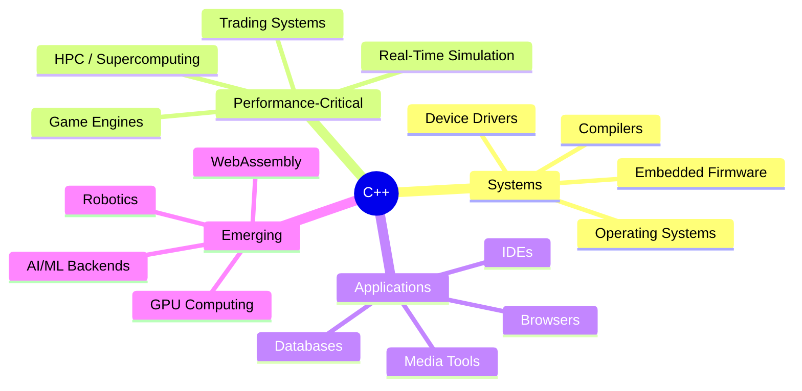

---

## 📜 History & Evolution

### The Origin Story

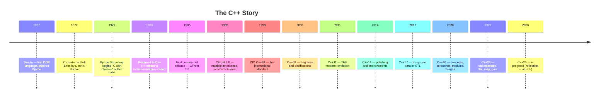

### Bjarne Stroustrup — The Creator

| Attribute | Detail |
|-----------|--------|
| **Full Name** | Bjarne Stroustrup |
| **Born** | December 30, 1950 — Aarhus, Denmark |
| **Education** | MSc from Aarhus University, PhD from Cambridge |
| **Created C++ At** | Bell Labs, Murray Hill, New Jersey |
| **Motivation** | Wanted Simula's OOP features in a language as fast as C |
| **Current Role** | Morgan Stanley Technical Fellow, Columbia University Prof |
| **Quote** | *"Within C++, there is a much smaller and cleaner language struggling to get out."* |

---

## 🗓️ Standards Timeline

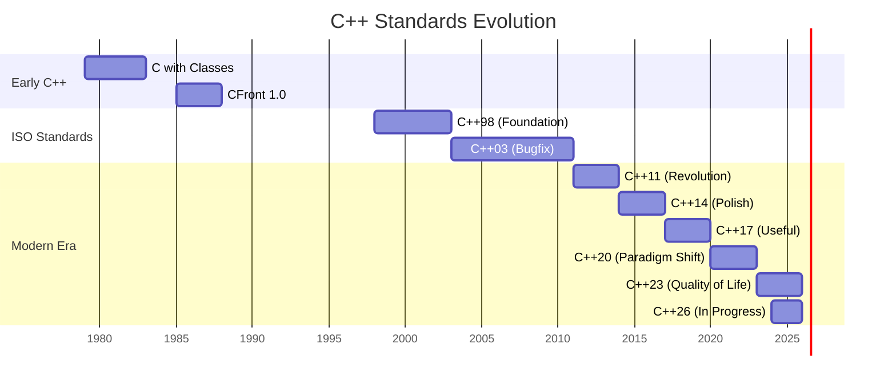

### What Each Standard Brought

| Standard | Nickname | Key Features Added |
|----------|----------|--------------------|
| **C++98** | Foundation | Templates, STL, exceptions, RTTI, namespaces |
| **C++03** | Bugfix | Value initialization fixes, minor corrections |
| **C++11** | Revolution 🔥 | `auto`, lambdas, `nullptr`, move semantics, smart pointers, range-for, `constexpr`, threads |
| **C++14** | Polish | Generic lambdas, `auto` return types, `std::make_unique` |
| **C++17** | Practical | `std::optional`, `std::variant`, structured bindings, `if constexpr`, filesystem |
| **C++20** | Paradigm Shift 🚀 | Concepts, Coroutines, Modules, Ranges, `std::format`, `consteval` |
| **C++23** | Quality of Life | `std::expected`, `std::print`, `std::flat_map`, `import std` |
| **C++26** | Reflection Era | Static reflection, contracts, more coroutine utilities *(in progress)* |

---

## 🏛️ Architecture Overview

### How C++ Sees a Program

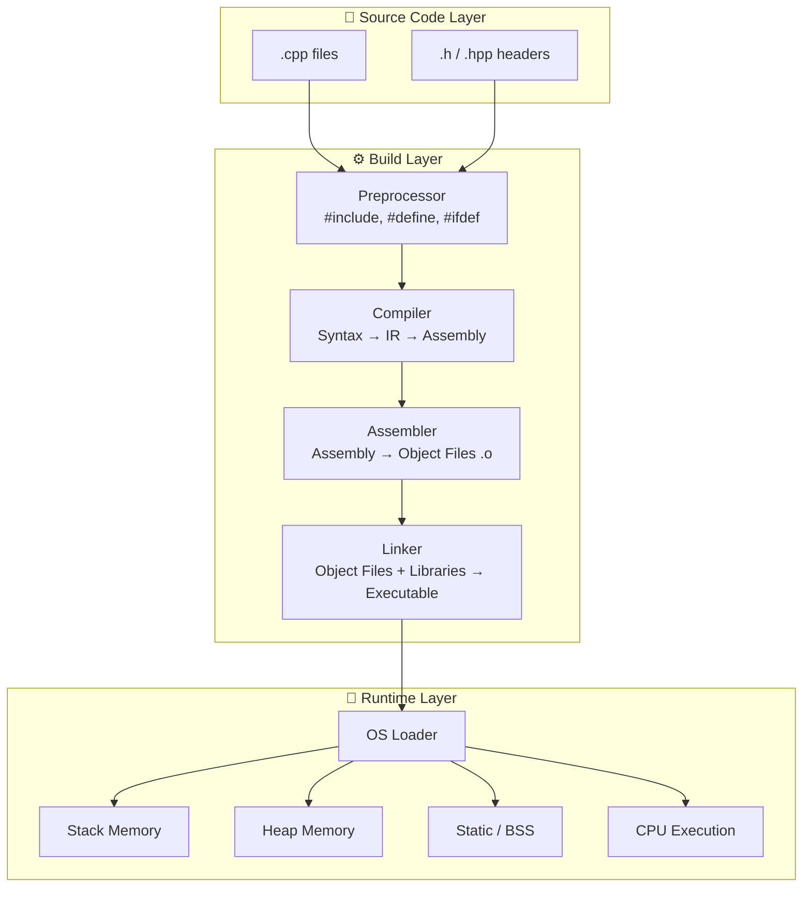

---

## 🧠 Core Language Concepts

### Memory Model

C++ gives you **direct, explicit control** over memory — a double-edged sword of power and responsibility.

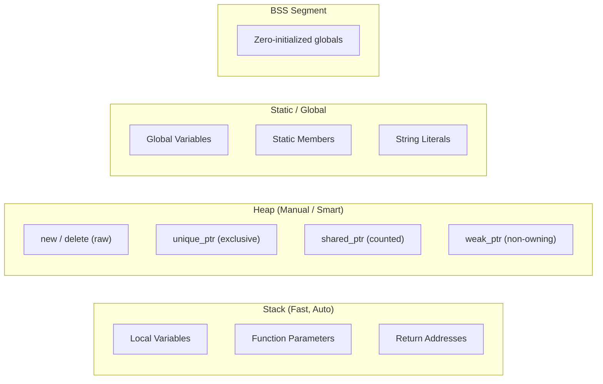

#### Smart Pointer Ownership Model

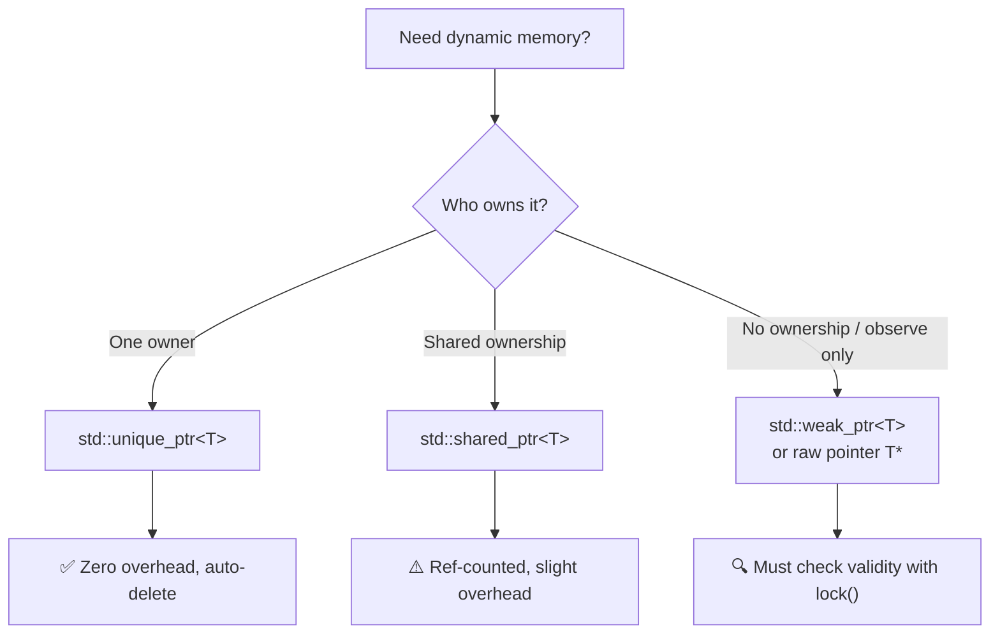

---

### Type System

C++ has a **rich, hierarchical type system** blending C-style fundamentals with high-level abstractions.

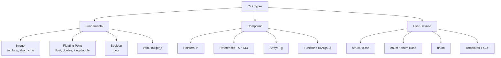

| Modifier | Effect | Example |
|----------|--------|---------|
| `const` | Value cannot change | `const int x = 5;` |
| `volatile` | Don't optimize away reads/writes | `volatile int* reg = ...;` |
| `mutable` | Can change inside `const` method | `mutable int cache;` |
| `constexpr` | Evaluated at compile time | `constexpr int sq(int x)` |
| `consteval` | *Must* be compile-time (C++20) | `consteval int id(int n)` |
| `inline` | Suggest inlining / allow multi-TU definition | `inline int max(int a, int b)` |
| `static` | Internal linkage or single instance | `static int counter = 0;` |

---

### Object-Oriented Programming

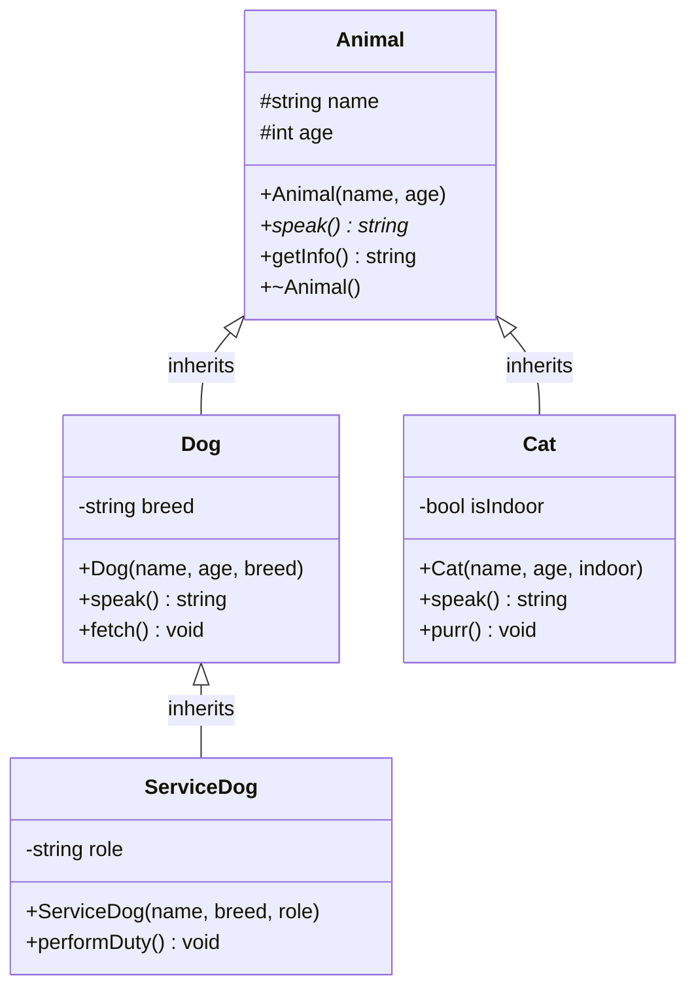

#### The Four Pillars in C++

| Pillar | C++ Mechanism | Example |
|--------|--------------|---------|
| **Encapsulation** | `private` / `protected` / `public` | Data hiding inside classes |
| **Inheritance** | `: public Base` | Code reuse and is-a relationships |
| **Polymorphism** | `virtual` + vtable / templates | Runtime and compile-time dispatch |
| **Abstraction** | Pure virtual `= 0` / concepts | Interface definitions |

---

### Templates & Generics

Templates are C++'s **compile-time metaprogramming system** — one of its most powerful and unique features.

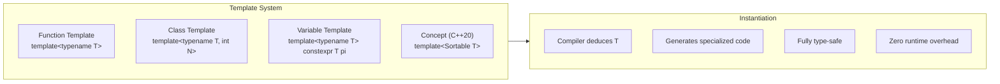

**SFINAE → Concepts Evolution:**

```
C++98/03                C++11/14              C++20
─────────────────────   ───────────────────   ──────────────────────
Manually check types    enable_if<...>        requires / concept
via specialization      SFINAE tricks         Clean, readable syntax
Hard to read            Hard to debug         Excellent error msgs
```

---

## ⚙️ The Compilation Pipeline


### Optimization Levels

| Flag | Name | Use Case |
|------|------|----------|
| `-O0` | No optimization | Debugging — variables always in memory |
| `-O1` | Basic | Small improvements, fast compile |
| `-O2` | Standard | Release builds — most optimizations |
| `-O3` | Aggressive | Max performance, may increase code size |
| `-Os` | Size | Embedded systems, minimize binary |
| `-Oz` | Smallest | Even smaller than `-Os` (Clang only) |

---

## 📊 C++ vs Other Languages

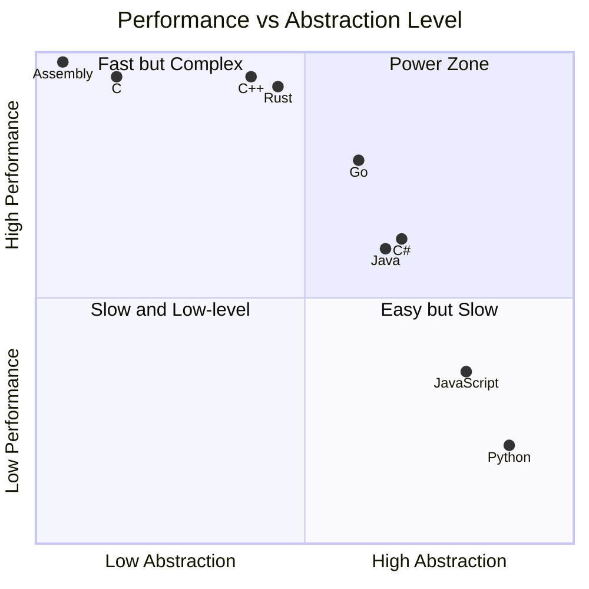

### Feature Comparison Matrix

| Feature | C | C++ | Rust | Java | Python |
|---------|---|-----|------|------|--------|
| Manual Memory | ✅ | ✅ | ✅ (ownership) | ❌ GC | ❌ GC |
| Zero-cost Abstractions | ⚠️ | ✅ | ✅ | ❌ | ❌ |
| OOP | ❌ | ✅ | ⚠️ traits | ✅ | ✅ |
| Templates/Generics | ❌ | ✅ | ✅ | ⚠️ erasure | ✅ duck |
| Compile-time Computation | ⚠️ | ✅ | ✅ | ❌ | ❌ |
| Operator Overloading | ❌ | ✅ | ✅ | ❌ | ✅ |
| Multiple Inheritance | ❌ | ✅ | ❌ | ❌ | ✅ |
| Undefined Behavior | ⚠️ | ⚠️ | ✅ safe | ❌ | ❌ |
| Package Manager | ❌ | ⚠️ vcpkg/conan | ✅ cargo | ✅ maven | ✅ pip |

---

## ✨ Modern C++ Features (C++11 → C++23)

### C++11 — The Revolution

```cpp
// auto type deduction
auto x = 42;
auto pi = 3.14159;

// Range-based for
for (const auto& elem : container) { ... }

// Lambda expressions
auto add = [](int a, int b) { return a + b; };
auto captured = [x, &y](int z) mutable { ... };

// Smart pointers
auto ptr = std::make_unique<MyClass>(args...);
auto shared = std::make_shared<Resource>();

// Move semantics
std::vector<std::string> v1 = buildLargeVector();
std::vector<std::string> v2 = std::move(v1); // O(1), no copy

// nullptr (replaces NULL)
int* p = nullptr;

// Variadic templates
template<typename... Args>
void log(Args&&... args) { (std::cout << ... << args); }
```

### C++17 — Practical Power

```cpp
// Structured bindings
auto [key, value] = *map.begin();
auto [x, y, z] = std::tuple{1, 2.0, "three"};

// if / switch with initializer
if (auto it = map.find(key); it != map.end()) {
    use(it->second);
}

// std::optional — represent nullable values safely
std::optional<int> divide(int a, int b) {
    if (b == 0) return std::nullopt;
    return a / b;
}

// std::variant — type-safe union
std::variant<int, float, std::string> val = "hello";
std::visit([](auto&& v) { std::cout << v; }, val);

// if constexpr — compile-time branching
template<typename T>
auto process(T val) {
    if constexpr (std::is_integral_v<T>) return val * 2;
    else return val + 0.5;
}
```

### C++20 — Paradigm Shift

```cpp
// Concepts — constrain templates expressively
template<typename T>
concept Addable = requires(T a, T b) { a + b; };

template<Addable T>
T sum(T a, T b) { return a + b; }

// Ranges — composable algorithms
auto result = numbers
    | std::views::filter([](int n) { return n % 2 == 0; })
    | std::views::transform([](int n) { return n * n; })
    | std::views::take(5);

// Coroutines — async/generator support
Generator<int> fibonacci() {
    int a = 0, b = 1;
    while (true) {
        co_yield a;
        std::tie(a, b) = std::pair{b, a + b};
    }
}

// std::format — Python-style string formatting
std::string s = std::format("Hello, {}! You are {} years old.", name, age);

// Three-way comparison operator <=>
auto result = (a <=> b); // returns strong/weak/partial ordering
```

---

## 📦 The STL Ecosystem

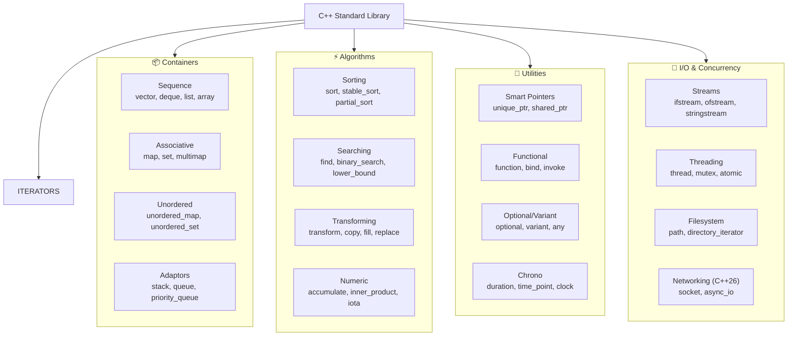

### Container Complexity Reference

| Container | Access | Insert Front | Insert Back | Insert Mid | Search |
|-----------|--------|-------------|-------------|------------|--------|
| `vector` | O(1) | O(n) | O(1) amort | O(n) | O(n) |
| `deque` | O(1) | O(1) | O(1) | O(n) | O(n) |
| `list` | O(n) | O(1) | O(1) | O(1)* | O(n) |
| `array` | O(1) | — | — | — | O(n) |
| `map` | O(log n) | — | — | O(log n) | O(log n) |
| `unordered_map` | O(1) avg | — | — | O(1) avg | O(1) avg |
| `set` | — | — | — | O(log n) | O(log n) |
| `priority_queue` | O(1) top | — | O(log n) | — | — |

*requires iterator*

---

## 🌍 Real-World Applications

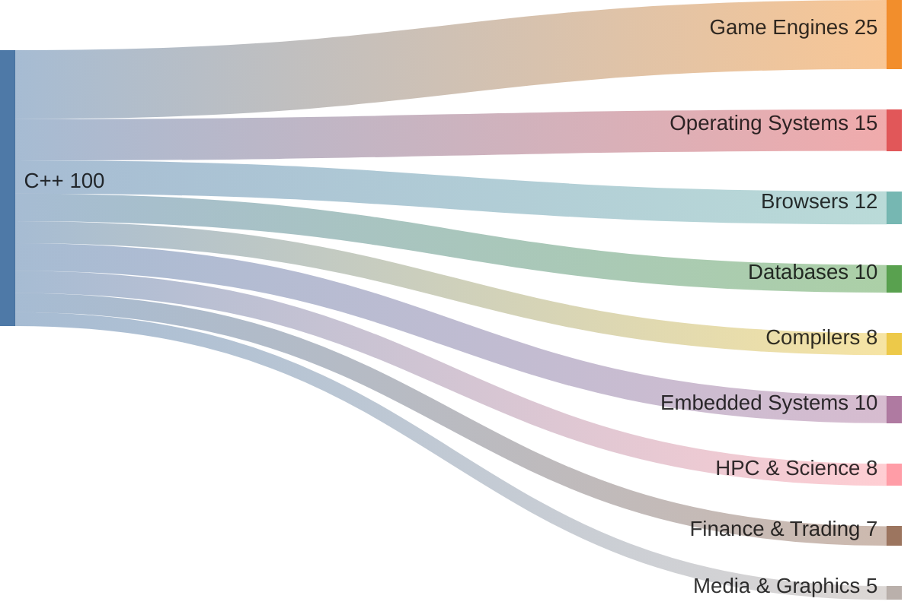

### Notable C++ Projects

| Category | Project | Details |
|----------|---------|---------|
| **Games** | Unreal Engine 5 | Powers AAA games — Fortnite, many more |
| **Games** | id Tech (DOOM, Quake) | Birth of FPS genre |
| **Browsers** | Google Chrome | V8 JS engine + rendering |
| **Browsers** | Mozilla Firefox | Gecko engine core |
| **OS** | Windows NT Kernel (partial) | Core subsystems |
| **Databases** | MySQL, MongoDB | Storage engines |
| **AI/ML** | TensorFlow, PyTorch | C++ backends |
| **Tools** | LLVM / Clang | Compiler infrastructure |
| **Tools** | CMake | Cross-platform build system |
| **HPC** | CERN ROOT | Particle physics data analysis |
| **Finance** | Bloomberg Terminal | Real-time financial data |
| **Space** | Mars Rover software | NASA JPL embedded systems |

---

## 📈 Performance Characteristics

### Benchmark Comparison (Relative to C)

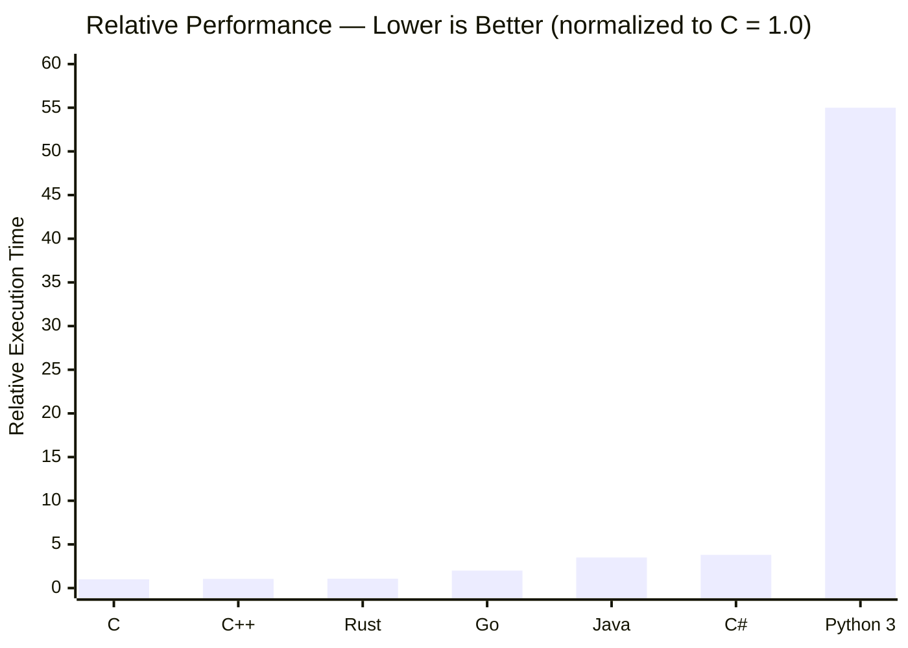

> *Note: Numbers are approximate and highly workload-dependent. For compute-intensive tasks, C++ often matches or beats C due to better optimizations enabled by stricter aliasing rules.*

### Memory Layout: AoS vs SoA

```
Array of Structs (AoS)           Structure of Arrays (SoA)
─────────────────────────        ──────────────────────────────
[x,y,z,w][x,y,z,w][x,y,z,w]    [x,x,x,x...][y,y,y,y...][z,z,z...]

❌ Poor cache usage for           ✅ Excellent cache usage for
   component-wise operations        component-wise operations
✅ Good for whole-object access  ❌ Poor for whole-object access
```

---

## 🗺️ Learning Roadmap

```mermaid
flowchart TD
    START([🚀 Start Here]) --> A

    subgraph FOUNDATION["📚 Phase 1 — Foundation (1-2 months)"]
        A["C Fundamentals\nVariables, control flow, functions, pointers"] --> B
        B["C++ Basics\nNamespaces, references, cin/cout, std::string"] --> C
        C["OOP Fundamentals\nClasses, constructors, destructors, access"] --> D
        D["STL Basics\nvector, string, map, algorithm header"]
    end

    subgraph INTERMEDIATE["⚙️ Phase 2 — Intermediate (2-4 months)"]
        E["Memory Management\nnew/delete, smart pointers, RAII"] --> F
        F["Templates\nFunction templates, class templates, specialization"] --> G
        G["Modern C++11/14/17\nauto, lambdas, move semantics, structured bindings"] --> H
        H["Error Handling\nExceptions, std::optional, std::expected"]
    end

    subgraph ADVANCED["🔥 Phase 3 — Advanced (4-8 months)"]
        I["Metaprogramming\nSFINAE, type traits, constexpr if"] --> J
        J["Concurrency\nthreads, mutex, atomic, condition_variable"] --> K
        K["Design Patterns\nCreational, structural, behavioral in C++"] --> L
        L["C++20 Features\nConcepts, ranges, coroutines, modules"]
    end

    subgraph EXPERT["💡 Phase 4 — Expert (ongoing)"]
        M["Compiler Internals\nABI, linkage, ODR, name mangling"] --> N
        N["Performance Engineering\nCache, SIMD, profiling, flamegraphs"] --> O
        O["Domain Specialization\nGame dev / HPC / Embedded / Systems"]
    end

    D --> E
    H --> I
    L --> M

    style START fill:#4a1a8c,color:#fff
    style FOUNDATION fill:#1a3a5c,color:#fff
    style INTERMEDIATE fill:#1a4a2c,color:#fff
    style ADVANCED fill:#4a2a1a,color:#fff
    style EXPERT fill:#4a1a1a,color:#fff
```

---

## 🎭 Common Paradigms

### RAII — Resource Acquisition Is Initialization

> The most important C++ idiom. Resources are tied to object lifetimes.

```
Constructor acquires → Object lives → Destructor releases
     open file              use                close file
     lock mutex           critical           unlock mutex
     alloc memory          section            free memory
```

### Rule of Zero / Three / Five

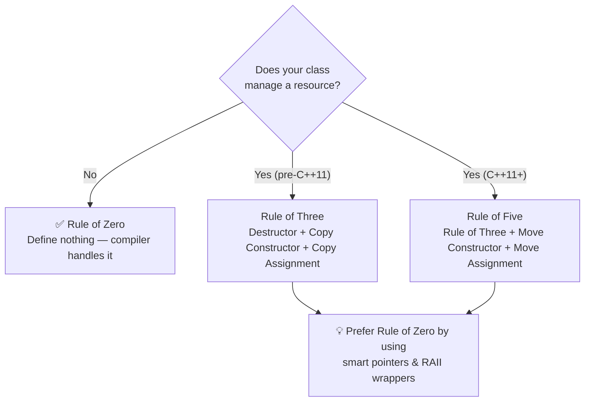

### The Big Four Design Principles

| Principle | Meaning in C++ |
|-----------|---------------|
| **DRY** | Templates, inheritance, lambdas — write once, use many types |
| **SOLID** | Classes with single responsibilities, open for extension, closed for modification |
| **RAII** | Constructors acquire, destructors release — no naked `new`/`delete` |
| **Zero Overhead** | Abstractions cost nothing you don't use — no hidden allocations or vtables unless needed |

---

## 🔬 Under the Hood: The vtable

When you declare a `virtual` function, C++ creates a **vtable** — a compile-time table of function pointers.

```
MyClass object in memory:
┌─────────────────────────────────┐
│ vptr ──────────────────────────►│  vtable:
│ member1                         │  ┌──────────────────────┐
│ member2                         │  │ &MyClass::speak()    │
│ member3                         │  │ &MyClass::draw()     │
│ ...                             │  │ &MyClass::~MyClass() │
└─────────────────────────────────┘  └──────────────────────┘
                                             │
                    Derived overrides? ───────┘ → points to Derived::speak()
```

This enables **runtime polymorphism** with a single pointer indirection overhead — usually negligible but measurable in tight loops.

---

## 🔧 Toolchain Reference

| Tool | Purpose | Command |
|------|---------|---------|
| `g++` | GNU Compiler | `g++ -std=c++23 -O2 main.cpp -o app` |
| `clang++` | LLVM Compiler | `clang++ -std=c++23 -Wall main.cpp -o app` |
| `cmake` | Build system | `cmake -B build && cmake --build build` |
| `gdb` | Debugger | `gdb ./app` |
| `valgrind` | Memory checker | `valgrind --leak-check=full ./app` |
| `perf` | Linux profiler | `perf stat ./app` |
| `clang-tidy` | Linter | `clang-tidy main.cpp` |
| `clang-format` | Formatter | `clang-format -i *.cpp` |
| `vcpkg` | Package manager | `vcpkg install boost` |
| `conan` | Package manager | `conan install .` |

---

## 📚 Essential Resources

| Resource | Type | Why Read It |
|----------|------|------------|
| *The C++ Programming Language* — Stroustrup | Book | The authoritative reference by the creator |
| *Effective Modern C++* — Scott Meyers | Book | Best practices for C++11/14 |
| *C++ Concurrency in Action* — Anthony Williams | Book | Threading and atomics mastery |
| [cppreference.com](https://cppreference.com) | Website | Best online API reference |
| [CppCon Talks](https://www.youtube.com/@CppCon) | Videos | Annual conference, cutting-edge talks |
| [Compiler Explorer](https://godbolt.org) | Tool | See your code as assembly in real time |
| [Quick C++ Benchmark](https://quick-bench.com) | Tool | Benchmark code snippets in browser |
| [C++ Insights](https://cppinsights.io) | Tool | See what the compiler really sees |

---

<div align="center">

---

```
Built with ❤️ and countless hours of template errors
by Saksham | github.com/Sakkkky
```

*"C++ isn't just a language — it's a discipline, a philosophy, and a direct line to the machine."*

[](https://github.com/Sakkkky)

</div>
