# C++ SUMMARY

# Table of Contents

1. Basic Input / Output
2. Streams
3. Data Types
4. Reserved Keywords
5. Control Structures
6. If-Else Statements
7. Switch Case
8. Arrays
9. Pointers and Arrays
10. Pointer Arithmetic
11. Common Mistakes
12. Quick Revision

---

# Basic Input and Output

C++ performs input and output using streams.

## Stream Architecture

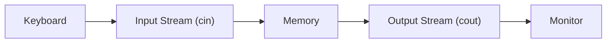

## Types of Streams

| Stream | Direction |
|----------|----------|
| Input Stream | Input Device → Memory |
| Output Stream | Memory → Output Device |

---

# Important Operators

| Operator | Name | Purpose |
|----------|------|------|
| << | Insertion Operator | Output |
| >> | Extraction Operator | Input |
| cout | Standard Output Object | Printing |
| cin | Standard Input Object | Runtime Input |
| endl | End Line | Newline + Flush |
| getline() | Input Function | String Input |

---

# Data Types

## Integer Types

| Type | Size | Signed Range |
|------|------|------|
| short | 2 Bytes | -32,768 to 32,767 |
| int | 4 Bytes | -2,147,483,648 to 2,147,483,647 |
| long | 4/8 Bytes | Platform dependent |
| long long | 8 Bytes | ±9.22 × 10^18 |

## Floating Types

| Type | Size | Precision |
|------|------|------|
| float | 4 Bytes | ~7 digits |
| double | 8 Bytes | ~15 digits |
| long double | 8-16 Bytes | Higher precision |

## Character Types

| Type | Size |
|------|------|
| char | 1 Byte |
| wchar_t | 2-4 Bytes |
| bool | 1 Byte |

---

# Complete Reserved Keywords

## Data Types

bool, char, int, short, long, float, double, void, signed, unsigned

## Control Statements

if, else, switch, case, default, break, continue, goto, return

## Loops

for, while, do

## OOP

class, struct, private, protected, public, friend, virtual, this

## Memory

new, delete

## Exception Handling

try, catch, throw

## Storage Classes

auto, register, static, extern, mutable

---

# Control Structures

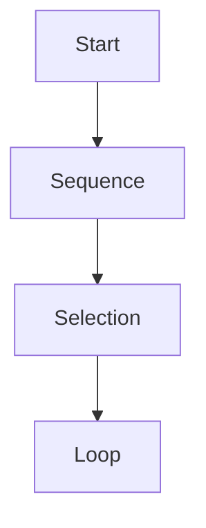

## Sequence Structure

Instructions execute one after another.

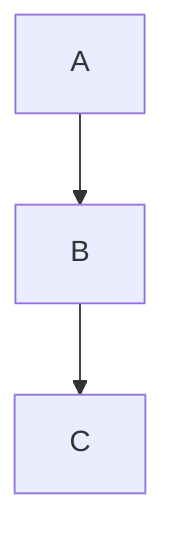

## Selection Structure

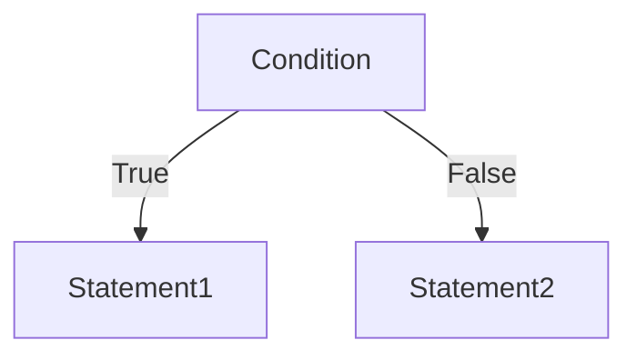

## Loop Structure

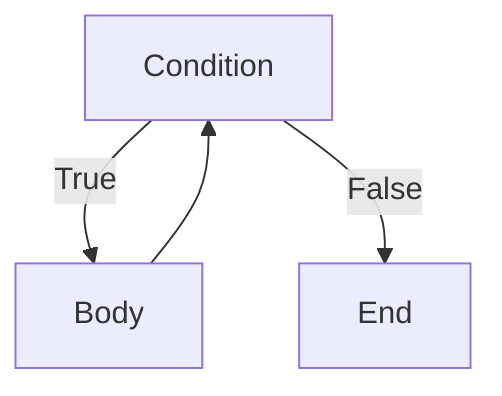

---

# If Else

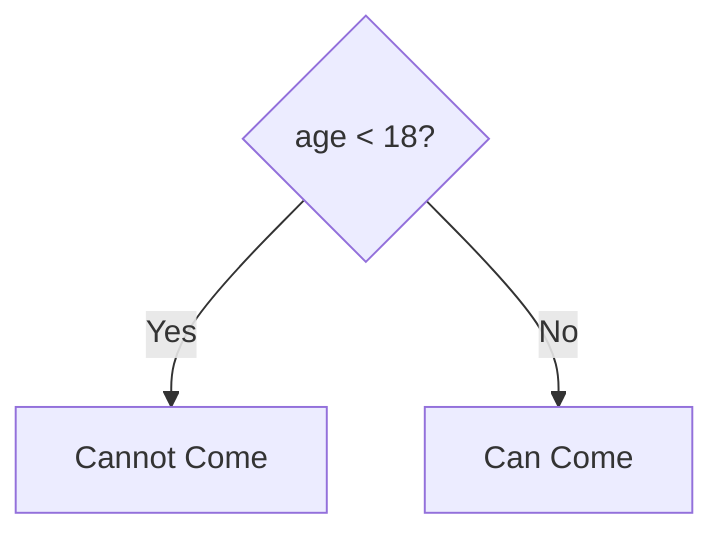

Multiple else-if statements may be used.

---

# Switch Case

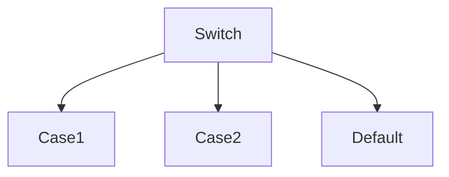

Break exits the switch block.

---

# Arrays

Array = Collection of same type stored in contiguous memory.

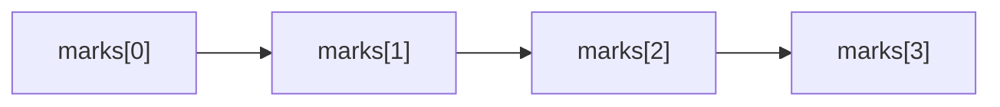

Properties:

- Fixed Size
- Contiguous Memory
- Index starts from 0

---

# Arrays and Loops

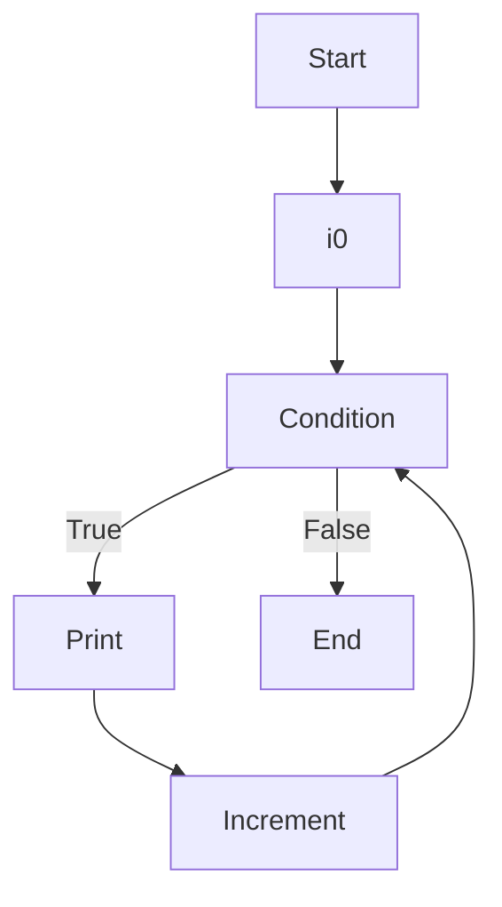

---

# Pointers and Arrays

Array name stores address of first element.

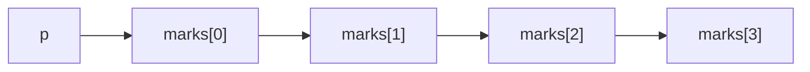

marks = address of marks[0]

---

# Pointer Arithmetic

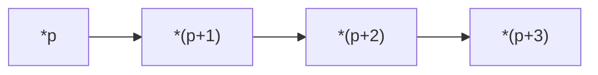

| Expression | Meaning |
|------------|---------|
| *p | First Element |
| *(p+1) | Second Element |
| *(p+2) | Third Element |
| *(p+3) | Fourth Element |

---

# Common Mistakes

❌ Using &marks

✔ marks already stores address of first element

❌ Accessing beyond array size

✔ Always stay within bounds

❌ Forgetting break in switch

✔ Use break to avoid fall-through

---

# Quick Revision

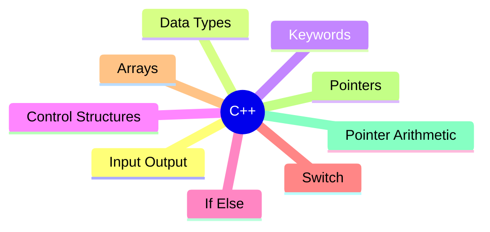

