# Object-Oriented Programming in C++

## Introduction

Object-Oriented Programming (OOP) is one of the most important paradigms in modern programming.

C++ was designed with the primary intention of extending C with Object-Oriented Programming features.

OOP helps in managing large and complex software systems by organizing programs around **objects** rather than functions.

---

# Why Object-Oriented Programming?

As the size of a program increases:

* Readability decreases
* Maintainability decreases
* Debugging becomes harder
* Data security becomes weaker

This was one of the major limitations of Procedural Programming Languages like C.

Since procedural programming mainly focuses on functions, the data was almost neglected and moved openly from function to function, making security difficult.

Object-Oriented Programming solves these problems by modeling programs as real-world entities.

---

# Real World Visualization

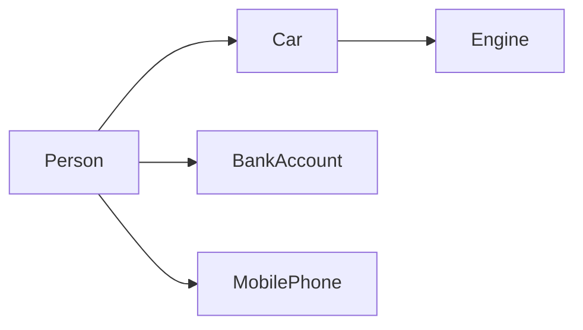

Everything in the real world is an object having:

* Properties (Data)
* Behaviors (Functions)

Similarly, OOP models software around objects.

---

# Procedure Oriented Programming vs Object-Oriented Programming

## Procedure Oriented Programming (POP)

### Characteristics

* Consists of writing instructions for the computer.
* Main focus is on functions.
* Data moves freely between functions.
* Uses local and global variables.
* Data security is weak.

### Visualization

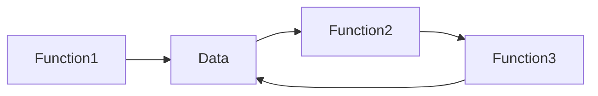

### Problems

* Large programs become difficult to manage.
* Debugging becomes complicated.
* Data is exposed to all functions.
* Low code reusability.

---

## Object-Oriented Programming (OOP)

### Characteristics

* Works on Classes and Objects.
* Treats data as a critical element.
* Wraps data and functions together.
* Promotes data hiding and security.
* Models real-world scenarios.

### Visualization

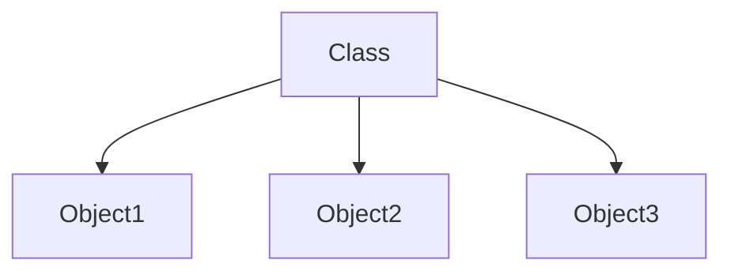

Objects contain both:

* Data
* Functions

---

# Difference Between POP and OOP

| Procedure Oriented Programming | Object-Oriented Programming |
| ------------------------------ | --------------------------- |
| Focuses on Functions           | Focuses on Objects          |
| Data moves freely              | Data is protected           |
| Less secure                    | More secure                 |
| Difficult for large programs   | Suitable for large projects |
| Less reusable                  | Highly reusable             |
| Top-down approach              | Bottom-up approach          |
| Data is global                 | Data is encapsulated        |

---

# Basic Concepts of Object-Oriented Programming

There are six major pillars of OOP:

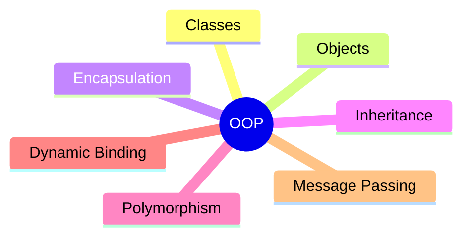

---

# 1. Classes

A class is a blueprint or template for creating objects.

It defines:

* Data members
* Member functions

### Visualization


Example:

```text
Class : Car

Properties:
- Color
- Speed
- Model

Functions:
- Start()
- Brake()
```

---

# 2. Objects

Objects are runtime entities created from classes.

### Visualization

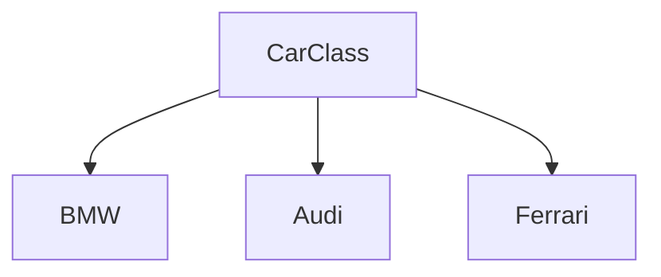

Each object has:

* Its own data
* Access to class functions

---

# 3. Encapsulation

Encapsulation means wrapping data and functions into a single unit.

It helps achieve:

* Data Hiding
* Security
* Better organization

### Visualization

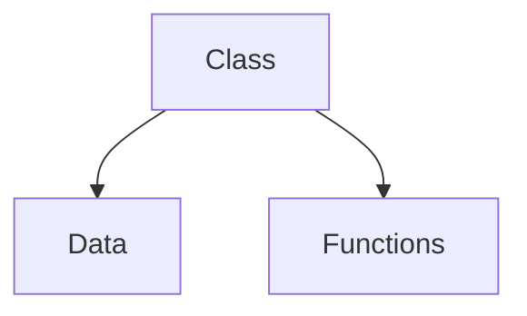

Example:

```text
Bank Account

Data:
- Balance

Functions:
- Deposit()
- Withdraw()
```

Users cannot directly access the balance.

---

# 4. Inheritance

Inheritance allows one class to acquire properties and functionalities of another class.

### Visualization

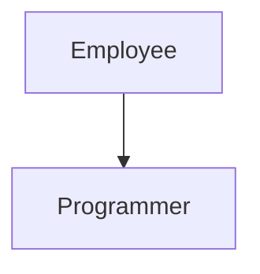

Benefits:

* Code Reusability
* Reduced Redundancy
* Easy Maintenance

---

# 5. Polymorphism

Polymorphism means "Many Forms".

A single interface can perform different tasks.

### Visualization

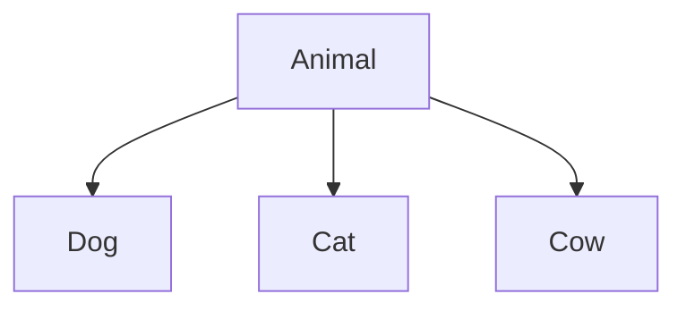

Each object can have different behavior.

Example:

```text
Speak()

Dog → Bark
Cat → Meow
Cow → Moo
```

---

# 6. Dynamic Binding

Dynamic Binding means the function to be executed is determined at runtime.

### Visualization

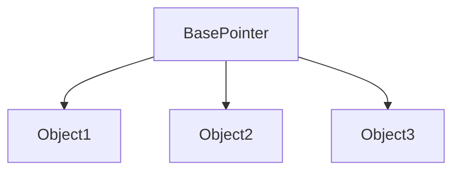

The compiler decides which function to execute while the program runs.

Used in:

* Runtime Polymorphism
* Virtual Functions

---

# 7. Message Passing

Objects communicate with each other by sending messages.

### Visualization

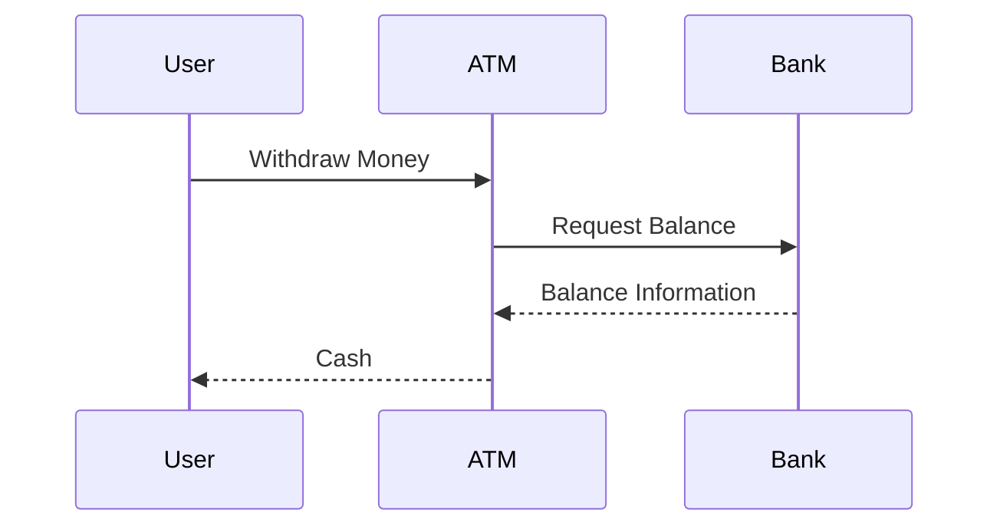

Information is exchanged through function calls.

---

# OOP Relationship

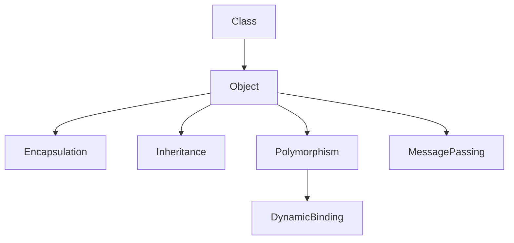

---

# Benefits of Object-Oriented Programming

## 1. Code Reusability

Inheritance allows reuse of existing code.

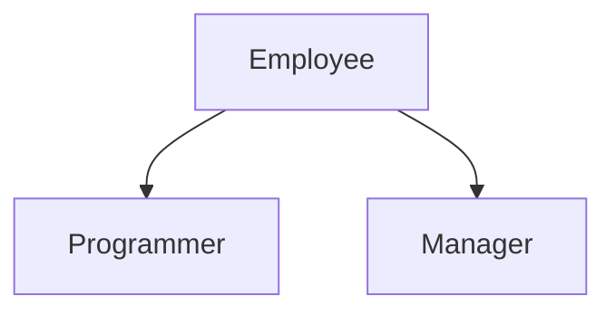

---

## 2. Data Security

Encapsulation and data hiding protect sensitive information.

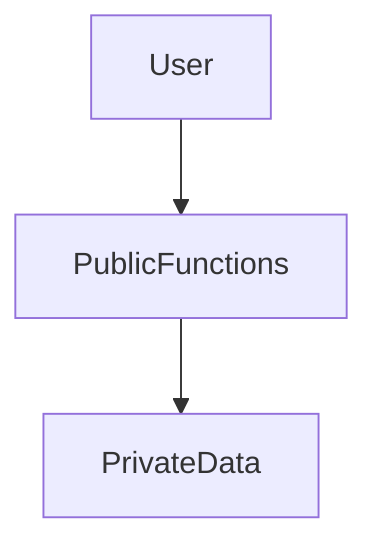

Users cannot directly modify private data.

---

## 3. Multiple Objects Can Coexist

Different objects work independently.

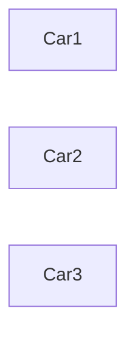

Each object maintains its own state.

---

## 4. Easier Software Management

Large projects can be divided into smaller classes.

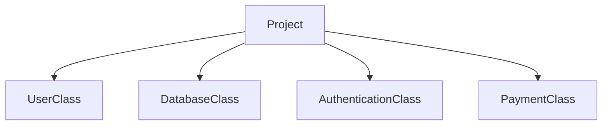

This makes development easier.

---

# POP vs OOP Summary

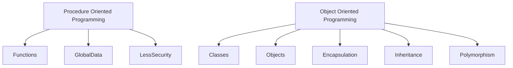

---

# One-Line Definition

> Object-Oriented Programming is a programming paradigm that organizes software around objects containing both data and functions, making programs reusable, secure, maintainable, and closer to real-world modeling.
