# Inheritance & Its Different Types in C++

## Inheritance in C++ - An Overview

Reusability is a very important feature of Object-Oriented Programming (OOP).

In C++, we can reuse an existing class and add additional features to it.

Reusing classes:

* Saves development time
* Saves money
* Reduces code duplication
* Improves maintainability
* Allows us to use already tested and debugged code

---

# What is Inheritance in C++?

The concept of reusability in C++ is supported using **Inheritance**.

Inheritance allows us to reuse the properties and functionalities of an existing class.

### Terminology

**Base Class**

* Existing class
* Parent class
* Super class

**Derived Class**

* New class
* Child class
* Sub class

The derived class acquires the properties and behaviors of the base class and can also add its own features.

---

# General Representation

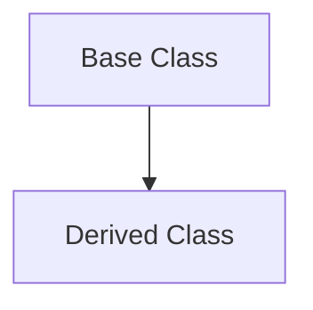

Example:

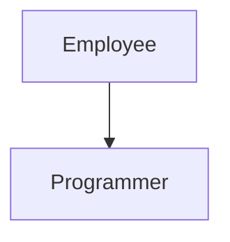

Here:

* Employee = Base Class
* Programmer = Derived Class

The Programmer class can use Employee's features and also add new ones.

---

# Why Use Inheritance?

### Without Inheritance

```text
Employee
 ├─ Name
 ├─ Salary
 └─ ID

Programmer
 ├─ Name
 ├─ Salary
 ├─ ID
 └─ Language

Manager
 ├─ Name
 ├─ Salary
 ├─ ID
 └─ Team
```

Notice that Name, Salary, and ID are repeated.

### With Inheritance

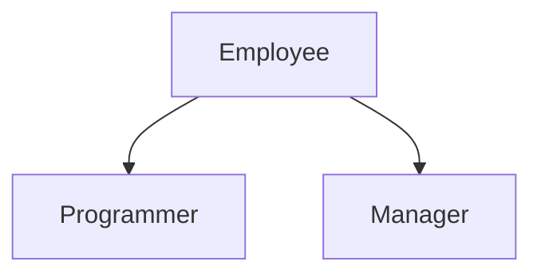

Now Programmer and Manager automatically get Employee's features.

---

# Forms of Inheritance in C++

There are five major types of inheritance:

1. Single Inheritance
2. Multiple Inheritance
3. Hierarchical Inheritance
4. Multilevel Inheritance
5. Hybrid Inheritance

---

# 1. Single Inheritance

Single inheritance is a type of inheritance in which a derived class inherits from only one base class.

Example:

We have two classes:

* Employee
* Programmer

Programmer inherits Employee.

## Visual Representation


### Explanation

Employee contains:

* Name
* Salary
* ID

Programmer contains:

* All Employee features
* Programming Language
* Coding Functions

Therefore Programmer can access Employee's functionalities.

---

# 2. Multiple Inheritance

Multiple inheritance is a type of inheritance in which one derived class inherits from more than one base class.

Example:

We have:

* Employee
* Assistant
* Programmer

Programmer inherits both Employee and Assistant.

## Visual Representation

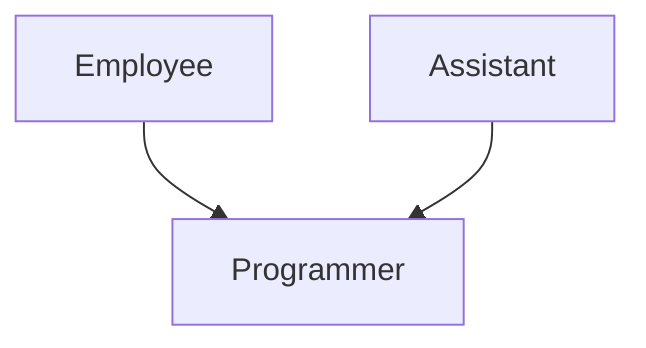

### Explanation

Employee provides:

* Salary
* Employee Details

Assistant provides:

* Office Management Features

Programmer receives:

* Employee Features
* Assistant Features
* Programmer Features

Thus Programmer can use functionalities from both classes.

---

# 3. Hierarchical Inheritance

Hierarchical inheritance is a type of inheritance in which multiple derived classes inherit from a single base class.

Example:

We have:

* Employee
* Programmer
* Manager

Programmer and Manager inherit Employee.

## Visual Representation


### Explanation

Employee contains common data:

* Name
* Salary
* ID

Programmer gets:

* Employee Features
* Coding Features

Manager gets:

* Employee Features
* Team Management Features

Both classes reuse Employee's code.

---

# 4. Multilevel Inheritance

Multilevel inheritance is a type of inheritance in which a derived class becomes the base class for another class.

Example:

We have:

* Animal
* Mammal
* Cow

Mammal inherits Animal.

Cow inherits Mammal.

## Visual Representation

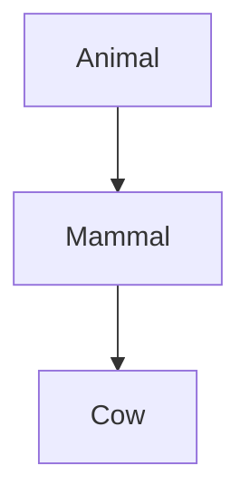

### Feature Flow


### Explanation

Animal provides:

* Eat()
* Sleep()

Mammal provides:

* GiveBirth()

Cow provides:

* ProduceMilk()

Cow can access:

* Animal Features
* Mammal Features
* Cow Features

---

# 5. Hybrid Inheritance

Hybrid inheritance is a combination of multiple inheritance and multilevel inheritance.

Example:

We have:

* Animal
* Mammal
* Bird
* Bat

Mammal inherits Animal.

Bird inherits Animal.

Bat inherits Mammal and Bird.

## Visual Representation

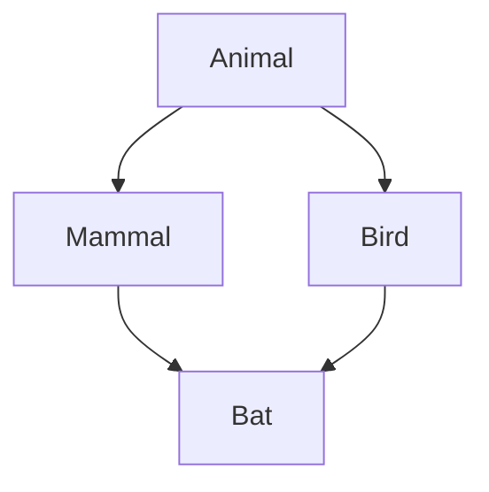

### Explanation

Mammal gets Animal features.

Bird gets Animal features.

Bat gets:

* Mammal Features
* Bird Features
* Animal Features

This combines:

* Hierarchical Inheritance
* Multiple Inheritance

Hence it is called Hybrid Inheritance.

---

# Diamond Problem

One common problem in Hybrid Inheritance is the Diamond Problem.

## Diagram


Bat receives Animal through:

1. Mammal
2. Bird

This may create ambiguity because Bat receives two copies of Animal.

### Solution

Use Virtual Base Classes.

Example:

```cpp
class Mammal : virtual public Animal
{
};

class Bird : virtual public Animal
{
};
```

Now only one copy of Animal exists.

---

# Quick Revision Diagram

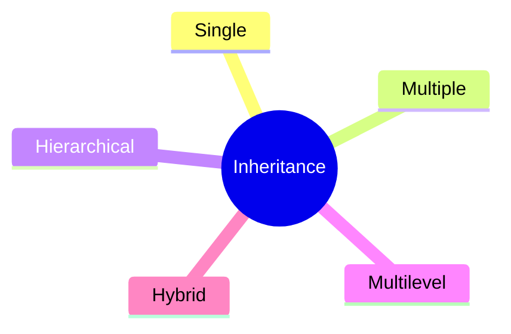

---

# Summary

### Single Inheritance


One Parent → One Child

---

### Multiple Inheritance

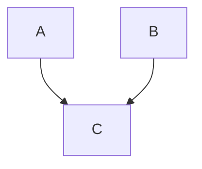

Many Parents → One Child

---

### Hierarchical Inheritance

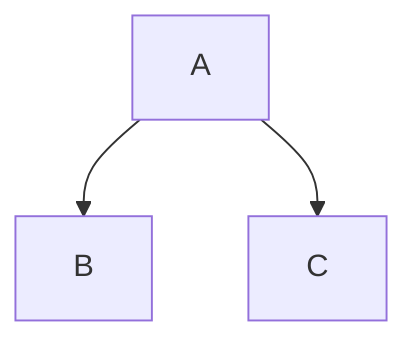

One Parent → Many Children

---

### Multilevel Inheritance

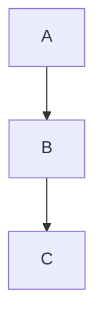

Grandparent → Parent → Child

---

### Hybrid Inheritance

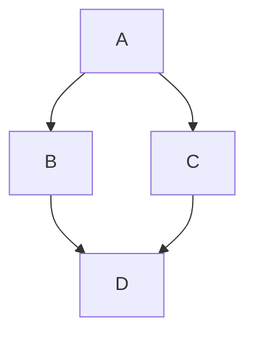

Combination of Multiple Types

---

# One-Line Definition

Inheritance is an OOP feature that allows one class to acquire the properties and behaviors of another class, promoting code reusability and creating parent-child relationships between classes.
