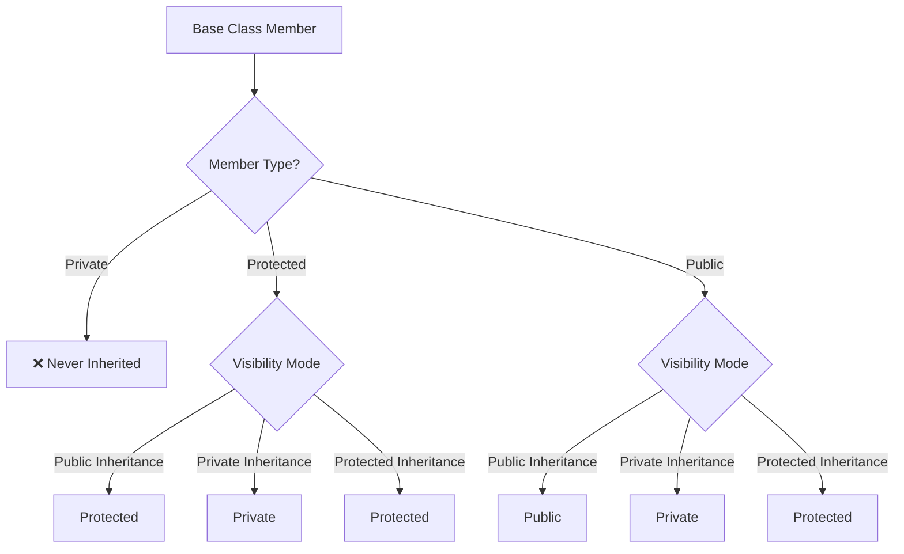
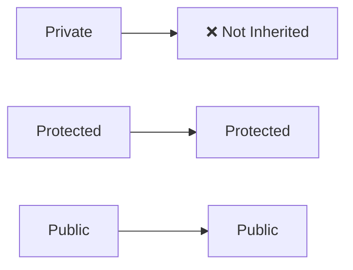
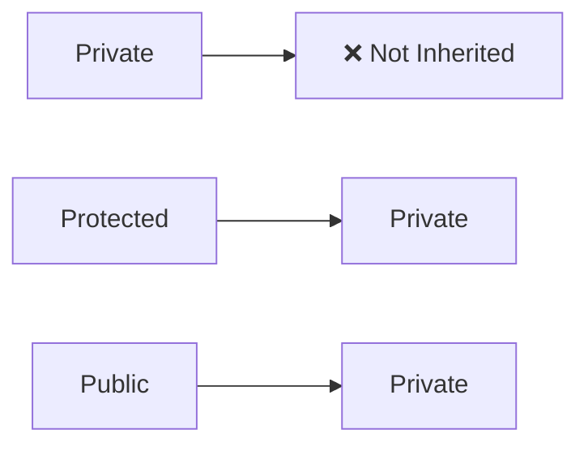
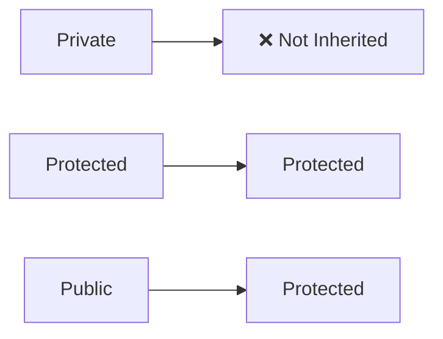

# 🔐 Visibility Modes in C++ Inheritance

---

# 📚 Introduction

When inheritance takes place in C++, the access specifiers (`public`, `protected`, `private`) of the base class members may change depending on the **visibility mode** used during derivation.

Understanding visibility modes is one of the most important concepts in Object-Oriented Programming.

---

# 🎯 General Syntax

```cpp
class Derived : visibility_mode Base {
    // ...
};
```

Example:

```cpp
class Derived : public Base {};
class Derived : private Base {};
class Derived : protected Base {};
```

---

# 🧠 Visibility Mode Table

| Base Class Members | Public Derivation | Private Derivation | Protected Derivation |
| :----------------- | :---------------: | :----------------: | :------------------: |
| **Private**        |  ❌ Not Inherited  |   ❌ Not Inherited  |    ❌ Not Inherited   |
| **Protected**      |    🟡 Protected   |     🔴 Private     |     🟡 Protected     |
| **Public**         |     🟢 Public     |     🔴 Private     |     🟡 Protected     |

---

# 📊 Visual Representation

```text
                VISIBILITY MODE

                 PUBLIC
                     |
        ----------------------------
        |                          |
 Protected → Protected      Public → Public


                 PRIVATE
                     |
        ----------------------------
        |                          |
 Protected → Private        Public → Private


                PROTECTED
                     |
        ----------------------------
        |                          |
 Protected → Protected     Public → Protected


Private Members
       ↓
❌ Never Inherited
```

---

# 🔥 The Golden Rule

> Private members are NEVER inherited.

No matter whether inheritance is:

* Public
* Private
* Protected

Private members of the base class are inaccessible directly inside the derived class.

---

# 🌳 Flowchart



---

# 🎨 Public Derivation

```cpp
class Derived : public Base {};
```

## Transformation

```text
Base Class               Derived Class
--------------------------------------
Private        ----->     ❌ Not inherited
Protected      ----->     Protected
Public         ----->     Public
```

### Mermaid Diagram



---

# 🎨 Private Derivation

```cpp
class Derived : private Base {};
```

## Transformation

```text
Base Class               Derived Class
--------------------------------------
Private        ----->     ❌ Not inherited
Protected      ----->     Private
Public         ----->     Private
```

### Mermaid Diagram



---

# 🎨 Protected Derivation

```cpp
class Derived : protected Base {};
```

## Transformation

```text
Base Class               Derived Class
--------------------------------------
Private        ----->     ❌ Not inherited
Protected      ----->     Protected
Public         ----->     Protected
```

### Mermaid Diagram



---

# ⚔️ Private vs Protected

| Feature                       | Private | Protected |
| ----------------------------- | ------- | --------- |
| Accessible inside class       | ✅ Yes   | ✅ Yes     |
| Accessible by derived classes | ❌ No    | ✅ Yes     |
| Accessible outside class      | ❌ No    | ❌ No      |

---

# 📌 Difference Explained

## Private Members

```cpp
class Base{
private:
    int x;
};
```

Derived class cannot directly access `x`.

```cpp
class Derived : public Base{
    // x is inaccessible
};
```

---

## Protected Members

```cpp
class Base{
protected:
    int y;
};
```

Derived class can access `y`.

```cpp
class Derived : public Base{
public:
    void display(){
        y = 10;
    }
};
```

---

# 🧠 Memory Tricks

## Rule #1

> Private is always NOT inherited.

```text
Private
    ↓
❌ Never inherited
```

---

## Rule #2

Protected members depend on visibility mode.

```text
Protected members

Public Derivation
      ↓
Protected

Private Derivation
      ↓
Private

Protected Derivation
      ↓
Protected
```

---

## Rule #3

Public members follow the visibility mode.

```text
Public members

Public Derivation
      ↓
Public

Private Derivation
      ↓
Private

Protected Derivation
      ↓
Protected
```

---

# 🧩 Ultimate Shortcut

```text
PRIVATE
↓
Never inherited

PROTECTED
↓
Protected → Private → Protected

PUBLIC
↓
Public → Private → Protected
```

---

# 🌟 Master Formula

```text
Visibility Mode Controls Public Members

Public Inheritance
------------------
Public → Public
Protected → Protected

Private Inheritance
-------------------
Public → Private
Protected → Private

Protected Inheritance
---------------------
Public → Protected
Protected → Protected

Private Members
---------------
Never Inherited
```

---

# 🚀 One-Line Summary

> Private members are never inherited, while public and protected members change according to the visibility mode used during inheritance.
