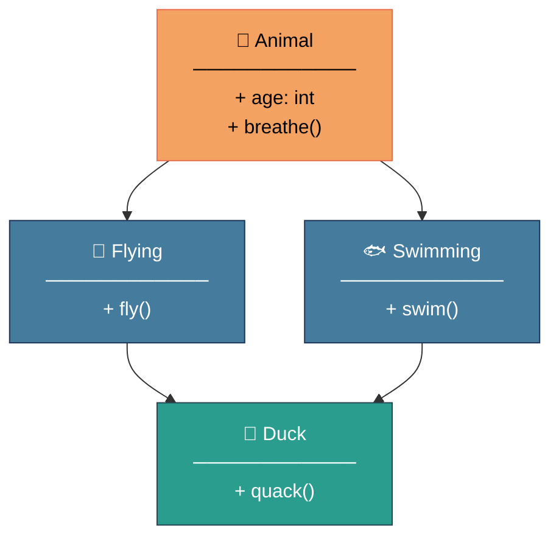
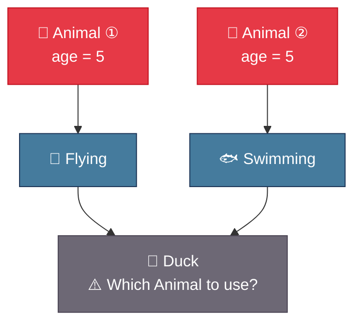
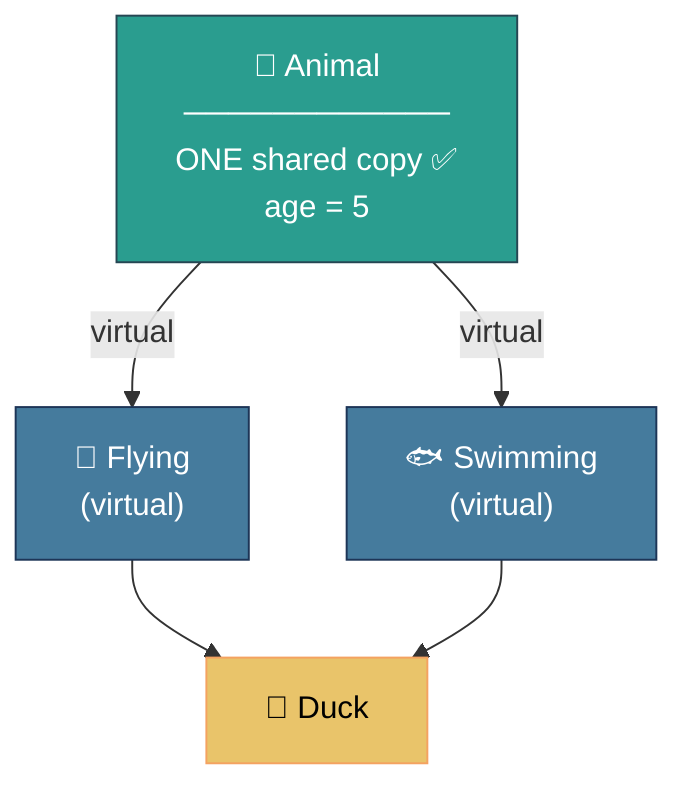
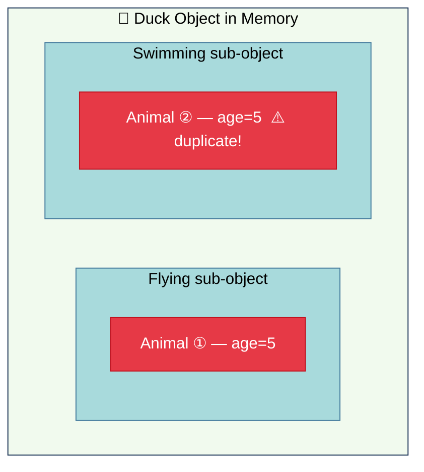
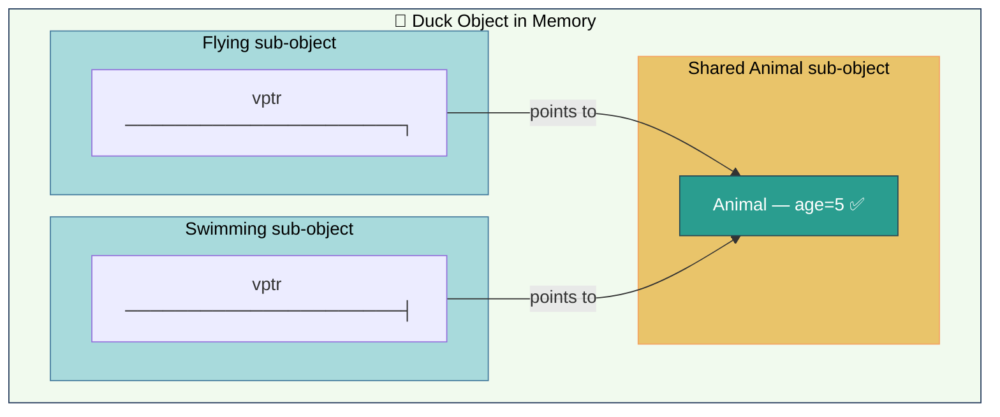
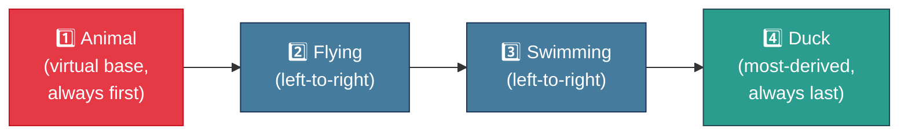
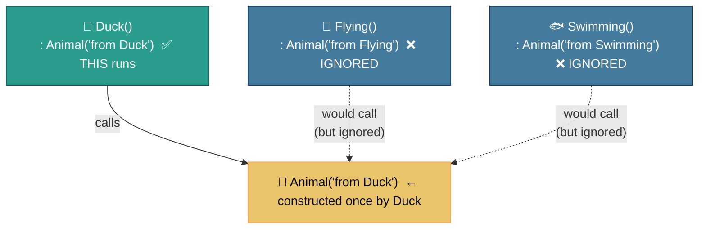
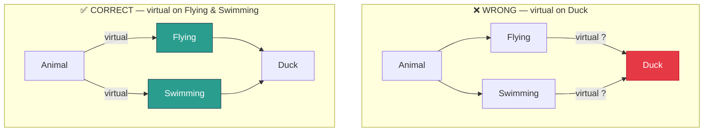
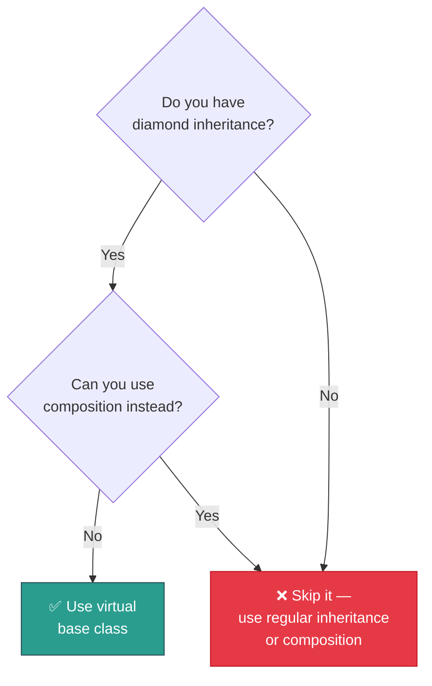
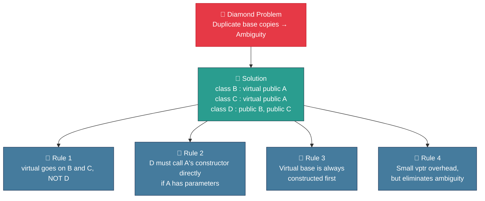

# 🧬 Virtual Base Classes in C++

> A beginner-friendly guide to understanding one of C++'s most important (and misunderstood) features.

---

## 📋 Table of Contents

- [The Problem — Diamond Inheritance](#the-problem--diamond-inheritance)
- [What is a Virtual Base Class?](#what-is-a-virtual-base-class)
- [Syntax](#syntax)
- [How It Works Internally](#how-it-works-internally)
- [Constructor Order](#constructor-order)
- [Quick Comparison](#quick-comparison)
- [Common Mistakes](#common-mistakes)
- [When Should You Use It?](#when-should-you-use-it)
- [Summary](#summary)

---

## The Problem — Diamond Inheritance

Imagine you're building a game. You have a base `Animal` class, and two classes `Flying` and `Swimming` that inherit from it. Then you want a `Duck` that can do both:



In code, this looks like:

```cpp
class Animal {
public:
    int age = 5;
    void breathe() { cout << "Breathing..." << endl; }
};

class Flying : public Animal { };
class Swimming : public Animal { };

class Duck : public Flying, public Swimming { };
```

Now when you do this:

```cpp
Duck duck;
duck.breathe();   // ❌ ERROR: ambiguous!
cout << duck.age; // ❌ ERROR: which 'age'? Flying's or Swimming's?
```

### Why does this happen?

Without virtual inheritance, `Duck` gets **two separate copies** of `Animal` — one from `Flying` and one from `Swimming`:



This is called the **Diamond Problem** 💎 — and virtual base classes are the solution.

---

## What is a Virtual Base Class?

A **virtual base class** tells the compiler:

> "No matter how many paths lead to this base class, include it **only once** in the final object."



Both `Flying` and `Swimming` now share the **same single** `Animal` instance inside `Duck`.

---

## Syntax

The keyword `virtual` goes in the **intermediate classes** (not in `Duck`):

```cpp
class Animal {
public:
    int age = 5;
    void breathe() { cout << "Breathing..." << endl; }
};

//          👇 add 'virtual' here
class Flying : virtual public Animal { };
class Swimming : virtual public Animal { };

// Duck stays the same — no changes needed here
class Duck : public Flying, public Swimming { };
```

Now everything works:

```cpp
Duck duck;
duck.breathe();    // ✅ No ambiguity
cout << duck.age;  // ✅ Only one 'age' exists
```

---

## How It Works Internally

### ❌ Without `virtual` — Two copies of Animal



### ✅ With `virtual` — One shared Animal



The compiler uses a **virtual table pointer (vptr)** so both `Flying` and `Swimming` point to the same `Animal` — no duplicates.

---

## Constructor Order

With virtual base classes, construction order is **well-defined**:



```cpp
class Animal   { public: Animal()   { cout << "1. Animal constructed\n";   } };
class Flying   : virtual public Animal { public: Flying()   { cout << "2. Flying constructed\n";   } };
class Swimming : virtual public Animal { public: Swimming() { cout << "3. Swimming constructed\n"; } };
class Duck     : public Flying, public Swimming { public: Duck() { cout << "4. Duck constructed\n"; } };

int main() {
    Duck d;
}
```

Output:
```
1. Animal constructed   ← virtual base, always first
2. Flying constructed
3. Swimming constructed
4. Duck constructed
```

### ⚠️ Important: Most-Derived Class Owns the Virtual Base Constructor



```cpp
class Duck : public Flying, public Swimming {
public:
    Duck() : Animal("from Duck") { }  // Duck must call Animal's constructor directly
};
```

---

## Quick Comparison

| Feature | Without `virtual` | With `virtual` |
|---|---|---|
| Copies of base class | Multiple (one per path) | Single shared copy |
| Ambiguity errors | Yes ❌ | No ✅ |
| Memory size | Larger (duplicate data) | Slightly larger (vptr added) |
| Constructor responsibility | Each intermediate class | Most-derived class |
| Performance | Slightly faster | Tiny vptr lookup overhead |

---

## Common Mistakes

### ❌ Mistake 1 — `virtual` on the wrong class



```cpp
// ❌ WRONG
class Duck : virtual public Flying, virtual public Swimming { };

// ✅ CORRECT
class Flying   : virtual public Animal { };
class Swimming : virtual public Animal { };
class Duck     : public Flying, public Swimming { };
```

### ❌ Mistake 2 — Forgetting to initialize virtual base in most-derived class

```cpp
class Animal {
public:
    Animal(int age) : age(age) { }  // no default constructor!
    int age;
};

class Flying : virtual public Animal {
public:
    Flying() : Animal(0) { }
};

class Duck : public Flying {
public:
    Duck() { }  // ❌ won't compile — Animal(int) has no default!
};
```

**Fix:**

```cpp
class Duck : public Flying {
public:
    Duck() : Animal(5) { }  // ✅ Duck must initialize Animal directly
};
```

### ❌ Mistake 3 — Using it when you don't need it

Virtual inheritance adds complexity. Only reach for it when you actually have a diamond-shaped hierarchy. For simple chains (`A → B → C`), it's unnecessary overhead.

---

## When Should You Use It?



> 💡 **Pro Tip:** In modern C++, deep inheritance hierarchies are often a design smell. Prefer **composition** (objects as members) over complex inheritance when possible.

---

## Summary



---

## Full Working Example

```cpp
#include <iostream>
#include <string>
using namespace std;

class Animal {
public:
    string name;
    Animal(string n) : name(n) {
        cout << "[Animal] " << name << " created\n";
    }
    void breathe() { cout << name << " is breathing\n"; }
};

class Flying : virtual public Animal {
public:
    Flying() : Animal("") { }
    void fly() { cout << name << " is flying!\n"; }
};

class Swimming : virtual public Animal {
public:
    Swimming() : Animal("") { }
    void swim() { cout << name << " is swimming!\n"; }
};

class Duck : public Flying, public Swimming {
public:
    Duck(string n) : Animal(n) { }  // Duck owns Animal's initialization
};

int main() {
    Duck donald("Donald");
    donald.breathe();  // ✅ no ambiguity
    donald.fly();
    donald.swim();
    return 0;
}
```

Output:
```
[Animal] Donald created
Donald is breathing
Donald is flying!
Donald is swimming!
```

---

*Happy coding! 🦆 If this helped, consider starring the repo.*
