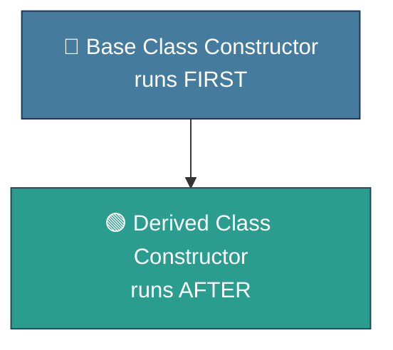
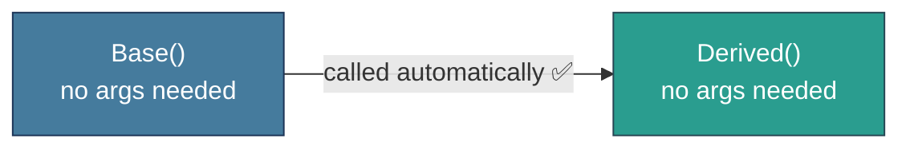
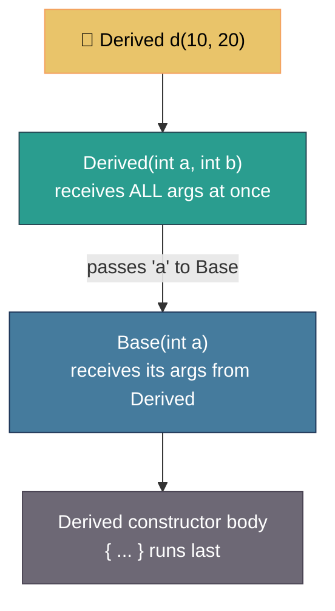
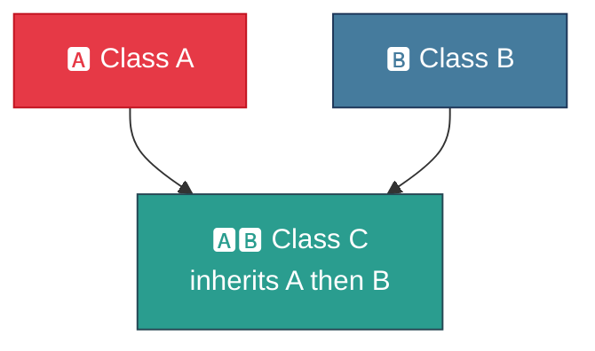
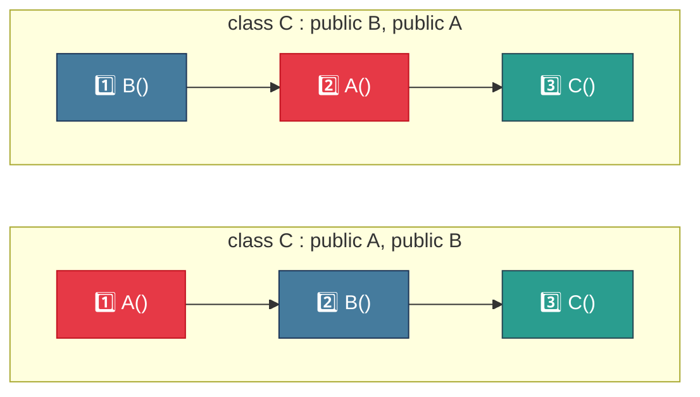
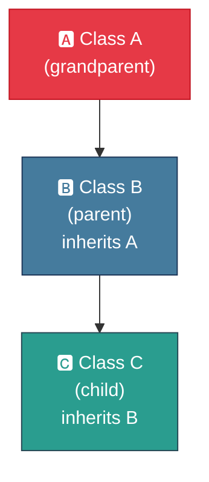
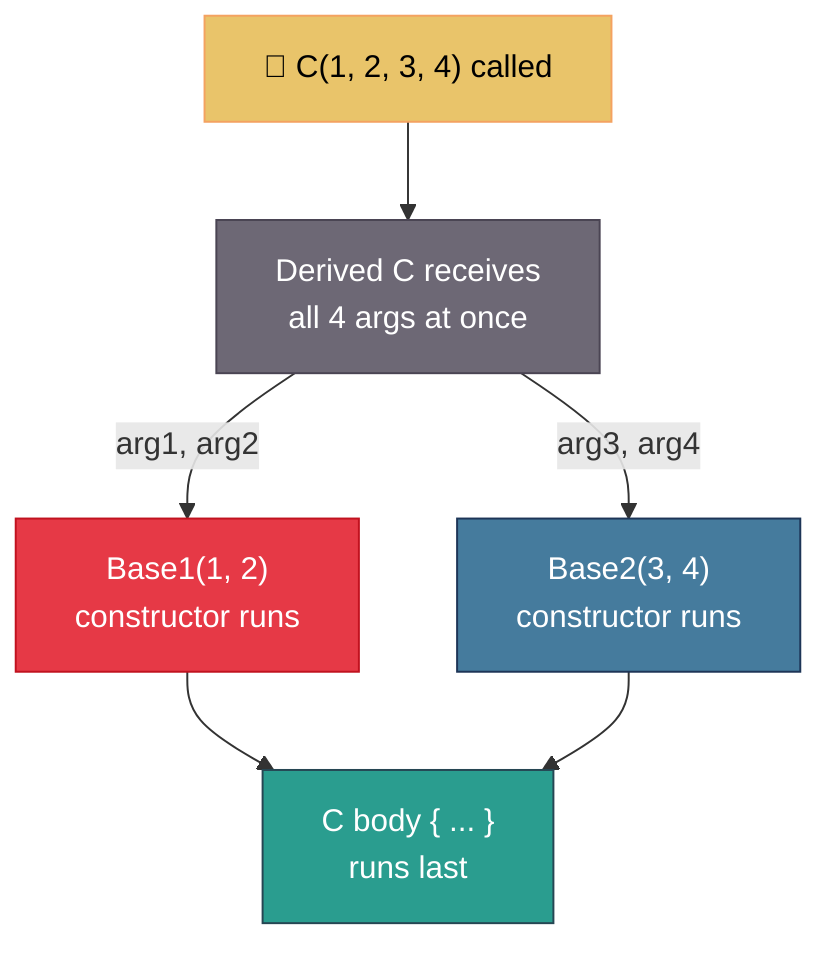
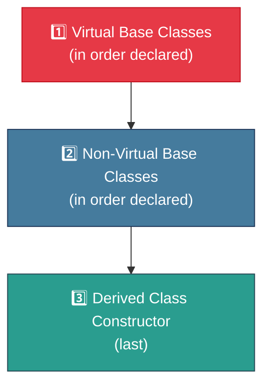
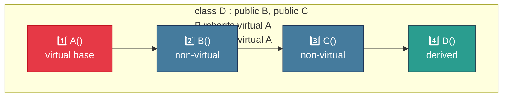
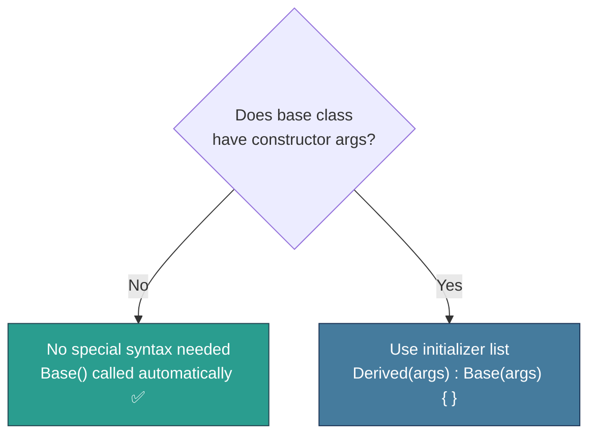

# 🏗️ Constructors in Derived Classes in C++

> A beginner-friendly guide to understanding how constructors work across inheritance hierarchies.

---

## 📋 Table of Contents

- [What Are Constructors in Derived Classes?](#what-are-constructors-in-derived-classes)
- [Case 1 — Base Class Has No Arguments](#case-1--base-class-has-no-arguments)
- [Case 2 — Base Class Has Arguments](#case-2--base-class-has-arguments)
- [Constructors in Multiple Inheritance](#constructors-in-multiple-inheritance)
- [Constructors in Multilevel Inheritance](#constructors-in-multilevel-inheritance)
- [Special Syntax for Passing Arguments](#special-syntax-for-passing-arguments)
- [Special Case — Virtual Base Class](#special-case--virtual-base-class)
- [Quick Summary](#quick-summary)

---

## What Are Constructors in Derived Classes?

When a class inherits from another, constructors are chained — the **base class constructor always runs before the derived class constructor**.



The key rules depend on whether the base class constructor takes **arguments or not**.

---

## Case 1 — Base Class Has No Arguments

If the base class constructor has **no parameters**, the derived class doesn't need to do anything special. C++ calls the base constructor automatically.



```cpp
#include <iostream>
using namespace std;

class Base {
public:
    Base() {
        cout << "Base constructor called\n";
    }
};

class Derived : public Base {
public:
    Derived() {
        // Base() is called automatically — no special syntax needed
        cout << "Derived constructor called\n";
    }
};

int main() {
    Derived d;
    return 0;
}
```

Output:
```
Base constructor called
Derived constructor called
```

---

## Case 2 — Base Class Has Arguments

If the base class constructor **requires arguments**, the derived class **must explicitly pass them** using an initializer list.



```cpp
#include <iostream>
using namespace std;

class Base {
public:
    int x;
    Base(int a) : x(a) {
        cout << "Base constructor: x = " << x << "\n";
    }
};

class Derived : public Base {
public:
    int y;
    //              👇 pass 'a' up to Base
    Derived(int a, int b) : Base(a), y(b) {
        cout << "Derived constructor: y = " << y << "\n";
    }
};

int main() {
    Derived d(10, 20);
    return 0;
}
```

Output:
```
Base constructor: x = 10
Derived constructor: y = 20
```

> 💡 **Key Rule:** The derived class receives **all arguments at once**, then passes the relevant ones to the base class via the initializer list. The body of the derived constructor runs only after the base constructor finishes.

---

## Constructors in Multiple Inheritance

When a class inherits from **multiple base classes**, constructors are called in the **order the base classes are declared**.



### Order depends on declaration — not the initializer list!



```cpp
#include <iostream>
using namespace std;

class A {
public:
    A() { cout << "Constructor A\n"; }
};

class B {
public:
    B() { cout << "Constructor B\n"; }
};

// A is listed before B → A's constructor runs first
class C : public A, public B {
public:
    C() { cout << "Constructor C\n"; }
};

int main() {
    C obj;
    return 0;
}
```

Output:
```
Constructor A    ← listed first
Constructor B    ← listed second
Constructor C    ← derived, always last
```

> ⚠️ **Watch out:** The order in the **class declaration** (`class C : public A, public B`) controls execution order — not the order in `C`'s initializer list.

---

## Constructors in Multilevel Inheritance

In multilevel inheritance (a chain: `A → B → C`), constructors are called from the **topmost base down to the most derived**.




```cpp
#include <iostream>
using namespace std;

class A {
public:
    A() { cout << "Constructor A (grandparent)\n"; }
};

class B : public A {
public:
    B() { cout << "Constructor B (parent)\n"; }
};

class C : public B {
public:
    C() { cout << "Constructor C (child)\n"; }
};

int main() {
    C obj;
    return 0;
}
```

Output:
```
Constructor A (grandparent)   ← top of chain
Constructor B (parent)
Constructor C (child)         ← bottom of chain
```

---

## Special Syntax for Passing Arguments

C++ provides a clean syntax for passing arguments to **multiple base classes at once**.

### Syntax

```cpp
DerivedConstructor(arg1, arg2, arg3, ...) : Base1Constructor(arg1, arg2), Base2Constructor(arg3, arg4)
{
    // body runs after ALL base constructors finish
}
```



```cpp
#include <iostream>
using namespace std;

class Base1 {
public:
    int x;
    Base1(int a) : x(a) {
        cout << "Base1 constructor: x = " << x << "\n";
    }
};

class Base2 {
public:
    int y;
    Base2(int b) : y(b) {
        cout << "Base2 constructor: y = " << y << "\n";
    }
};

class Derived : public Base1, public Base2 {
public:
    int z;
    //            receives all args 👇       passes them 👇
    Derived(int a, int b, int c) : Base1(a), Base2(b), z(c) {
        cout << "Derived constructor: z = " << z << "\n";
    }
};

int main() {
    Derived d(10, 20, 30);
    return 0;
}
```

Output:
```
Base1 constructor: x = 10
Base2 constructor: y = 20
Derived constructor: z = 30
```

---

## Special Case — Virtual Base Class

When **virtual base classes** are involved, the constructor order changes:



### Rules:
- **Virtual base classes** are always constructed **before** non-virtual base classes
- If there are **multiple virtual bases**, they are constructed in **declaration order**
- **Non-virtual base classes** are constructed next
- Finally, the **derived class** constructor body runs



```cpp
#include <iostream>
using namespace std;

class A {
public:
    A() { cout << "1. Virtual Base A\n"; }
};

class B : virtual public A {
public:
    B() { cout << "2. Class B (non-virtual)\n"; }
};

class C : virtual public A {
public:
    C() { cout << "3. Class C (non-virtual)\n"; }
};

class D : public B, public C {
public:
    D() { cout << "4. Derived Class D\n"; }
};

int main() {
    D obj;
    return 0;
}
```

Output:
```
1. Virtual Base A       ← virtual base, always first
2. Class B (non-virtual)
3. Class C (non-virtual)
4. Derived Class D      ← always last
```

---

## Quick Summary



| Scenario | Constructor Execution Order |
|---|---|
| Simple inheritance | Base → Derived |
| Multiple inheritance | Base1 → Base2 → Derived *(declaration order)* |
| Multilevel inheritance | Grandparent → Parent → Child |
| With virtual base | Virtual Base → Non-virtual Bases → Derived |

### Key Takeaways

- 🔵 **Base constructor always runs before derived** — no exceptions
- 📋 **In multiple inheritance**, order = declaration order in the class header
- 🔗 **In multilevel inheritance**, constructors chain from top to bottom
- 📨 **Derived class receives all args**, then distributes them via initializer list
- ⚡ **Virtual base classes** jump to the front of the construction queue

---

*Happy coding! 🏗️ If this helped, consider starring the repo.*
