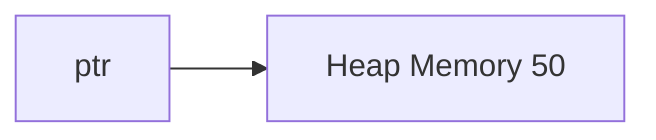
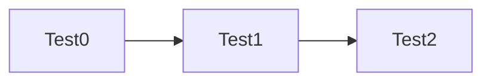
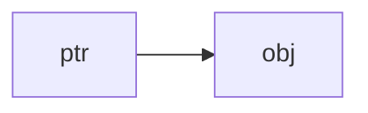
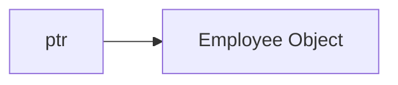
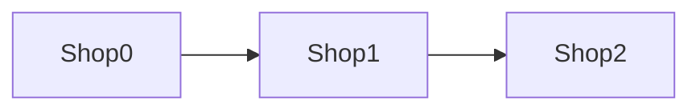
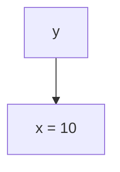
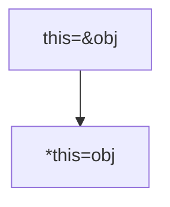
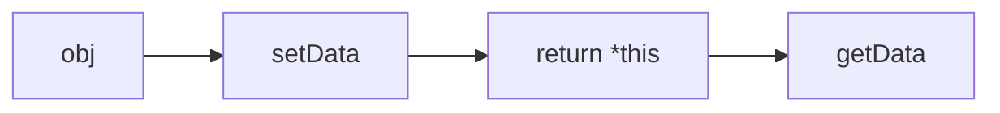
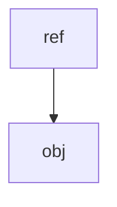

# # Mastering Pointers and Dynamic Memory in C++

> A beginner-to-intermediate guide covering pointers, dynamic memory allocation, object pointers, arrays of objects, the `this` pointer, references, method chaining, and more.

---

# Table of Contents

* Introduction
* Stack vs Heap Memory
* Dynamic Memory Allocation
* `new` Keyword
* `delete` Keyword
* `new[]` and `delete[]`
* Dangling Pointers
* Pointer to Objects
* Arrow Operator (`->`)
* Array of Objects Using Pointers
* Pointer Arithmetic
* The `this` Pointer
* What is `Type&` ?
* References
* `*this`
* Returning Objects
* Method Chaining
* Memory Diagrams
* Common Mistakes
* Best Practices
* Summary

---

# Introduction

Pointers are one of the most powerful features of C++.

They allow us to:

* Access memory directly.
* Create objects dynamically.
* Build data structures.
* Use polymorphism.
* Manage resources efficiently.

---

# Stack vs Heap Memory

## Stack Memory

```cpp
int x = 10;
```

Memory:

```text
Stack
+------+
| x=10 |
+------+
```

Variables are automatically destroyed when they go out of scope.

---

## Heap Memory

```cpp
int *ptr = new int(10);
```

Memory:

```text
Stack               Heap
+------+          +------+
| ptr -|--------->|  10  |
+------+          +------+
```

Heap memory remains allocated until manually freed.

---

# Dynamic Memory Allocation

Dynamic memory allocation means memory is allocated while the program is running.

Example:

```cpp
int *ptr = new int;
```

Memory is allocated from the heap.

---

# new Keyword

Syntax:

```cpp
Type *pointer = new Type;
```

Example:

```cpp
int *ptr = new int;
```

Example:

```cpp
int *ptr = new int(50);
```

Memory:



---

# delete Keyword

Syntax:

```cpp
delete ptr;
```

Example:

```cpp
int *ptr = new int(100);

delete ptr;
```

Memory before:

```text
ptr
 |
 v
100
```

Memory after:

```text
ptr
 |
 v
Dangling Pointer
```

---

# Dangling Pointer

After deleting memory:

```cpp
delete ptr;
```

ptr still stores the address.

Therefore:

```cpp
cout<<*ptr;
```

is dangerous.

Good practice:

```cpp
delete ptr;
ptr = nullptr;
```

---

# Arrays with new[]

Example:

```cpp
int *arr = new int[5];
```

Memory:

```text
Heap

+---+---+---+---+---+
|   |   |   |   |   |
+---+---+---+---+---+
```

---

# delete[] Keyword

Correct:

```cpp
delete[] arr;
```

Wrong:

```cpp
delete arr;
```

---

# Why delete[] ?

Suppose:

```cpp
Test *ptr = new Test[3];
```

Memory:



Using:

```cpp
delete[] ptr;
```

calls all destructors.

Using:

```cpp
delete ptr;
```

causes undefined behavior.

---

# Pointer to Objects

Example:

```cpp
class Employee{
public:
    void show(){
        cout<<"Hello";
    }
};

Employee obj;
Employee *ptr = &obj;
```

Memory:



---

# Accessing Members

Without pointer:

```cpp
obj.show();
```

With pointer:

```cpp
ptr->show();
```

Equivalent to:

```cpp
(*ptr).show();
```

---

# Arrow Operator

Arrow operator:

```cpp
ptr->show();
```

is shorthand for:

```cpp
(*ptr).show();
```

---

# Dynamic Objects

Example:

```cpp
Employee *ptr = new Employee;
```

Memory:



Calling function:

```cpp
ptr->show();
```

---

# Array of Objects

Example:

```cpp
Shop *ptr = new Shop[3];
```

Memory:

```text
Heap

+--------+
| Shop 0 |
+--------+

+--------+
| Shop 1 |
+--------+

+--------+
| Shop 2 |
+--------+
```

---

# Pointer Arithmetic

Suppose:

```cpp
ptr++;
```

Then:



Pointer moves to next object.

---

# Saving Original Pointer

```cpp
Shop *ptr = new Shop[3];
Shop *temp = ptr;
```

Use temp for traversal.

Delete original:

```cpp
delete[] ptr;
```

Never:

```cpp
delete[] temp;
```

if temp has been incremented.

---

# References

Example:

```cpp
int x = 10;
int &y = x;
```

Memory:



y is another name for x.

---

# Type&

General form:

```cpp
Type&
```

means:

> Reference to Type.

Examples:

```cpp
int&
float&
string&
Employee&
```

---

# this Pointer

Suppose:

```cpp
Employee sakky;
sakky.salary();
```

Inside salary():

```cpp
this == &sakky
```

Diagram:

```mermaid
graph LR
A[sakky] --> B[salary()]
B --> C[this=&sakky]
```

---

# Using this->

Example:

```cpp
class Test{
int a;

public:

void setData(int a){
this->a = a;
}
};
```

this->a means member variable.

a means parameter.

---

# What is *this ?

Suppose:

```cpp
this=&obj
```

Since this is a pointer:

```cpp
*this == obj
```

Diagram:



---

# Returning Objects

Function returning int:

```cpp
int fun()
```

returns integer.

Function returning object:

```cpp
Test fun()
```

returns object.

Function returning reference:

```cpp
Test& fun()
```

returns reference to object.

---

# Method Chaining

Example:

```cpp
obj.setData(5).getData();
```

Function:

```cpp
Test& setData(int a){
this->a=a;
return *this;
}
```

Flow:



---

# Understanding test&

Example:

```cpp
Test obj;
Test &ref=obj;
```

Memory:



ref becomes another name for obj.

---

# Common Mistakes

### Forgetting delete

Bad:

```cpp
int *ptr=new int;
```

Memory leak.

---

### Wrong delete

Bad:

```cpp
delete arr;
```

Correct:

```cpp
delete[] arr;
```

---

### Using Deleted Memory

Bad:

```cpp
delete ptr;

cout<<*ptr;
```

Undefined behavior.

---

### Incrementing Original Pointer

Bad:

```cpp
ptr++;
delete[] ptr;
```

Always keep original pointer.

---

# Best Practices

✔ Prefer nullptr over NULL

```cpp
ptr=nullptr;
```

✔ Pair

```cpp
new
```

with

```cpp
delete
```

✔ Pair

```cpp
new[]
```

with

```cpp
delete[]
```

✔ Use arrow operator with object pointers.

✔ Set pointer to nullptr after deletion.

✔ Save original pointer while traversing arrays.

---

# Summary

| Concept         | Meaning                        |
| --------------- | ------------------------------ |
| new             | Allocates memory               |
| delete          | Frees memory                   |
| new[]           | Allocates array                |
| delete[]        | Frees array                    |
| ptr->member     | Access object member           |
| (*ptr).member   | Same as arrow operator         |
| this            | Pointer to current object      |
| *this           | Current object                 |
| Type&           | Reference to Type              |
| return *this    | Returns current object         |
| Method chaining | Calling functions continuously |

---

# One-Line Summary

> `new` allocates memory, `delete` frees it, pointers access memory, `this` points to the current object, `*this` represents the object itself, and `Type&` means a reference to a type, enabling powerful features like method chaining and efficient object manipulation.
