# 🚀 Mastering Pointers & Dynamic Memory in C++

<div align="center">


*A complete, visual guide to object pointers, dynamic memory, `new`/`delete`, references, `this` pointer, and method chaining.*

</div>

---

## 📚 Table of Contents

| # | Topic | Description |
|---|-------|-------------|
| 01 | [Stack vs Heap](#-stack-vs-heap-memory) | How memory is organized |
| 02 | [Dynamic Allocation](#-dynamic-memory-allocation) | Runtime memory management |
| 03 | [`new` Keyword](#-new-keyword) | Allocating on the heap |
| 04 | [`delete` Keyword](#-delete-keyword) | Freeing heap memory |
| 05 | [`new[]` and `delete[]`](#-new-and-delete) | Arrays on the heap |
| 06 | [Dangling Pointers](#-dangling-pointers) | Avoiding undefined behavior |
| 07 | [Pointer to Objects](#-pointer-to-objects) | Pointing at class instances |
| 08 | [Arrow Operator `->`](#-arrow-operator) | Accessing members via pointer |
| 09 | [Dynamic Objects](#-dynamic-objects) | Heap-allocated class instances |
| 10 | [Arrays of Objects](#-arrays-of-objects) | Dynamic object arrays |
| 11 | [Pointer Arithmetic](#-pointer-arithmetic) | Moving through memory |
| 12 | [References](#-references) | Aliases to variables |
| 13 | [`Type&` Syntax](#-understanding-type) | Reference types explained |
| 14 | [`this` Pointer](#-the-this-pointer) | The hidden method parameter |
| 15 | [`this->`](#-this) | Disambiguating member names |
| 16 | [`*this`](#-this-1) | The object itself |
| 17 | [Returning Objects](#-returning-objects) | Return by value vs reference |
| 18 | [Method Chaining](#-method-chaining) | Fluent interface pattern |
| 19 | [Common Mistakes](#-common-mistakes) | Pitfalls to avoid |
| 20 | [Best Practices](#-best-practices) | Write safe, clean C++ |

---

## 🧠 Stack vs Heap Memory

Understanding where your data lives is the foundation of pointer mastery.

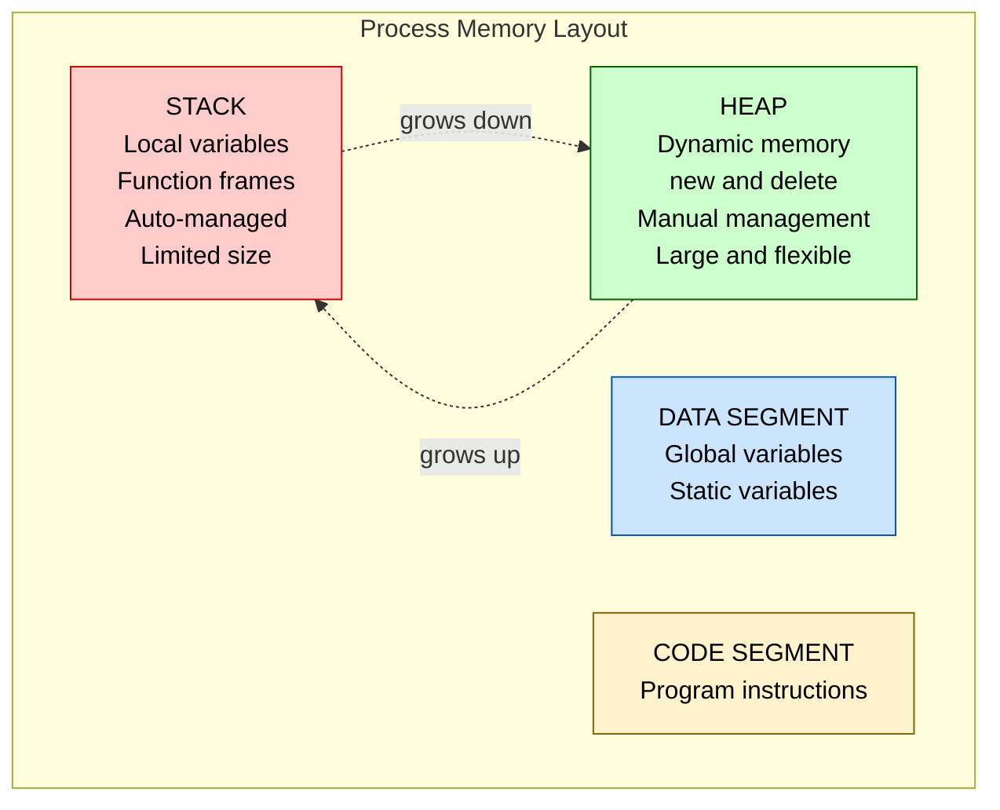

### Stack Memory

```cpp
int x = 10;       // Lives on the stack
double y = 3.14;  // Lives on the stack
```

- ✅ Automatically managed — created and destroyed for you
- ✅ Very fast allocation
- ❌ Limited size (~1–8 MB typically)
- ❌ Cannot outlive the function scope

### Heap Memory

```cpp
int *ptr = new int(10);  // Lives on the heap
```

- ✅ Large memory pool (limited by system RAM)
- ✅ Can outlive the function that created it
- ❌ Must be manually freed with `delete`
- ❌ Memory leaks if you forget!

### Side-by-Side Comparison

| Feature | Stack | Heap |
|---------|-------|------|
| Management | Automatic | Manual (`new` / `delete`) |
| Speed | ⚡ Very fast | 🐢 Slightly slower |
| Size | Small (~MB) | Large (GB possible) |
| Lifetime | Scope-limited | Until `delete` is called |
| Fragmentation | None | Possible over time |
| Allocation | Compile time | Runtime |

---

## 🏗️ Dynamic Memory Allocation

Memory allocated **while the program is running** — not known at compile time.

```cpp
// We don't know n at compile time
int n;
cin >> n;
int *arr = new int[n];  // ✅ Dynamic! Works perfectly.
```

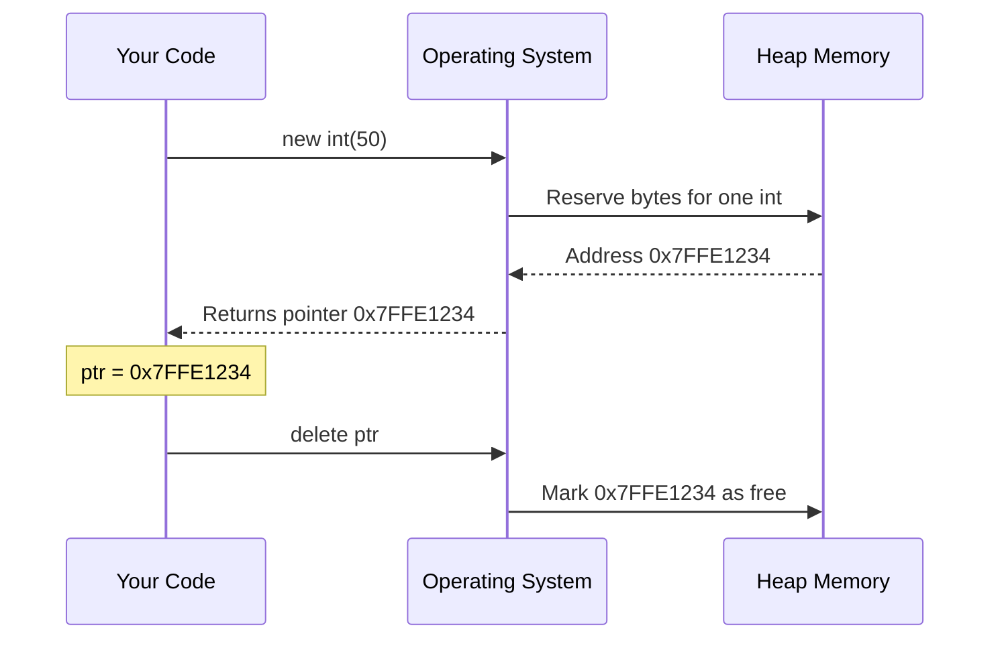

---

## 🆕 `new` Keyword

### Syntax

```cpp
Type *pointer = new Type;           // Uninitialized
Type *pointer = new Type(value);    // Initialized with value
Type *pointer = new Type[n];        // Array of n elements
```

### Examples

```cpp
int    *p1 = new int;          // Uninitialized int on heap
int    *p2 = new int(42);      // int initialized to 42
double *p3 = new double(3.14);
string *p4 = new string("Hello");
```

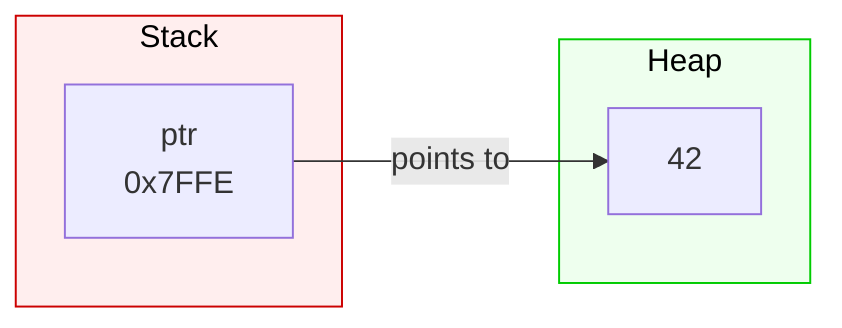

> 💡 `new` returns a **pointer** to the allocated memory. If allocation fails, it throws `std::bad_alloc`.

---

## 🗑️ `delete` Keyword

### Syntax

```cpp
delete pointer;     // Free single object
delete[] pointer;   // Free array of objects
```

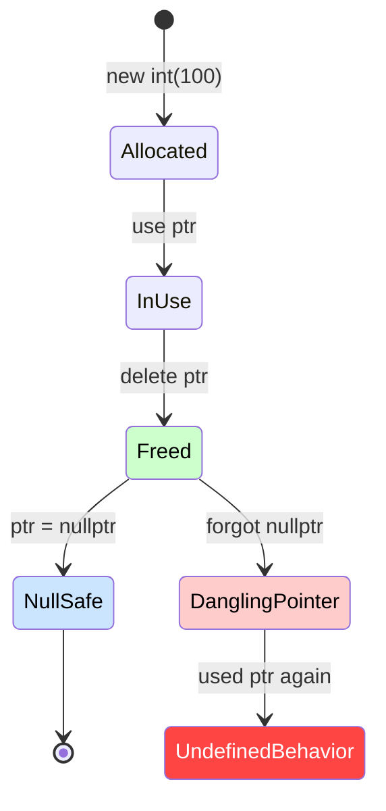

### Before and After `delete`

```cpp
int *ptr = new int(100);
// Before: ptr → [100]  (valid heap memory)

delete ptr;
// After: memory is freed — ptr still holds old address (DANGEROUS)

ptr = nullptr;
// Safe: ptr now holds nullptr
```

---

## 📦 `new[]` and `delete[]`

### Allocating Arrays

```cpp
int *arr = new int[5];         // Array of 5 ints
int *arr = new int[5]{};       // Zero-initialized
int *arr = new int[5]{1,2,3};  // Partially initialized
```

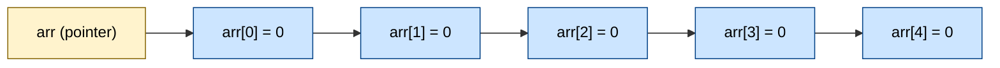

### Why `delete[]` and Not `delete`?

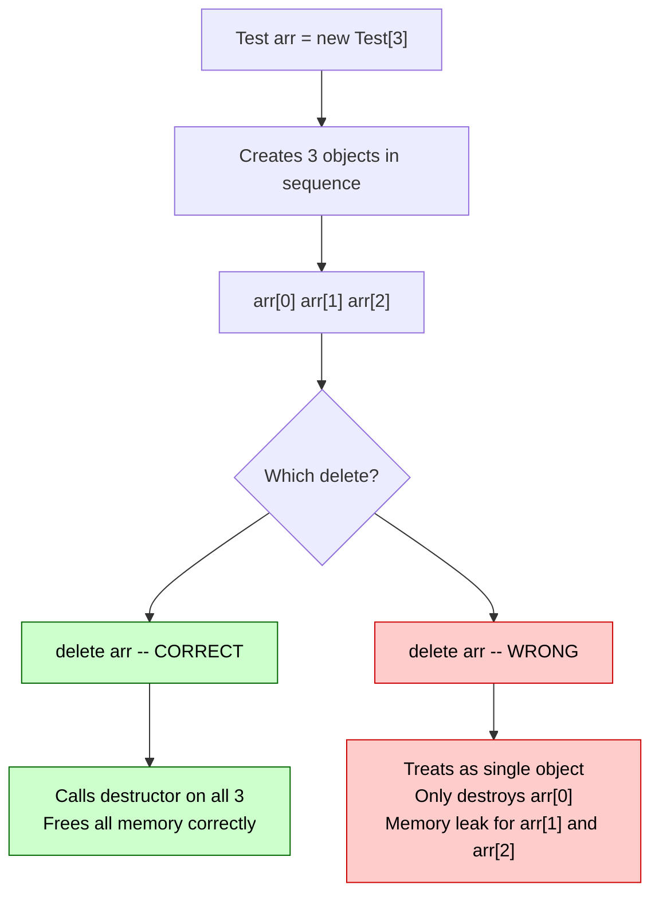

### Rule of Thumb

| You wrote | You must write |
|-----------|---------------|
| `new Type` | `delete ptr` |
| `new Type[n]` | `delete[] ptr` |

---

## ☠️ Dangling Pointers

A **dangling pointer** points to memory that has already been freed.

```cpp
int *ptr = new int(10);
delete ptr;
// ptr still holds the old address — now INVALID

cout << *ptr;  // ❌ Undefined behavior — could crash or show garbage
```

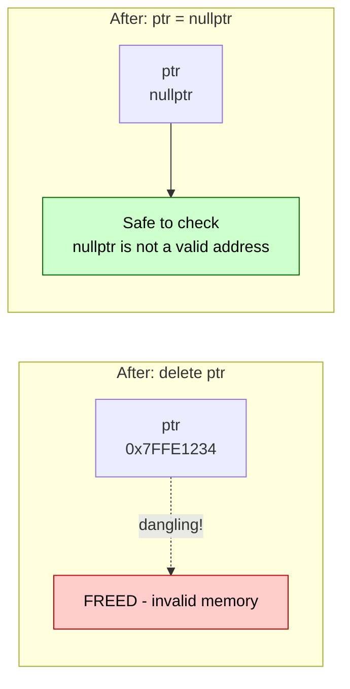

### Fix: Always Null After Delete

```cpp
delete ptr;
ptr = nullptr;     // ✅ Safe

// Now you can check before use:
if (ptr != nullptr) {
    cout << *ptr;  // Only runs if ptr is valid
}
```

---

## 🎯 Pointer to Objects

You can point to any object, just like you point to primitive types.

```cpp
class Employee {
public:
    string name;
    int salary;
    void show() { cout << name << ": " << salary << endl; }
};

Employee obj;          // Stack object
Employee *ptr = &obj;  // Pointer to stack object
```

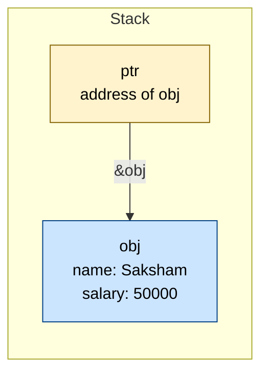

### Accessing Members

```cpp
// Two equivalent ways to access members through a pointer:
ptr->show();       // ✅ Arrow operator (preferred)
(*ptr).show();     // ✅ Dereference then dot (verbose)
```

---

## ➡️ Arrow Operator

The `->` operator is syntactic sugar for `(*ptr).member`.

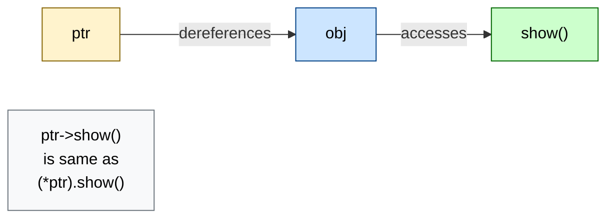

```cpp
ptr->name    // same as (*ptr).name
ptr->salary  // same as (*ptr).salary
ptr->show()  // same as (*ptr).show()
```

> 💡 **Always prefer `->` over `(*ptr).`** — it's cleaner and less error-prone.

---

## 🏭 Dynamic Objects

Objects can be allocated directly on the heap:

```cpp
Employee *ptr = new Employee;         // Default constructor
Employee *ptr = new Employee("Bob");  // Parameterized constructor
```

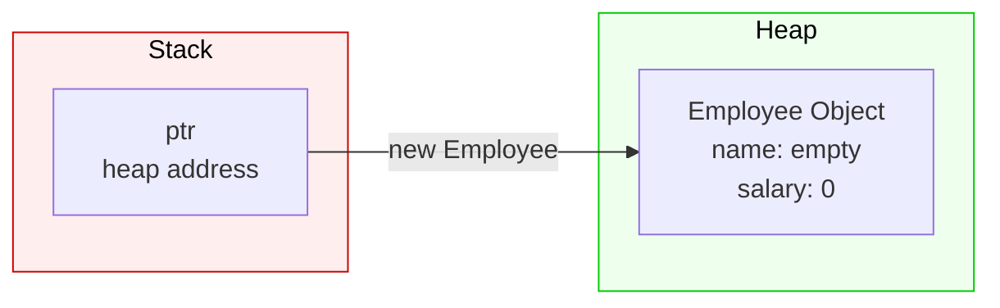

### Lifecycle of a Dynamic Object

```cpp
// 1. Create
Employee *e = new Employee("Alice", 75000);

// 2. Use
e->show();
e->salary += 5000;

// 3. Destroy
delete e;
e = nullptr;
```

---

## 🏪 Arrays of Objects

```cpp
Shop *ptr = new Shop[3];  // 3 Shop objects on the heap
```

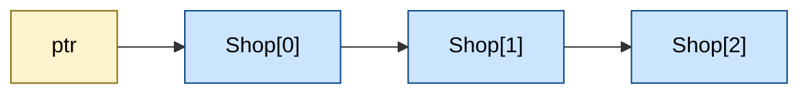

### Traversing — Save the Original Pointer!

```cpp
Shop *ptr  = new Shop[3];
Shop *temp = ptr;        // ✅ Save original

for (int i = 0; i < 3; i++) {
    temp->display();
    temp++;              // Move temp, never move ptr
}

delete[] ptr;            // ✅ Delete using ORIGINAL pointer
ptr = nullptr;
```

> ⚠️ **Never do `delete[] temp`** if you've moved `temp` — you'll be deleting the wrong address!

---

## ➕ Pointer Arithmetic

When you increment a pointer, it moves by **`sizeof(Type)`** bytes, not just 1.

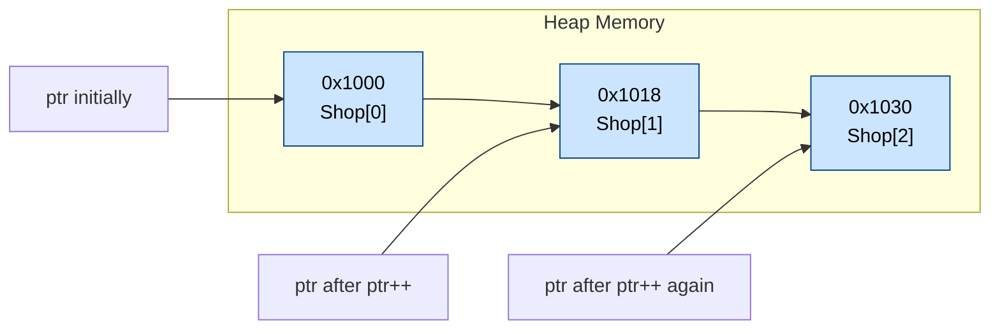

```cpp
int *arr = new int[4]{10, 20, 30, 40};

cout << *arr;    // 10  (arr[0])
arr++;
cout << *arr;    // 20  (arr[1])
arr += 2;
cout << *arr;    // 40  (arr[3])
```

| Expression | Result |
|------------|--------|
| `ptr + 0` | First element |
| `ptr + 1` | Second element (jumps `sizeof(T)` bytes) |
| `ptr[i]` | Same as `*(ptr + i)` |
| `ptr++` | Moves to next element |

---

## 🔗 References

A reference is an **alias** — another name for an existing variable.

```cpp
int x = 10;
int &y = x;   // y is another name for x
```

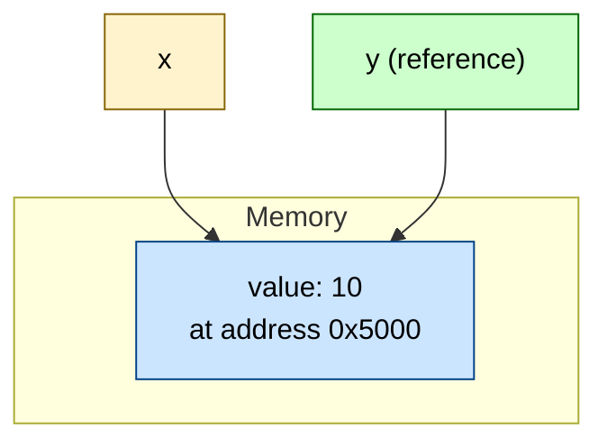

### References vs Pointers

| Feature | Reference `int &r` | Pointer `int *p` |
|---------|-------------------|-----------------|
| Syntax | `int &r = x;` | `int *p = &x;` |
| Can be null? | No | Yes (`nullptr`) |
| Reassignable? | No | Yes |
| Must initialize? | Yes | No |
| Needs dereference? | No | Yes (`*p`) |
| Supports arithmetic? | No | Yes |

```cpp
int x = 10;
int &y = x;

y = 20;        // Changes x too!
cout << x;     // Output: 20
```

### References as Parameters (Pass by Reference)

```cpp
void increment(int &val) {   // No copy — works on the original
    val++;
}

int n = 5;
increment(n);
cout << n;    // Output: 6
```

---

## 🏷️ Understanding `Type&`

`Type&` is how you declare a **reference type** in C++.

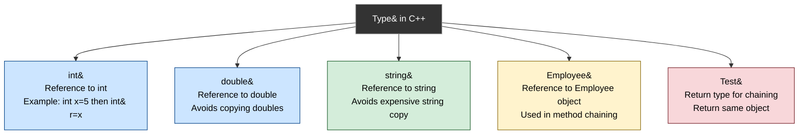

### Why Use `Type&` as Return Type?

```cpp
// ❌ Returns a COPY of the object
Test setData(int a) {
    this->a = a;
    return *this;   // copy made — chaining breaks
}

// ✅ Returns a REFERENCE to the object
Test& setData(int a) {
    this->a = a;
    return *this;   // same object — chaining works!
}
```

### Reference in Function Signatures

```cpp
// As parameter — avoids expensive copy of large objects
void process(const Employee& emp);

// As return type — allows modification or chaining
Employee& getEmployee(int id);

// Const reference — read-only access, no copy
void print(const string& msg);
```

---

## 🧭 The `this` Pointer

Every non-static member function receives a **hidden pointer** to the calling object — that's `this`.

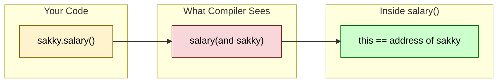

### `this` is Always a Pointer to the Current Object

```cpp
class Employee {
    string name;
    int salary;

public:
    void show() {
        // 'this' == address of whichever object called show()
        cout << this->name;
        cout << this->salary;
    }
};

Employee alice, bob;
alice.show();  // this == &alice
bob.show();    // this == &bob
```

---

## 🔍 `this->`

Used to disambiguate when a **parameter has the same name** as a member variable.

```cpp
class Test {
    int a;   // member variable

public:
    void setData(int a) {   // parameter also named 'a'
        // a = a;           ❌ Assigns parameter to itself — bug!
        this->a = a;        // ✅ this->a = member,  a = parameter
    }
};
```

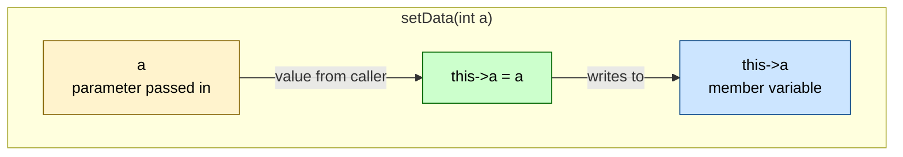

---

## ⭐ `*this`

If `this` is a pointer to the object, then `*this` is the **object itself**.

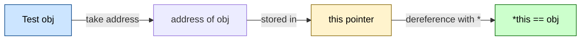

```cpp
class Test {
    int a;
public:
    Test& setData(int a) {
        this->a = a;
        return *this;   // Returns the object itself (by reference)
    }
};

Test obj;
obj.setData(5);   // *this == obj inside setData
```

---

## 🔄 Returning Objects

Different return types have very different behaviors:

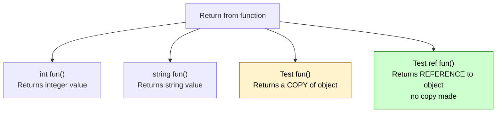

### Return by Value vs Reference

```cpp
class Test {
    int a;
public:
    // Returns COPY — creates new temporary object
    Test getCopy() {
        return *this;
    }

    // Returns REFERENCE — same object, no copy
    Test& getRef() {
        return *this;
    }
};
```

| | `Test fun()` | `Test& fun()` |
|-|-------------|--------------|
| Returns | A new copy | The original object |
| Memory | New object allocated | No extra memory |
| Chaining | Won't affect original | ✅ Modifies original |
| Use case | When you need a copy | Method chaining |

---

## ⛓️ Method Chaining

Method chaining lets you call multiple methods on the same object in one line.

### How It Works

```cpp
class Test {
    int a, b;
public:
    Test& setA(int a) {
        this->a = a;
        return *this;    // Return reference to self
    }

    Test& setB(int b) {
        this->b = b;
        return *this;    // Return reference to self
    }

    void print() {
        cout << a << ", " << b;
    }
};

Test obj;
obj.setA(5).setB(10).print();   // ✅ Method chaining!
```

### Execution Flow

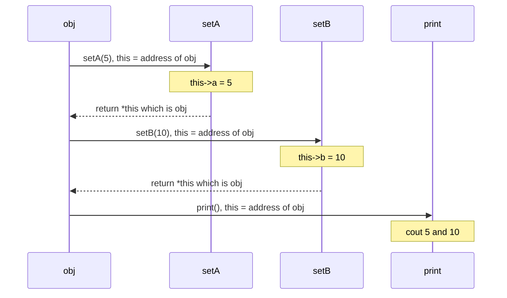

### Chaining vs Non-Chaining

```cpp
// Without chaining (verbose)
obj.setA(5);
obj.setB(10);
obj.print();

// With method chaining (elegant)
obj.setA(5).setB(10).print();
```

> 💡 This pattern powers **builder patterns**, **stream operators** (`cout << x << y`), and fluent APIs.

---

## ⚠️ Common Mistakes

### 1. Forgetting `delete` — Memory Leak

```cpp
void bad() {
    int *ptr = new int(10);
    // No delete — heap memory never freed
}  // ptr goes out of scope, memory is LOST
```

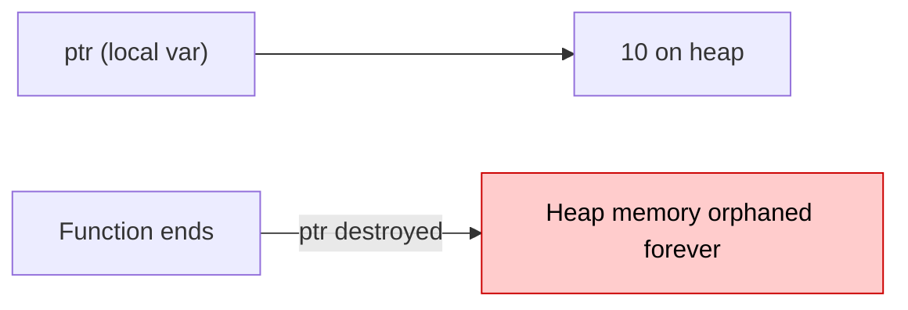

### 2. Using `delete` Instead of `delete[]`

```cpp
int *arr = new int[5];
delete arr;    // ❌ Wrong — UB for remaining elements
delete[] arr;  // ✅ Correct — frees all 5 elements
```

### 3. Using Pointer After `delete`

```cpp
int *ptr = new int(10);
delete ptr;
cout << *ptr;   // ❌ Undefined behavior
```

### 4. Incrementing the Original Array Pointer

```cpp
Shop *ptr = new Shop[3];
ptr++;          // ❌ ptr no longer points to array start
delete[] ptr;   // ❌ Deleting wrong address
```

### 5. Double Delete

```cpp
int *ptr = new int(10);
delete ptr;
delete ptr;   // ❌ Double free — crash
```

### Quick Reference: Mistake vs Fix

| Mistake | Fix |
|---------|-----|
| Forget `delete` | Always pair `new` with `delete` |
| `delete arr` for array | Use `delete[] arr` |
| Use after `delete` | Set `ptr = nullptr` after delete |
| Increment array pointer | Save original, use temp for traversal |
| Double `delete` | Set `ptr = nullptr` after first delete |

---

## ✅ Best Practices

```mermaid
flowchart TD
    ROOT["Safe C++ Pointers"]

    ROOT --> A["Always set nullptr after delete\nPrevents dangling pointer use\nAllows safe nullptr check"]
    ROOT --> B["Pair new with delete\nEvery new gets one delete\nEvery new-array gets delete-array"]
    ROOT --> C["Save original pointer\nBefore pointer arithmetic\nDelete original not the moved copy"]
    ROOT --> D["Prefer references\nLess error-prone than pointers\nEnable method chaining"]
    ROOT --> E["Use smart pointers\nunique_ptr auto-deletes\nshared_ptr is reference counted"]
    ROOT --> F["Check before dereference\nif ptr is not nullptr\nAvoid null dereference crash"]

    style ROOT fill:#333,stroke:#999,color:#fff
    style A fill:#d4edda,stroke:#155724,color:#000
    style B fill:#d4edda,stroke:#155724,color:#000
    style C fill:#d4edda,stroke:#155724,color:#000
    style D fill:#cce5ff,stroke:#004085,color:#000
    style E fill:#cce5ff,stroke:#004085,color:#000
    style F fill:#fff3cd,stroke:#856404,color:#000
```

### Code Checklist

```cpp
// ✅ Always initialize
int *ptr = nullptr;

// ✅ Always check before use
if (ptr != nullptr) { /* safe */ }

// ✅ Pair new with delete
ptr = new int(5);
delete ptr;
ptr = nullptr;

// ✅ Save original before arithmetic
int *arr  = new int[5];
int *temp = arr;     // save
temp++;              // move temp, not arr
delete[] arr;        // delete original
arr = nullptr;

// ✅ Use arrow operator (cleaner)
ptr->method();       // prefer over (*ptr).method()

// ✅ Pass large objects by reference
void process(const Employee& emp);   // no copy!
```

---

## 🗺️ Master Concept Map

```mermaid
flowchart TD
    subgraph Dynamic["Dynamic Memory"]
        NEW["new\nAllocate heap memory"]
        DEL["delete or delete[]\nFree heap memory"]
        HEAP["Heap\nLarge, manual lifetime"]
        NEW --> HEAP
        DEL --> HEAP
    end

    subgraph Pointers["Pointers"]
        PTR["Pointer\nStores address"]
        ARROW["Arrow operator\nAccess via pointer"]
        ARITH["Pointer Arithmetic\nMove through array"]
        PTR --> ARROW
        PTR --> ARITH
    end

    subgraph Objects["Objects"]
        OBJ["Object\nInstance of class"]
        THIS["this\naddress of current object"]
        DEREF["*this\nthe object itself"]
        OBJ --> THIS
        THIS --> DEREF
    end

    subgraph Refs["References"]
        REF["Type ref\nAlias to variable"]
        RETREF["Return Type ref\nReturn reference"]
        CHAIN["Method Chaining\nobj.a().b().c()"]
        REF --> RETREF
        RETREF --> CHAIN
    end

    NEW -->|"returns"| PTR
    PTR -->|"points to"| OBJ
    DEREF -->|"return *this enables"| CHAIN
    OBJ -->|"aliased via"| REF

    style NEW fill:#ccffcc,stroke:#006600,color:#000
    style DEL fill:#ffcccc,stroke:#cc0000,color:#000
    style THIS fill:#fff3cd,stroke:#856404,color:#000
    style CHAIN fill:#cce5ff,stroke:#004085,color:#000
```

---

## 🎯 One-Line Summary per Topic

| Topic | Summary |
|-------|---------|
| `new` | Allocates memory on the heap and returns a pointer |
| `delete` | Frees a single heap-allocated object |
| `delete[]` | Frees a heap-allocated array (calls all destructors) |
| Dangling pointer | Pointer to freed memory — set to `nullptr` to prevent |
| `->` | Shorthand for `(*ptr).member` |
| References | Aliases — another name for the same variable |
| `Type&` | A reference type — enables in-place modification and chaining |
| `this` | Hidden pointer to the object that called the method |
| `this->` | Disambiguates member variables from same-named parameters |
| `*this` | Dereferences `this` — represents the calling object itself |
| `return *this` | Returns the object by reference — enables method chaining |
| Method chaining | Calling multiple methods in sequence: `obj.a().b().c()` |

---

<div align="center">

*Made with ❤️ for the C++ community*


</div>
