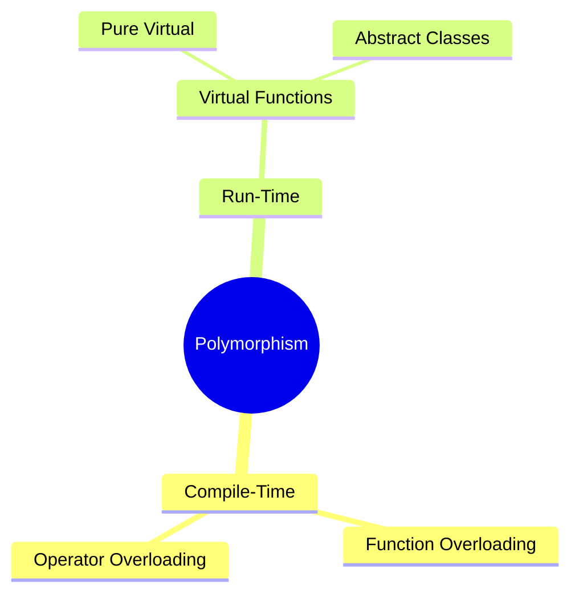
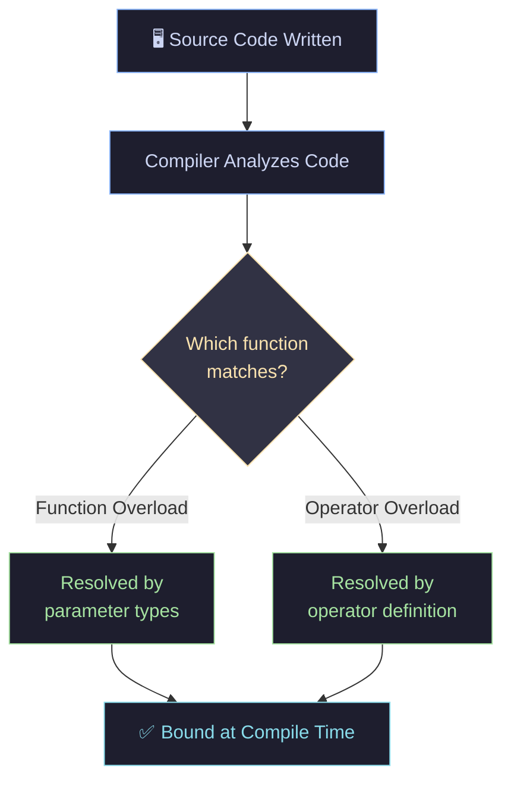
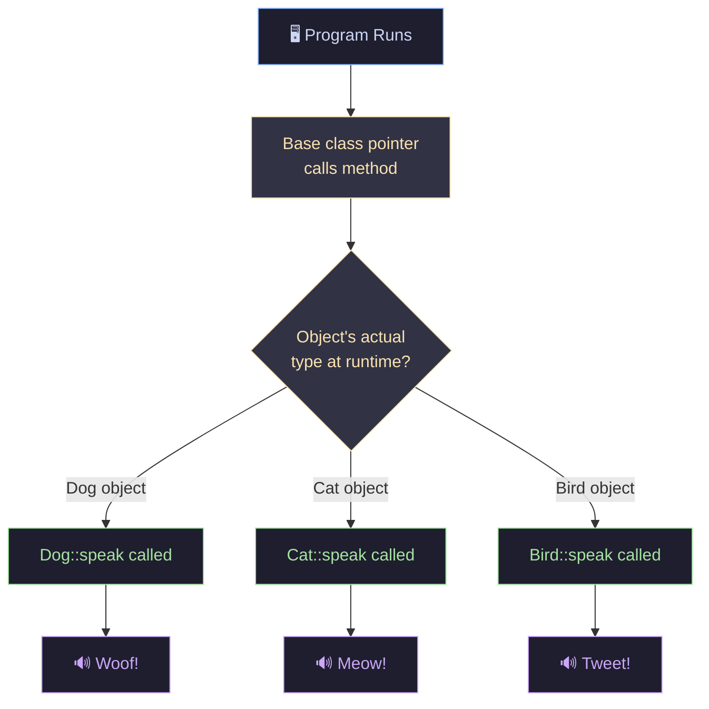
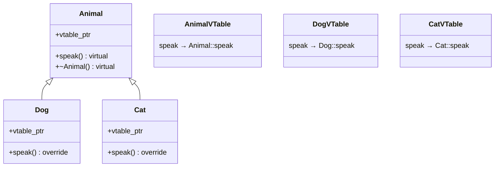
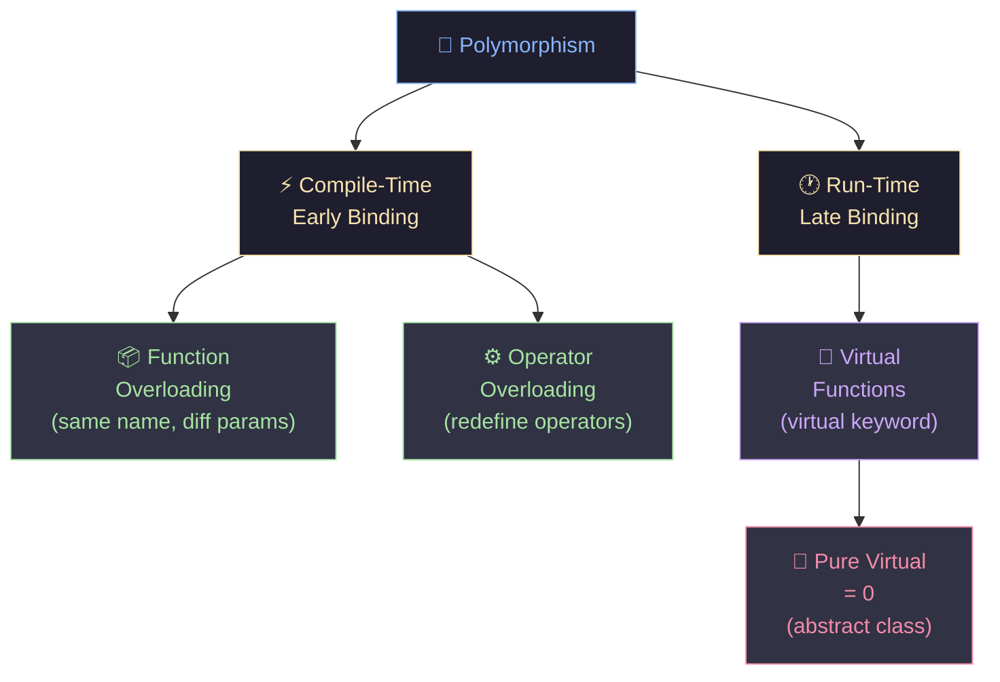

# 🔷 Polymorphism in C++

> **"One name, many forms."** — The core philosophy of polymorphism in Object-Oriented Programming.

---

## 📌 What is Polymorphism?

| Word | Meaning |
|------|---------|
| **Poly** | Several / Many |
| **Morphism** | Form / Shape |
| **Polymorphism** | One name, multiple forms |

Polymorphism allows a single interface to represent different underlying data types or behaviors — a cornerstone of OOP in C++.

---

## 🗂️ Types of Polymorphism



---

## ⚡ Compile-Time Polymorphism

Also known as **Early Binding** — the compiler resolves which function to call at **compile time**.



### 1️⃣ Function Overloading

Same function name, **different parameters** (type, count, or order).

```cpp
#include <iostream>
using namespace std;

class Calculator {
public:
    // Same name — different parameter types
    int add(int a, int b)          { return a + b; }
    double add(double a, double b) { return a + b; }
    int add(int a, int b, int c)   { return a + b + c; }
};

int main() {
    Calculator calc;
    cout << calc.add(2, 3)        << endl; // 5
    cout << calc.add(2.5, 3.5)    << endl; // 6.0
    cout << calc.add(1, 2, 3)     << endl; // 6
}
```

| Call | Parameters | Return Type | Resolved |
|------|-----------|-------------|---------|
| `add(2, 3)` | `int, int` | `int` | `add(int, int)` |
| `add(2.5, 3.5)` | `double, double` | `double` | `add(double, double)` |
| `add(1, 2, 3)` | `int, int, int` | `int` | `add(int, int, int)` |

---

### 2️⃣ Operator Overloading

Redefine how **built-in operators** behave for user-defined types.

```cpp
#include <iostream>
using namespace std;

class Vector2D {
public:
    float x, y;
    Vector2D(float x, float y) : x(x), y(y) {}

    // Overload the '+' operator
    Vector2D operator+(const Vector2D& other) {
        return Vector2D(x + other.x, y + other.y);
    }

    void print() { cout << "(" << x << ", " << y << ")" << endl; }
};

int main() {
    Vector2D v1(1.0f, 2.0f);
    Vector2D v2(3.0f, 4.0f);
    Vector2D v3 = v1 + v2;  // Calls operator+
    v3.print();              // Output: (4, 6)
}
```

---

## 🕐 Run-Time Polymorphism

Also known as **Late Binding** — the function call is resolved at **runtime** using **vtables**.



### 3️⃣ Virtual Functions

A function declared with `virtual` in the **base class** and **overridden** in derived classes.

```cpp
#include <iostream>
using namespace std;

class Animal {
public:
    virtual void speak() {         // Virtual function
        cout << "Some generic sound" << endl;
    }
    virtual ~Animal() {}           // Always use virtual destructor!
};

class Dog : public Animal {
public:
    void speak() override {        // Override in derived class
        cout << "Woof! 🐕" << endl;
    }
};

class Cat : public Animal {
public:
    void speak() override {
        cout << "Meow! 🐈" << endl;
    }
};

int main() {
    Animal* animals[] = { new Dog(), new Cat() };

    for (Animal* a : animals) {
        a->speak();               // Resolved at RUNTIME
    }

    // Cleanup
    for (Animal* a : animals) delete a;
}
```

**Output:**
```
Woof! 🐕
Meow! 🐈
```

---

## 🏗️ Virtual Function & VTable Internals



> 💡 Each class with virtual functions gets its own **vtable**. The object's hidden `vtable_ptr` points to the correct table at runtime, enabling dynamic dispatch.

---

## 🔵 Pure Virtual Functions & Abstract Classes

A **pure virtual function** has no implementation in the base class — it *must* be overridden.

```cpp
class Shape {
public:
    virtual double area() = 0;    // Pure virtual — no body!
    virtual void draw() = 0;
    virtual ~Shape() {}
};

// Shape cannot be instantiated — it's ABSTRACT

class Circle : public Shape {
    double radius;
public:
    Circle(double r) : radius(r) {}
    double area() override { return 3.14159 * radius * radius; }
    void draw() override { cout << "Drawing Circle ⭕" << endl; }
};

class Rectangle : public Shape {
    double w, h;
public:
    Rectangle(double w, double h) : w(w), h(h) {}
    double area() override { return w * h; }
    void draw() override { cout << "Drawing Rectangle 🟦" << endl; }
};
```

---

## 📊 Compile-Time vs Run-Time — Full Comparison

| Feature | Compile-Time | Run-Time |
|---------|-------------|----------|
| **Also Called** | Early Binding | Late Binding |
| **Resolved At** | Compile time | Runtime |
| **Mechanism** | Overloading | Virtual functions |
| **Speed** | ⚡ Fast | 🐢 Slightly slower (vtable lookup) |
| **Flexibility** | Less flexible | More flexible |
| **Types** | Function & Operator Overloading | Virtual & Pure Virtual |
| **Pointer/Ref needed?** | ❌ No | ✅ Yes (base class pointer/ref) |
| **Use Case** | Same operation, different types | Same interface, different behavior |

---

## 🚦 Key Rules to Remember


| Rule | Why It Matters |
|------|---------------|
| `virtual ~Destructor()` | Prevents memory leaks when deleting via base pointer |
| Use `override` keyword | Compiler catches typos in function signatures |
| Access via base pointer/ref | Required for runtime polymorphism to work |
| Don't call virtual in constructors | Object isn't fully constructed yet |

---

## 🧠 Quick Summary



---

<div align="center">

**C++ Tutorials for Beginners — #54**

*Made with ❤️ | Keep learning, keep building.*

</div>
