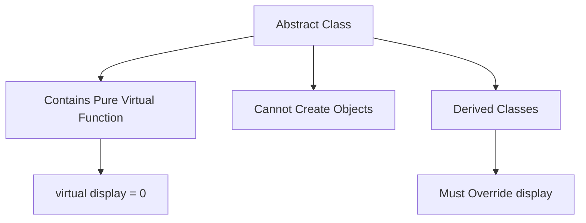
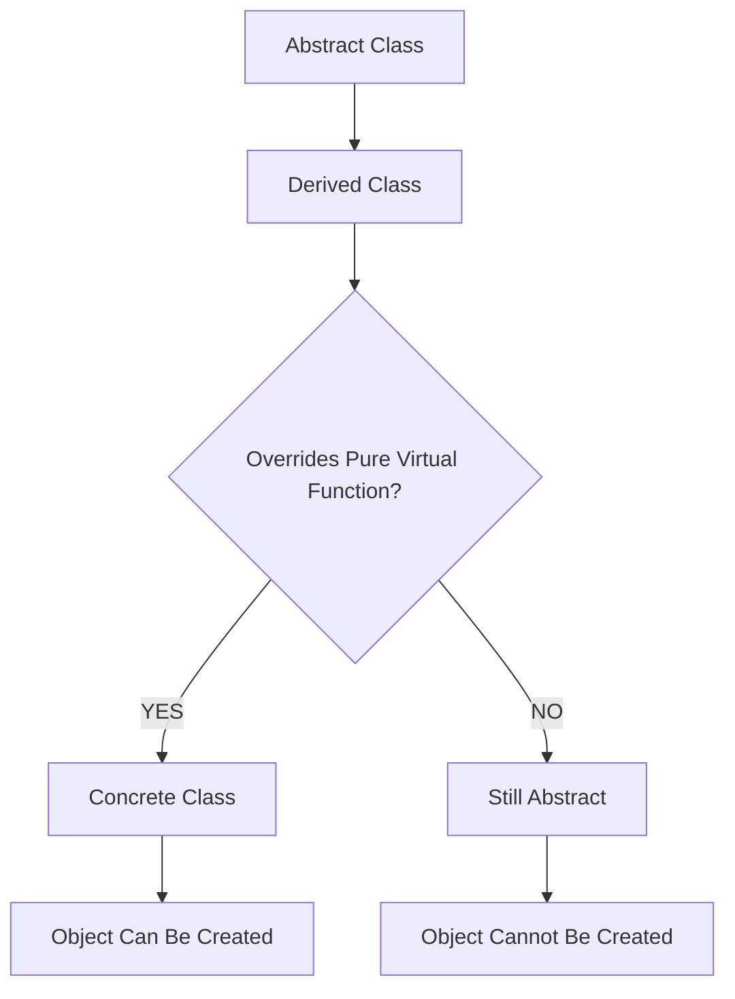
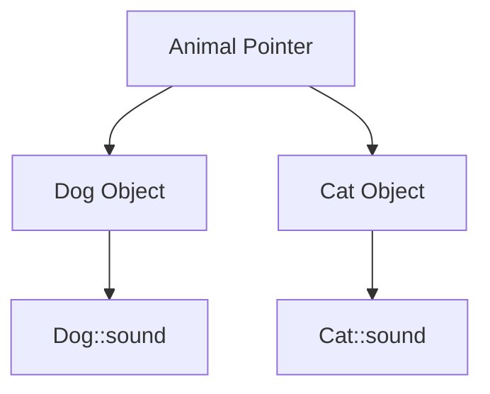

# 🎯 Pure Virtual Functions and Abstract Base Classes in C++

---

# 📚 Introduction

A **Pure Virtual Function** is a virtual function that does not provide any implementation in the base class and is declared by assigning `= 0`.

```cpp
virtual return_type function_name(parameters) = 0;
```

Example:

```cpp
virtual void display() = 0;
```

---

# Why Pure Virtual Functions?

Sometimes the base class should only provide a common interface and force derived classes to implement their own versions of certain functions.

This is achieved using **Pure Virtual Functions**.

---

# Syntax

```cpp
class Base{
public:
    virtual void display() = 0;
};
```

Here,

* `virtual` → Enables Runtime Polymorphism.
* `= 0` → Makes the function Pure Virtual.
* `Base` becomes an **Abstract Class**.

---

# What is an Abstract Base Class?

An **Abstract Base Class** is a class that contains at least one Pure Virtual Function.

### Characteristics

| Property                                     | Abstract Class |
| -------------------------------------------- | -------------- |
| Can create objects?                          | ❌ No           |
| Can contain variables?                       | ✅ Yes          |
| Can contain constructors?                    | ✅ Yes          |
| Can contain normal functions?                | ✅ Yes          |
| Must have at least one pure virtual function | ✅ Yes          |
| Used for Runtime Polymorphism                | ✅ Yes          |

---

# Syntax

```cpp
class AbstractClass{
public:
    virtual void display() = 0;
};
```

---

# Visual Representation

```text
              Abstract Class
                     |
      --------------------------------
      |                              |
 Pure Virtual Function          Cannot Create Objects
 virtual display() = 0              ❌
```

---

# Mermaid Diagram



---

# Rule

If a derived class does not override the Pure Virtual Function, then that derived class also becomes an abstract class.

---

# Flowchart



---

# Example Program

## Step 1: Create Abstract Base Class

```cpp
class Animal{
public:
    virtual void sound() = 0;
};
```

Here,

```cpp
sound()
```

is a Pure Virtual Function.

Therefore,

```cpp
Animal
```

becomes an Abstract Class.

---

## Step 2: Create Derived Classes

```cpp
class Dog : public Animal{
public:
    void sound() override{
        cout<<"Dog barks"<<endl;
    }
};

class Cat : public Animal{
public:
    void sound() override{
        cout<<"Cat meows"<<endl;
    }
};
```

---

## Complete Program

```cpp
#include <iostream>
using namespace std;

// Abstract Base Class
class Animal{
public:

    // Pure Virtual Function
    virtual void sound() = 0;
};

// Derived Class
class Dog : public Animal{
public:

    void sound() override{
        cout<<"Dog barks"<<endl;
    }
};

// Derived Class
class Cat : public Animal{
public:

    void sound() override{
        cout<<"Cat meows"<<endl;
    }
};

int main(){

    Dog d;
    Cat c;

    Animal* ptr;

    ptr = &d;
    ptr->sound();

    ptr = &c;
    ptr->sound();

    return 0;
}
```

---

# Output

```text
Dog barks
Cat meows
```

---

# Runtime Polymorphism



---

# Internal Working

```text
Animal* ptr
      |
      ↓
+---------------+
| Dog Object    |
+---------------+
      |
      ↓
sound()
      |
      ↓
Dog::sound()
```

Later:

```text
Animal* ptr
      |
      ↓
+---------------+
| Cat Object    |
+---------------+
      |
      ↓
sound()
      |
      ↓
Cat::sound()
```

---

# Why Use Abstract Classes?

They provide a blueprint for derived classes.

Example:

```text
Vehicle
  |
  +----- Car
  |
  +----- Bike
  |
  +----- Truck
```

Every vehicle should have:

* start()
* stop()
* accelerate()

But implementation differs.

---

# Real-Life Example

```mermaid
graph TD

Vehicle --> Car
Vehicle --> Bike
Vehicle --> Truck

Car --> StartCar

Bike --> StartBike

Truck --> StartTruck
```



The parent defines **WHAT** should be done.

Derived classes decide **HOW** to do it.

---

# Difference Between Virtual and Pure Virtual Functions

| Feature                        | Virtual Function | Pure Virtual Function |
| ------------------------------ | ---------------- | --------------------- |
| Has body in base class         | ✅ Yes            | ❌ No                  |
| Uses keyword virtual           | ✅ Yes            | ✅ Yes                 |
| Runtime polymorphism           | ✅ Yes            | ✅ Yes                 |
| Makes class abstract           | ❌ No             | ✅ Yes                 |
| Object of base class possible  | ✅ Yes            | ❌ No                  |
| Must override in derived class | ❌ Optional       | ✅ Necessary           |

---

# Memory Trick

### Virtual Function

```cpp
virtual void display(){
    cout<<"Base";
}
```

✔ Optional override

---

### Pure Virtual Function

```cpp
virtual void display() = 0;
```

✔ Mandatory override

---

# Summary Diagram


---

# Key Points

### ✅ Pure Virtual Function

```cpp
virtual void function() = 0;
```

### ✅ Abstract Class

Contains at least one Pure Virtual Function.

### ✅ Objects of Abstract Classes cannot be created.

### ✅ Derived classes must override Pure Virtual Functions.

### ✅ Used to achieve Runtime Polymorphism and enforce interfaces.

---

# One-Line Summary

> A Pure Virtual Function is a virtual function declared using `= 0`, and any class containing at least one Pure Virtual Function becomes an Abstract Base Class whose objects cannot be created directly.
