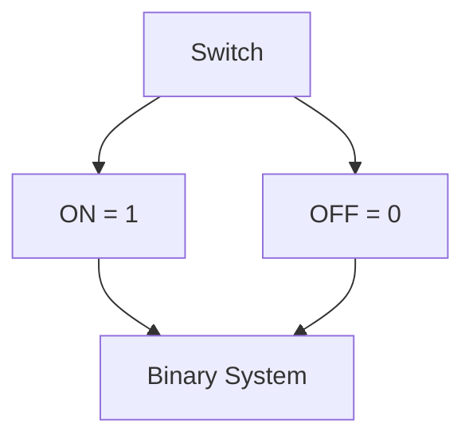
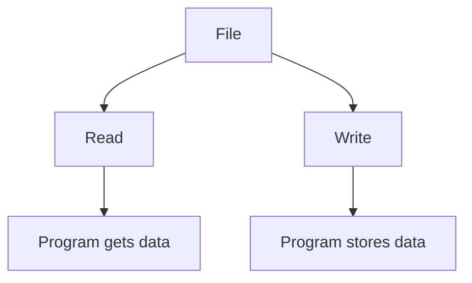
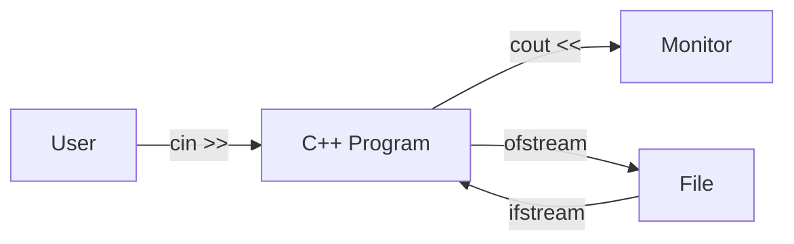
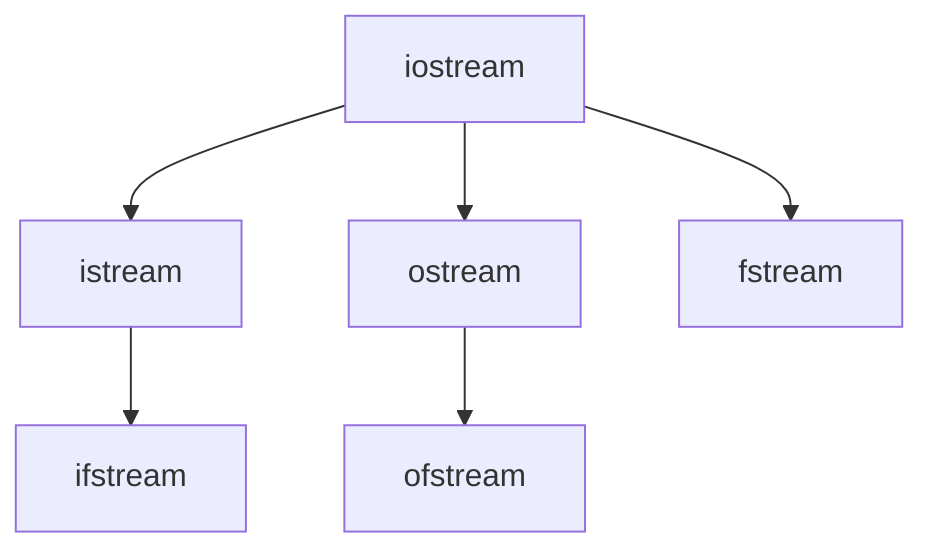
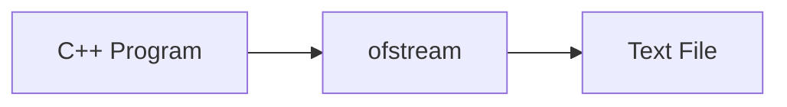
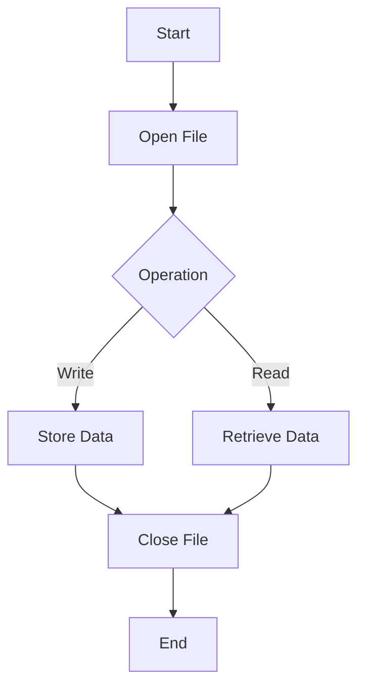
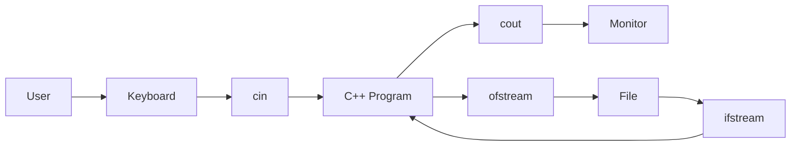

# 📂 File I/O in C++: Working with Files

---

# 📖 Introduction

A **file** is a collection of data stored permanently on secondary storage devices such as hard disks, SSDs, USB drives, etc.

Files allow programs to store data permanently so that information is not lost when the program terminates.

Examples of files include:

* C++ source files (`.cpp`)
* Text files (`.txt`)
* Images (`.png`, `.jpg`)
* Audio files (`.mp3`)
* Video files (`.mp4`)
* Game save files
* Database files

---

# What is Stored Inside a File?

Everything written inside a file is called **data**.

Example:

```cpp
#include <iostream>
```

contains characters like:

```text
#
i
n
c
l
u
d
e
<
>
;
```

A text file is simply a sequence of characters.

---

# Character Representation

Computers do not understand characters directly.

For example:

| Character | ASCII Value |
| --------- | ----------: |
| A         |          65 |
| B         |          66 |
| a         |          97 |
| ;         |          59 |
| #         |          35 |

---

## Conversion Process


---

# Why Computers Use Binary?

Computers are made up of billions of electronic switches.

Each switch has only two states:

* ON (1)
* OFF (0)

Therefore, computers understand only binary numbers.

---



---

# File Input and Output

File I/O means:

* Reading data from files.
* Writing data to files.

---

# Main Operations

There are two basic operations:

| Operation  | Description                    |
| ---------- | ------------------------------ |
| Read File  | Retrieve information from file |
| Write File | Store information inside file  |

---



---

# Input and Output in C++

There are four possible operations:

### Keyboard Input

```cpp
cin >>
```

### Monitor Output

```cpp
cout <<
```

### File Input

```cpp
ifstream
```

### File Output

```cpp
ofstream
```

---

# Complete Input/Output System



---

# Visual Representation

```text
                 Keyboard
                     |
                  cin >>
                     |
                     V

              +--------------+
              | C++ Program  |
              +--------------+
                ^          |
                |          |
           ifstream     ofstream
                |          |
                V          V
             +----------------+
             |      File       |
             +----------------+

                     |
                  cout <<
                     |
                     V

                  Monitor
```

---

# Types of File Streams

C++ provides three stream classes for file handling.

| Stream Class | Purpose               |
| ------------ | --------------------- |
| ifstream     | Input from file       |
| ofstream     | Output to file        |
| fstream      | Input and Output both |

---

## Stream Hierarchy



---

# Writing to a File

Program → File



Example:

```cpp
ofstream out("sample.txt");

out<<"Hello World";
```

---

# Reading from a File

File → Program


Example:

```cpp
ifstream in("sample.txt");

string s;

in>>s;
```

---

# Complete File Handling Process



---

# Comparison Between cin/cout and Files

| Feature           | Keyboard & Monitor | File Handling   |
| ----------------- | ------------------ | --------------- |
| Input             | cin                | ifstream        |
| Output            | cout               | ofstream        |
| Temporary         | Yes                | No              |
| Permanent Storage | No                 | Yes             |
| Device            | Keyboard/Monitor   | Disk            |
| Speed             | Fast               | Slightly slower |

---

# Memory Trick

```text
cin
 ↓
Keyboard → Program

cout
 ↓
Program → Monitor

ifstream
 ↓
File → Program

ofstream
 ↓
Program → File
```

---

# Summary Diagram



---

# Key Points

✅ A file is a collection of data stored permanently.

✅ Computers read characters using ASCII codes.

✅ Computers understand binary numbers only.

✅ Two major file operations:

* Read
* Write

✅ Stream classes:

* `ifstream`
* `ofstream`
* `fstream`

✅ File handling provides permanent storage.

---

# One-Line Summary

> File I/O in C++ allows programs to store and retrieve data permanently using stream classes such as `ifstream`, `ofstream`, and `fstream`.
