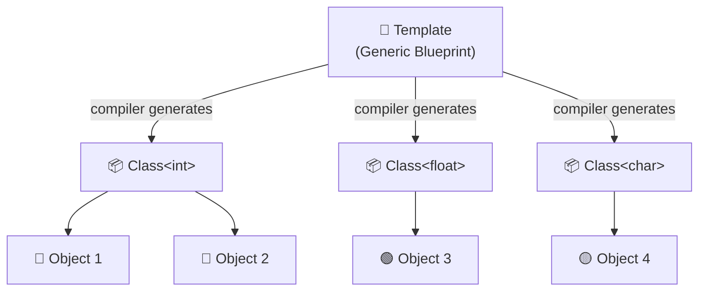
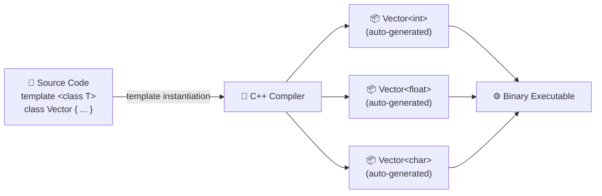
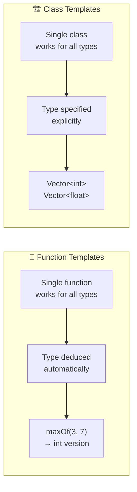
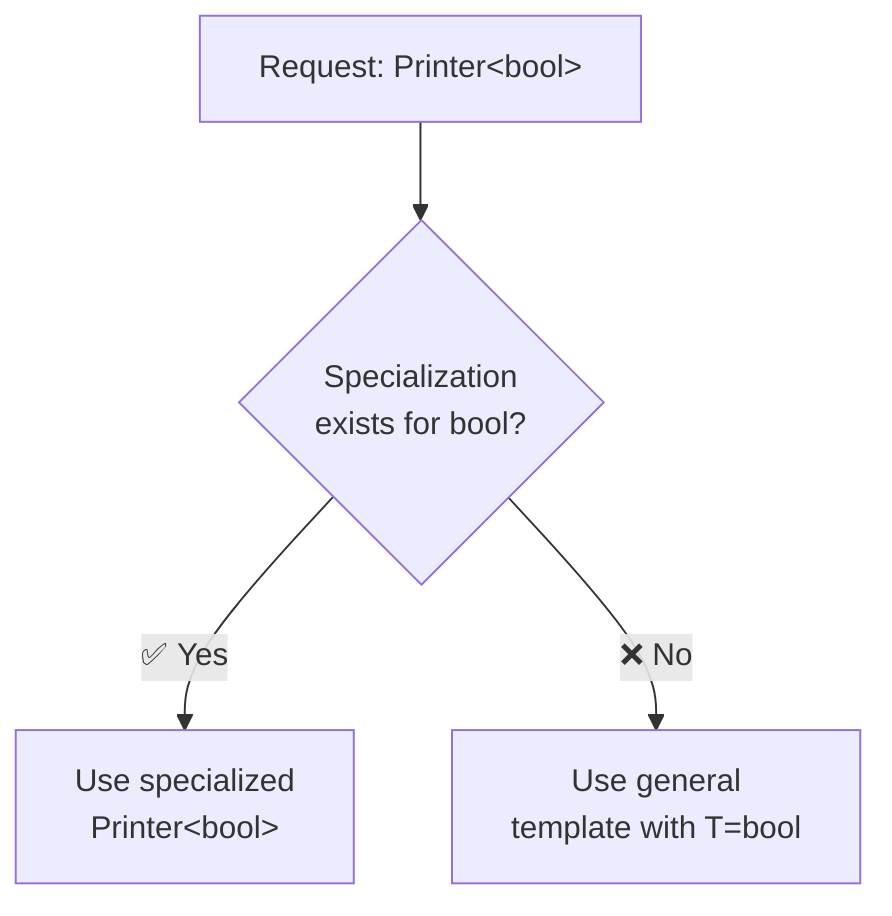
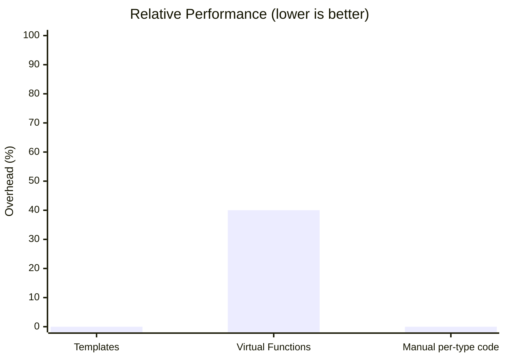
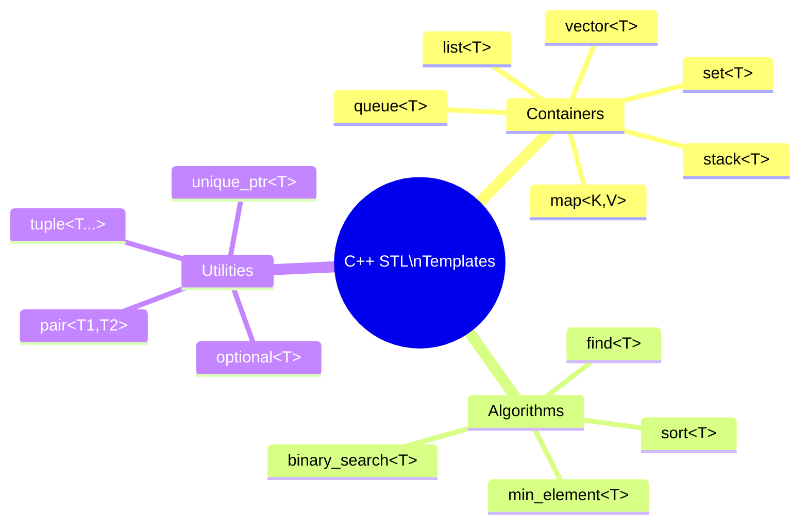
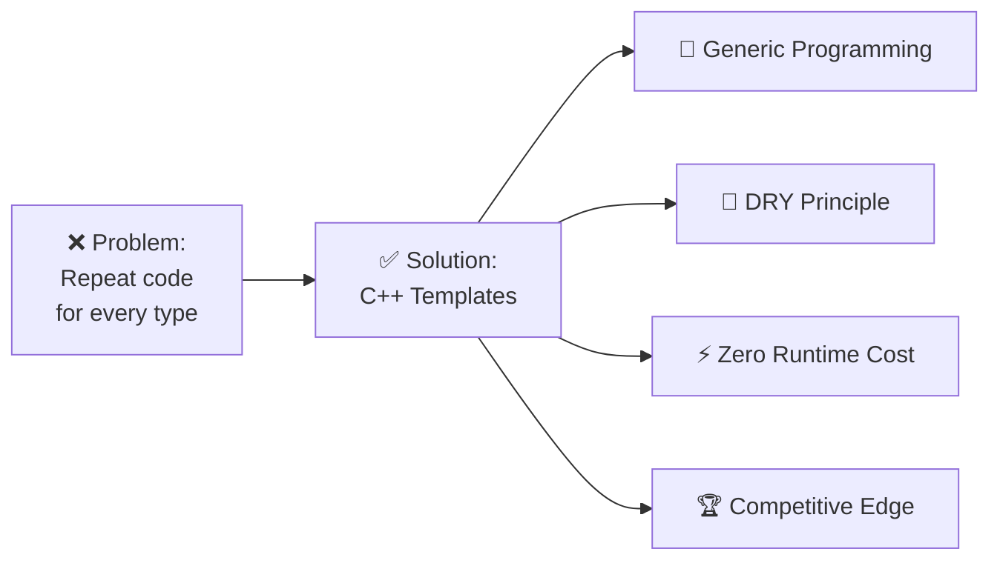

# 🧬 C++ Templates — The Competitive Programmer's Secret Weapon

> **Tutorial #63 | C++ Tutorials for Beginners**  
> *"What classes are to objects, templates are to classes."*

---

## 📋 Table of Contents

- [What is a Template?](#-what-is-a-template)
- [Why Use Templates?](#-why-use-templates)
- [How Templates Work — Under the Hood](#-how-templates-work--under-the-hood)
- [Syntax Deep Dive](#-syntax-deep-dive)
- [Function Templates vs Class Templates](#-function-templates-vs-class-templates)
- [Template Specialization](#-template-specialization)
- [Common Competitive Programming Patterns](#-common-competitive-programming-patterns)
- [Performance Comparison](#-performance-comparison)
- [Quick Reference Cheatsheet](#-quick-reference-cheatsheet)
- [Common Mistakes](#-common-mistakes)

---

## 🧩 What is a Template?

A **template** in C++ is a blueprint that allows you to write **generic, type-independent code**. Instead of writing the same class or function multiple times for `int`, `float`, `double`, `char`, etc., you write it once — and let the compiler generate the specific versions.

```
Template  ──▶  blueprint (written once)
Class     ──▶  blueprint for objects (written once per type WITHOUT templates)
Object    ──▶  instance of a class
```

### The Analogy



---

## ❓ Why Use Templates?

### Problem Without Templates

Imagine you want a `Vector` class for `int`, `float`, and `char`:

```cpp
// ❌ WITHOUT Templates — Violates DRY Rule
class VectorInt {
    int *arr;
    int size;
public:
    VectorInt(int* arr) { /* code */ }
    // 50+ lines of methods...
};

class VectorFloat {
    float *arr;        // Only this changes!
    int size;
public:
    VectorFloat(float* arr) { /* same code */ }
    // Same 50+ lines repeated...
};

class VectorChar {
    char *arr;         // Only this changes!
    int size;
public:
    VectorChar(char* arr) { /* same code again */ }
    // Same 50+ lines repeated AGAIN...
};
```

### Solution With Templates

```cpp
// ✅ WITH Templates — Write Once, Use Everywhere
template <class T>
class Vector {
    T *arr;
    int size;
public:
    Vector(T* arr) { /* code — written ONCE */ }
    // Methods written once, work for ALL types
};
```

### Comparison Table

| Aspect | Without Templates | With Templates |
|--------|:-----------------:|:--------------:|
| Lines of Code | `N × types` | `N` (once) |
| DRY Principle | ❌ Violated | ✅ Followed |
| Maintainability | ❌ Change in N places | ✅ Change in 1 place |
| Type Safety | ✅ Yes | ✅ Yes |
| Runtime Overhead | ✅ None | ✅ None (compile-time) |
| Compile Time | ✅ Fast | ⚠️ Slightly slower |
| Competitive Programming Edge | ❌ Low | ✅ High |

---

## ⚙️ How Templates Work — Under the Hood

Templates are resolved entirely at **compile time**, not runtime. The compiler creates separate concrete classes/functions for every type you use.



> 💡 This process is called **Template Instantiation** — the compiler stamps out a concrete version for each type you use.

---

## 📝 Syntax Deep Dive

### Class Template

```cpp
#include <iostream>
using namespace std;

// Step 1: Declare the template with type parameter T
template <class T>
class Vector {
    T *arr;       // Step 2: Use T as the data type
    int size;

public:
    Vector(T* arr) {
        // constructor code
    }

    T getElement(int index) {
        return arr[index];
    }

    // More methods...
};

int main() {
    // Step 3: Instantiate with specific types
    Vector<int>   myIntVec(nullptr);    // T becomes int
    Vector<float> myFloatVec(nullptr);  // T becomes float
    Vector<char>  myCharVec(nullptr);   // T becomes char

    return 0;
}
```

### Function Template

```cpp
#include <iostream>
using namespace std;

// Function template — works for any comparable type
template <class T>
T maxOf(T a, T b) {
    return (a > b) ? a : b;
}

int main() {
    cout << maxOf(3, 7);         // int version
    cout << maxOf(3.5, 2.1);     // double version
    cout << maxOf('a', 'z');     // char version
    return 0;
}
```

### Multiple Template Parameters

```cpp
template <class T, class U>
class Pair {
    T first;
    U second;

public:
    Pair(T f, U s) : first(f), second(s) {}

    void display() {
        cout << first << " : " << second << endl;
    }
};

int main() {
    Pair<int, string>   p1(1, "one");
    Pair<string, float> p2("pi", 3.14f);
    p1.display();  // Output: 1 : one
    p2.display();  // Output: pi : 3.14
    return 0;
}
```

### Non-Type Template Parameters

```cpp
// T is the type, N is a compile-time constant
template <class T, int N>
class FixedArray {
    T data[N];  // Array of fixed size N

public:
    int size() { return N; }
    T& operator[](int i) { return data[i]; }
};

int main() {
    FixedArray<int, 10>    arr10;   // Array of 10 ints
    FixedArray<double, 5>  arr5;    // Array of 5 doubles
    cout << arr10.size();           // 10
    return 0;
}
```

---

## 🔁 Function Templates vs Class Templates



| Feature | Function Template | Class Template |
|---------|:-----------------:|:--------------:|
| Keyword | `template <class T>` | `template <class T>` |
| Type Deduction | ✅ Automatic | ❌ Must specify |
| Use Case | Generic algorithms | Generic data structures |
| Example | `maxOf(a, b)` | `Vector<int>` |
| STL Examples | `std::sort`, `std::swap` | `std::vector`, `std::map` |

---

## 🎯 Template Specialization

Sometimes you need **different behavior for a specific type**. Template specialization handles that:

```cpp
// General template
template <class T>
class Printer {
public:
    void print(T val) {
        cout << "Value: " << val << endl;
    }
};

// Specialization for bool
template <>
class Printer<bool> {
public:
    void print(bool val) {
        cout << "Boolean: " << (val ? "true" : "false") << endl;
    }
};

int main() {
    Printer<int>  p1; p1.print(42);     // Value: 42
    Printer<bool> p2; p2.print(true);   // Boolean: true
    return 0;
}
```

### Specialization Flow



---

## 🏆 Common Competitive Programming Patterns

These are the templates that save precious time in competitions:

### 1. Generic Stack

```cpp
template <class T>
class Stack {
    T data[1000];
    int top = -1;

public:
    void push(T val) { data[++top] = val; }
    T pop()          { return data[top--]; }
    T peek()         { return data[top];   }
    bool empty()     { return top == -1;   }
};

// Usage:
Stack<int>    intStack;
Stack<string> strStack;
```

### 2. Generic Pair (Custom)

```cpp
template <class T1, class T2>
struct Pair {
    T1 first;
    T2 second;
    Pair(T1 a, T2 b) : first(a), second(b) {}
    bool operator<(const Pair& o) const {
        return first < o.first;
    }
};
```

### 3. Min/Max with Any Type

```cpp
template <class T>
T clamp(T val, T lo, T hi) {
    return max(lo, min(val, hi));
}

// Works for int, long long, double, etc.
int   x = clamp(15, 0, 10);    // 10
float y = clamp(3.5f, 0.0f, 5.0f); // 3.5
```

### 4. Generic Binary Search

```cpp
template <class T>
int binarySearch(T arr[], int n, T target) {
    int lo = 0, hi = n - 1;
    while (lo <= hi) {
        int mid = lo + (hi - lo) / 2;
        if (arr[mid] == target) return mid;
        else if (arr[mid] < target) lo = mid + 1;
        else hi = mid - 1;
    }
    return -1;
}
```

---

## 📊 Performance Comparison

Since templates are resolved at **compile time**, there is **zero runtime overhead** compared to runtime polymorphism (virtual functions).



| Approach | Runtime Overhead | Code Duplication | Type Safety |
|----------|:----------------:|:----------------:|:-----------:|
| Templates (compile-time) | ✅ 0% | ✅ None | ✅ Full |
| Virtual Functions (runtime) | ⚠️ ~10–40% | ✅ None | ✅ Full |
| Manual per-type classes | ✅ 0% | ❌ High | ✅ Full |
| `void*` generics (C-style) | ✅ 0% | ✅ None | ❌ None |

---

## 📌 Quick Reference Cheatsheet

```
┌─────────────────────────────────────────────────────────────┐
│                C++ TEMPLATES QUICK REFERENCE                 │
├──────────────────────┬──────────────────────────────────────┤
│ CLASS TEMPLATE       │ template <class T>                    │
│                      │ class MyClass { T data; };            │
├──────────────────────┼──────────────────────────────────────┤
│ FUNCTION TEMPLATE    │ template <class T>                    │
│                      │ T myFunc(T a, T b) { ... }            │
├──────────────────────┼──────────────────────────────────────┤
│ MULTI-PARAM          │ template <class T, class U>           │
│                      │ class Pair { T a; U b; };             │
├──────────────────────┼──────────────────────────────────────┤
│ NON-TYPE PARAM       │ template <class T, int N>             │
│                      │ class Array { T data[N]; };           │
├──────────────────────┼──────────────────────────────────────┤
│ SPECIALIZATION       │ template <>                           │
│                      │ class MyClass<bool> { ... };          │
├──────────────────────┼──────────────────────────────────────┤
│ INSTANTIATE          │ MyClass<int> obj;                     │
│                      │ MyClass<float> obj2;                  │
└──────────────────────┴──────────────────────────────────────┘
```

### STL Classes Built With Templates



---

## ⚠️ Common Mistakes

### Mistake 1: Missing `template` Keyword on Member Functions

```cpp
// ❌ Wrong
template <class T>
class MyClass {
    T val;
public:
    T getValue();  // declaration OK
};

T MyClass::getValue() { return val; }  // ❌ Missing template header

// ✅ Correct
template <class T>
T MyClass<T>::getValue() { return val; }  // ✅ Full template syntax
```

### Mistake 2: Template Definitions in `.cpp` Files

```cpp
// ❌ Don't separate template definition into a .cpp file
// The compiler needs the full definition at instantiation point

// ✅ Keep everything in the header file (.h / .hpp)
// OR use explicit instantiation in the .cpp
```

### Mistake 3: Forgetting `<T>` When Referencing the Class

```cpp
template <class T>
class Node {
public:
    T data;
    Node* next;        // ❌ Should be Node<T>* next;
    Node<T>* next;     // ✅ Correct
};
```

---

## 🎓 Summary



Templates are one of C++'s most powerful features, enabling you to:

- Write **once**, run for **any type**
- Follow the **DRY principle** strictly
- Achieve **zero runtime overhead** (compile-time resolution)
- Build the foundations of the entire **C++ STL**
- Gain a significant **edge in competitive programming**

---

> 📚 **Next Up:** Template Metaprogramming, Variadic Templates, and SFINAE  
> 🔗 **Playlist:** C++ Tutorials for Beginners — Tutorial #63  
> ⭐ Star this repo if it helped you!

---

*Made with ❤️ for the C++ community*
