# 🚀 C++ Standard Template Library (STL) — Complete Reference

> **The ultimate STL guide for competitive programmers, students, and professionals.**
> Covers every container, algorithm, iterator, and utility with diagrams, flowcharts, and code examples.

---

## 📋 Table of Contents

- [What is STL?](#what-is-stl)
- [Why Use STL?](#why-use-stl)
- [STL Architecture Overview](#stl-architecture-overview)
- [Component 1: Containers](#component-1-containers)
  - [Sequence Containers](#sequence-containers)
  - [Associative Containers](#associative-containers)
  - [Unordered Containers](#unordered-containers)
  - [Container Adaptors](#container-adaptors)
  - [Container Comparison Table](#container-comparison-table)
- [Component 2: Algorithms](#component-2-algorithms)
  - [Sorting Algorithms](#sorting-algorithms)
  - [Searching Algorithms](#searching-algorithms)
  - [Modifying Algorithms](#modifying-algorithms)
  - [Non-Modifying Algorithms](#non-modifying-algorithms)
  - [Numeric Algorithms](#numeric-algorithms)
- [Component 3: Iterators](#component-3-iterators)
  - [Iterator Types](#iterator-types)
  - [Iterator Operations](#iterator-operations)
- [Utility Components](#utility-components)
  - [Pairs and Tuples](#pairs-and-tuples)
  - [Functors](#functors)
  - [Lambda Functions](#lambda-functions)
- [Deep Dive: Each Container](#deep-dive-each-container)
- [Time Complexity Cheatsheet](#time-complexity-cheatsheet)
- [Common Competitive Programming Patterns](#common-competitive-programming-patterns)
- [STL Gotchas & Tips](#stl-gotchas--tips)

---

## What is STL?

The **Standard Template Library (STL)** is a powerful set of C++ template classes that provides general-purpose classes and functions with templates that implement many popular and commonly used algorithms and data structures.

> 💡 **Core Philosophy:** *Don't reinvent the wheel. Use battle-tested, optimized implementations so you can focus on solving problems, not re-coding primitives.*

```
"STL is to C++ what the Swiss Army knife is to survival — versatile,
 reliable, and always there when you need it most."
```

---

## Why Use STL?

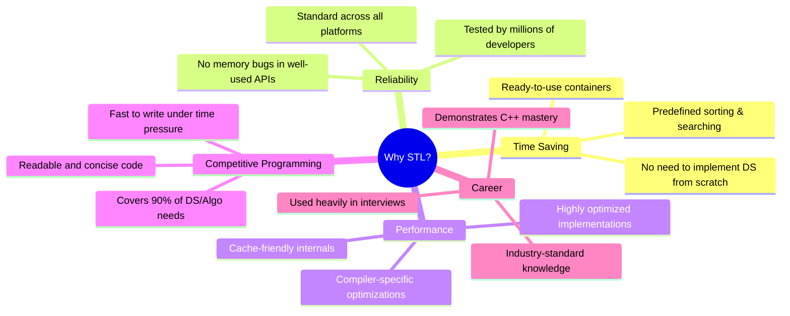

### The Car Factory Analogy


---

## STL Architecture Overview

```mermaid
graph TD
    STL["🏗️ STL — Standard Template Library"]
    STL --> CONT["📦 Containers\nStore Data"]
    STL --> ALGO["⚙️ Algorithms\nProcess Data"]
    STL --> ITER["🔗 Iterators\nBridge Between Both"]
    STL --> UTIL["🛠️ Utilities\nPairs, Functors, etc."]

    CONT --> SC["Sequence Containers\nvector, list, deque, array"]
    CONT --> AC["Associative Containers\nset, map, multiset, multimap"]
    CONT --> UC["Unordered Containers\nunordered_set, unordered_map"]
    CONT --> CA["Container Adaptors\nstack, queue, priority_queue"]

    ALGO --> SA["Sorting\nsort, stable_sort, partial_sort"]
    ALGO --> SEA["Searching\nbinary_search, find, lower_bound"]
    ALGO --> MA["Modifying\ncopy, fill, replace, transform"]
    ALGO --> NA["Numeric\naccumulate, inner_product, iota"]

    ITER --> II["Input Iterator"]
    ITER --> OI["Output Iterator"]
    ITER --> FI["Forward Iterator"]
    ITER --> BI["Bidirectional Iterator"]
    ITER --> RI["Random Access Iterator"]

    style STL fill:#1a1a2e,color:#e0e0e0,stroke:#7b2d8b
    style CONT fill:#16213e,color:#e0e0e0
    style ALGO fill:#16213e,color:#e0e0e0
    style ITER fill:#16213e,color:#e0e0e0
    style UTIL fill:#16213e,color:#e0e0e0
```

### How the Three Core Components Work Together

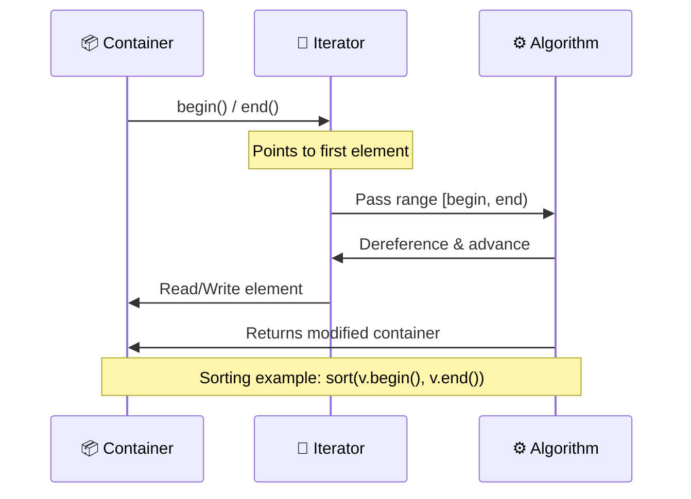

---

## Component 1: Containers

> A **container** is an object that stores a collection of elements. STL provides ready-made template containers so you never have to build your own linked list, tree, or hash table again.

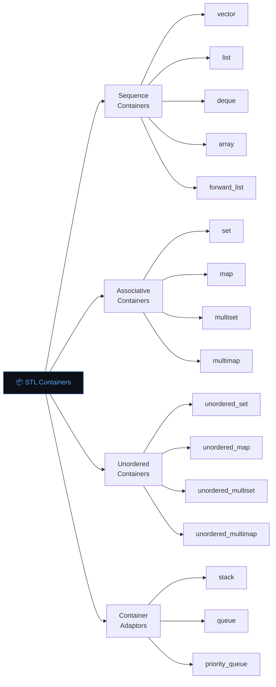

---

### Sequence Containers

#### 🔷 `vector<T>` — Dynamic Array

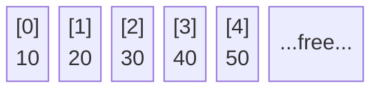

```cpp
#include <vector>
using namespace std;

vector<int> v;                    // Empty vector
vector<int> v(5, 0);             // {0, 0, 0, 0, 0}
vector<int> v = {1, 2, 3, 4, 5};

// Core Operations
v.push_back(6);       // Add to end        O(1) amortized
v.pop_back();         // Remove from end   O(1)
v[2];                 // Random access     O(1)
v.at(2);              // Bounds-checked    O(1)
v.front();            // First element     O(1)
v.back();             // Last element      O(1)
v.size();             // Number of elements
v.empty();            // Is it empty?
v.clear();            // Remove all elements
v.resize(10);         // Resize
v.reserve(100);       // Reserve capacity (no resize)
v.insert(v.begin()+2, 99);  // Insert at position O(n)
v.erase(v.begin()+2);       // Erase at position  O(n)

// 2D Vector
vector<vector<int>> grid(3, vector<int>(3, 0));
```

**Memory Layout of Vector (Reallocation):**

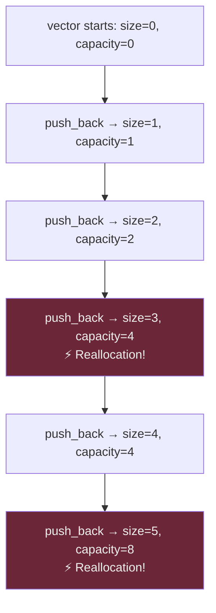

> **Tip:** Use `v.reserve(n)` if you know the size in advance — avoids costly reallocations.

---

#### 🔷 `list<T>` — Doubly Linked List


```cpp
#include <list>
list<int> lst = {1, 2, 3, 4};

lst.push_back(5);       // O(1)
lst.push_front(0);      // O(1) ← advantage over vector!
lst.pop_back();         // O(1)
lst.pop_front();        // O(1)
lst.insert(it, 99);     // O(1) if iterator known
lst.erase(it);          // O(1) if iterator known
lst.sort();             // O(n log n)
lst.reverse();          // O(n)
lst.unique();           // Remove consecutive duplicates
lst.merge(lst2);        // Merge two sorted lists
lst.splice(it, lst2);  // Move elements from lst2
```

---

#### 🔷 `deque<T>` — Double-Ended Queue


```cpp
#include <deque>
deque<int> dq = {3, 4, 5};

dq.push_front(2);   // O(1)
dq.push_back(6);    // O(1)
dq.pop_front();     // O(1)
dq.pop_back();      // O(1)
dq[2];              // O(1) Random access
```

> **Use deque when:** You need fast insertions at both ends AND random access.

---

#### 🔷 `array<T, N>` — Fixed-Size Array (C++11)

```cpp
#include <array>
array<int, 5> arr = {1, 2, 3, 4, 5};

arr[0];          // O(1)
arr.at(0);       // O(1) bounds-checked
arr.size();      // Always 5
arr.fill(0);     // Fill all with 0
arr.front();
arr.back();
sort(arr.begin(), arr.end());
```

> **Use `array` over raw C arrays:** It knows its size, works with STL algorithms, and is bounds-checkable.

---

#### 🔷 `forward_list<T>` — Singly Linked List (C++11)

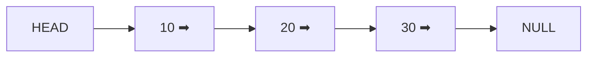

```cpp
#include <forward_list>
forward_list<int> fl = {1, 2, 3};

fl.push_front(0);           // O(1) — no push_back!
fl.insert_after(it, 99);    // O(1)
fl.erase_after(it);         // O(1)
fl.sort();                  // O(n log n)
fl.reverse();               // O(n)
```

> **Use `forward_list`** when memory is critical — it uses ~half the memory of `list`.

---

### Associative Containers

> These store elements in a **sorted order** and use **Red-Black Trees** internally. All operations are **O(log n)**.

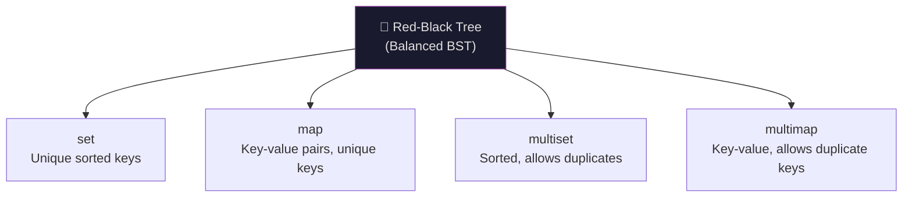

#### 🔷 `set<T>`

```cpp
#include <set>
set<int> s = {5, 1, 3, 2, 4};
// Internally stored as: {1, 2, 3, 4, 5}

s.insert(6);           // O(log n)
s.erase(3);            // O(log n)
s.count(5);            // 0 or 1
s.find(5);             // iterator or s.end()
s.lower_bound(3);      // Iterator to first element >= 3
s.upper_bound(3);      // Iterator to first element > 3

// Iterating (always sorted)
for (auto x : s) cout << x << " ";
```

#### 🔷 `map<K, V>`

```cpp
#include <map>
map<string, int> freq;

freq["apple"]++;
freq["banana"] = 5;
freq.insert({"cherry", 3});
freq.erase("apple");
freq.count("banana");      // 1 if exists
freq.find("cherry");       // iterator

// Iterate in sorted key order
for (auto& [key, val] : freq) {
    cout << key << ": " << val << "\n";
}
```

**Map Internal Structure:**

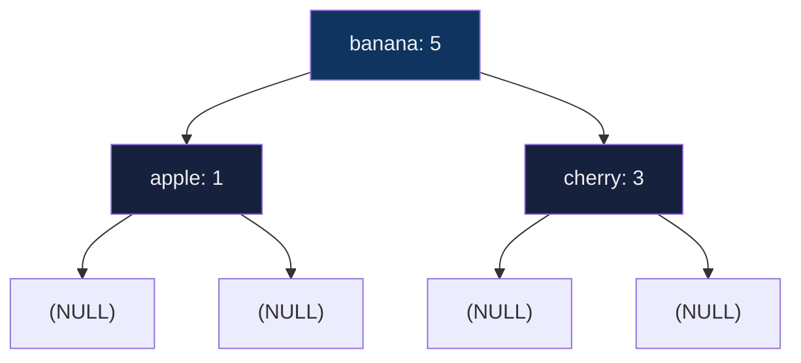

#### 🔷 `multiset<T>` and `multimap<K,V>`

```cpp
#include <set>
#include <map>

multiset<int> ms = {1, 2, 2, 3, 3, 3};
ms.count(3);          // 3
ms.erase(ms.find(2)); // Remove ONE occurrence of 2
ms.erase(3);          // Remove ALL occurrences of 3

multimap<string, int> mm;
mm.insert({"a", 1});
mm.insert({"a", 2});  // Same key, different value!
mm.count("a");        // 2
```

---

### Unordered Containers

> These use **Hash Tables** internally. Average **O(1)** operations, but **O(n)** worst case on hash collisions.


#### 🔷 `unordered_set<T>` and `unordered_map<K,V>`

```cpp
#include <unordered_set>
#include <unordered_map>

unordered_set<int> us = {5, 3, 1, 4, 2};
// NO guaranteed order!

us.insert(6);     // O(1) average
us.erase(3);      // O(1) average
us.count(5);      // O(1) average
us.find(5);       // O(1) average

unordered_map<string, int> um;
um["hello"] = 1;
um["world"] = 2;

// Custom hash for pairs (common in competitive programming)
struct PairHash {
    size_t operator()(const pair<int,int>& p) const {
        return hash<long long>()(((long long)p.first << 32) | p.second);
    }
};
unordered_map<pair<int,int>, int, PairHash> pairMap;
```

---

### Container Adaptors

> These **wrap** existing containers and **restrict** their interface to provide specific behavior.

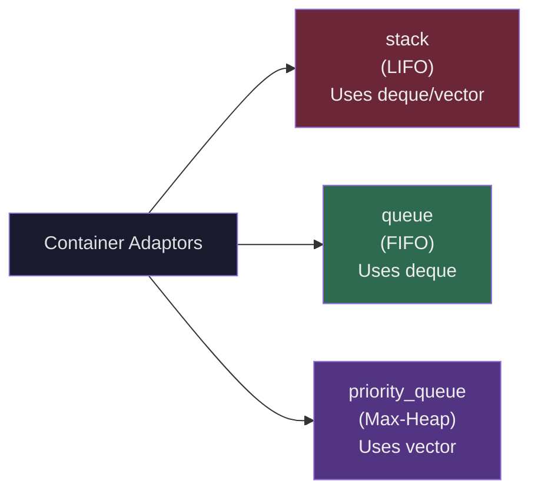

#### 🔷 `stack<T>` — LIFO

```
Push →  [5] [4] [3] [2] [1]  ← Top
Pop  →  Remove from Top
```

```cpp
#include <stack>
stack<int> stk;

stk.push(10);     // Push
stk.push(20);
stk.top();        // Peek top (20)
stk.pop();        // Remove top
stk.empty();      // Is empty?
stk.size();       // Number of elements
```

#### 🔷 `queue<T>` — FIFO

```
Enqueue → [1][2][3][4][5] → Dequeue
Front ↑                    ↑ Back
```

```cpp
#include <queue>
queue<int> q;

q.push(10);       // Enqueue at back
q.push(20);
q.front();        // Peek front (10)
q.back();         // Peek back (20)
q.pop();          // Dequeue from front
q.empty();
q.size();
```

#### 🔷 `priority_queue<T>` — Max-Heap

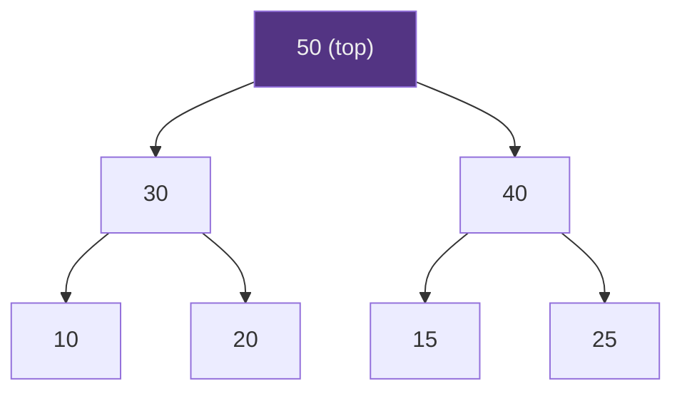

```cpp
#include <queue>

// Max-heap (default)
priority_queue<int> pq;
pq.push(10);
pq.push(50);
pq.push(30);
pq.top();   // 50
pq.pop();   // Removes 50

// Min-heap
priority_queue<int, vector<int>, greater<int>> minPQ;

// Custom comparator
auto cmp = [](pair<int,int> a, pair<int,int> b) {
    return a.second > b.second; // Min-heap by second
};
priority_queue<pair<int,int>, vector<pair<int,int>>, decltype(cmp)> customPQ(cmp);
```

---

### Container Comparison Table

| Container | Header | Ordering | Duplicates | Access | Insert/Delete | Search |
|---|---|---|---|---|---|---|
| `vector` | `<vector>` | Insertion order | ✅ | O(1) random | O(1) end / O(n) mid | O(n) |
| `list` | `<list>` | Insertion order | ✅ | O(n) | O(1) anywhere | O(n) |
| `deque` | `<deque>` | Insertion order | ✅ | O(1) random | O(1) both ends | O(n) |
| `array` | `<array>` | Insertion order | ✅ | O(1) random | ❌ Fixed size | O(n) |
| `forward_list` | `<forward_list>` | Insertion order | ✅ | O(n) | O(1) front | O(n) |
| `set` | `<set>` | Sorted | ❌ | O(log n) | O(log n) | O(log n) |
| `multiset` | `<set>` | Sorted | ✅ | O(log n) | O(log n) | O(log n) |
| `map` | `<map>` | Sorted by key | ❌ keys | O(log n) | O(log n) | O(log n) |
| `multimap` | `<map>` | Sorted by key | ✅ keys | O(log n) | O(log n) | O(log n) |
| `unordered_set` | `<unordered_set>` | None | ❌ | O(1) avg | O(1) avg | O(1) avg |
| `unordered_map` | `<unordered_map>` | None | ❌ keys | O(1) avg | O(1) avg | O(1) avg |
| `stack` | `<stack>` | LIFO | ✅ | top only | O(1) | ❌ |
| `queue` | `<queue>` | FIFO | ✅ | front/back | O(1) | ❌ |
| `priority_queue` | `<queue>` | Heap order | ✅ | O(1) top | O(log n) | ❌ |

---

## Component 2: Algorithms

> STL algorithms operate on **ranges** defined by iterators. They are in `<algorithm>` and `<numeric>`.

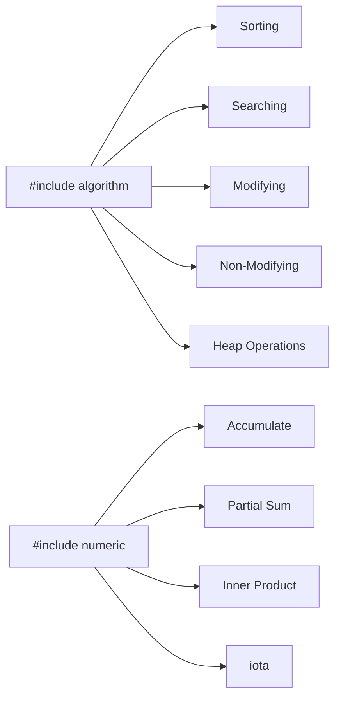

---

### Sorting Algorithms

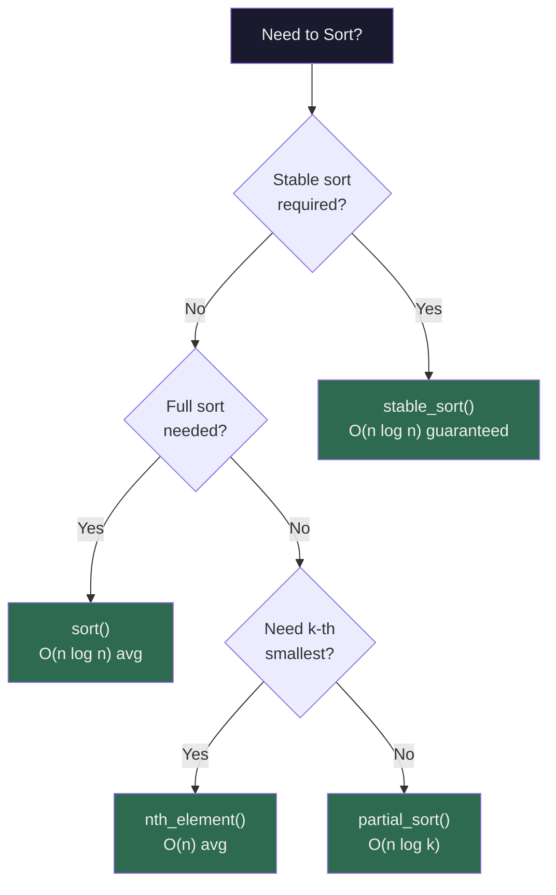

```cpp
#include <algorithm>
vector<int> v = {5, 2, 8, 1, 9, 3};

// Basic sort (ascending)
sort(v.begin(), v.end());

// Descending sort
sort(v.begin(), v.end(), greater<int>());

// Custom comparator
sort(v.begin(), v.end(), [](int a, int b) {
    return a > b;  // Descending
});

// Sort struct by field
struct Student { string name; int gpa; };
vector<Student> students = { {"Alice", 90}, {"Bob", 85} };
sort(students.begin(), students.end(), [](const Student& a, const Student& b) {
    return a.gpa > b.gpa;  // By GPA descending
});

// Stable sort (preserves relative order of equal elements)
stable_sort(v.begin(), v.end());

// Partial sort (only first k elements sorted)
partial_sort(v.begin(), v.begin() + 3, v.end()); // Sort first 3

// nth_element (guarantees v[n] is correct, rest unordered)
nth_element(v.begin(), v.begin() + 2, v.end());

// Is sorted?
is_sorted(v.begin(), v.end()); // bool

// Sort subarray
sort(v.begin() + 2, v.begin() + 5);  // Sort indices [2, 5)
```

---

### Searching Algorithms

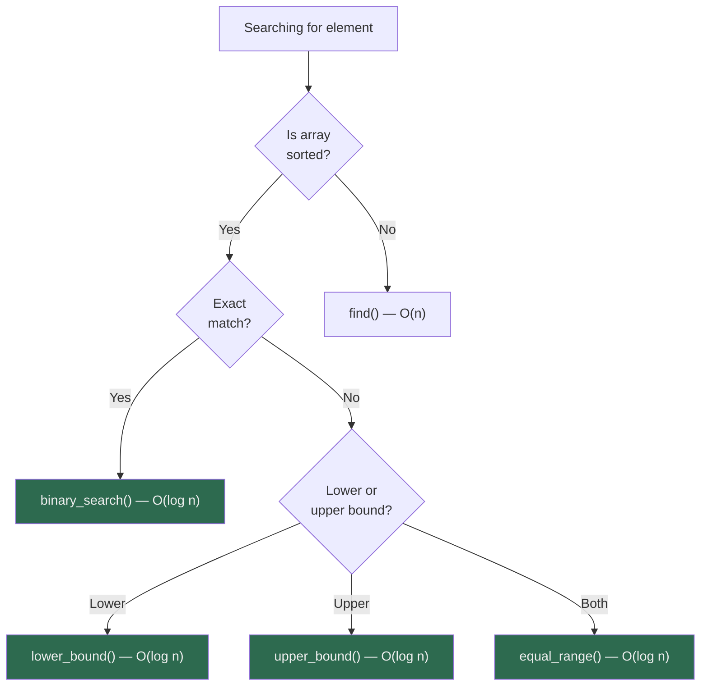

```cpp
vector<int> v = {1, 2, 3, 4, 4, 4, 5, 6};
//              0  1  2  3  4  5  6  7

// Binary search (must be sorted!)
binary_search(v.begin(), v.end(), 4); // true

// lower_bound: first position where value >= x
auto lb = lower_bound(v.begin(), v.end(), 4);
// *lb == 4, index = 3

// upper_bound: first position where value > x
auto ub = upper_bound(v.begin(), v.end(), 4);
// *ub == 5, index = 6

// Count occurrences of 4:
int count = upper_bound(v.begin(), v.end(), 4)
           - lower_bound(v.begin(), v.end(), 4);
// count = 3

// equal_range: returns pair (lower_bound, upper_bound)
auto [lo, hi] = equal_range(v.begin(), v.end(), 4);

// Linear search (unsorted)
auto it = find(v.begin(), v.end(), 3);
if (it != v.end()) cout << "Found at index " << it - v.begin();

// find_if with predicate
auto it2 = find_if(v.begin(), v.end(), [](int x) { return x > 3; });

// min/max element
auto maxIt = max_element(v.begin(), v.end());
auto minIt = min_element(v.begin(), v.end());
```

---

### Modifying Algorithms

```cpp
#include <algorithm>

vector<int> v = {1, 2, 3, 4, 5};
vector<int> dest(5);

// Copy
copy(v.begin(), v.end(), dest.begin());

// Fill
fill(v.begin(), v.end(), 0);       // All zeros
fill_n(v.begin(), 3, 7);           // First 3 become 7

// Replace
replace(v.begin(), v.end(), 2, 99);  // Replace 2 with 99
replace_if(v.begin(), v.end(), [](int x){ return x%2==0; }, 0);

// Transform (apply function to each element)
transform(v.begin(), v.end(), v.begin(), [](int x){ return x*2; });

// Two-range transform
transform(v.begin(), v.end(), dest.begin(), v.begin(),
          [](int a, int b){ return a + b; });

// Reverse
reverse(v.begin(), v.end());

// Rotate (bring element at v.begin()+2 to front)
rotate(v.begin(), v.begin() + 2, v.end());

// Unique (remove consecutive duplicates, must sort first!)
sort(v.begin(), v.end());
v.erase(unique(v.begin(), v.end()), v.end());

// Remove (doesn't actually resize! Use erase-remove idiom)
v.erase(remove(v.begin(), v.end(), 3), v.end());
v.erase(remove_if(v.begin(), v.end(), [](int x){ return x%2==0; }), v.end());

// Shuffle (C++11)
#include <random>
mt19937 rng(42);
shuffle(v.begin(), v.end(), rng);
```

**Erase-Remove Idiom Explained:**

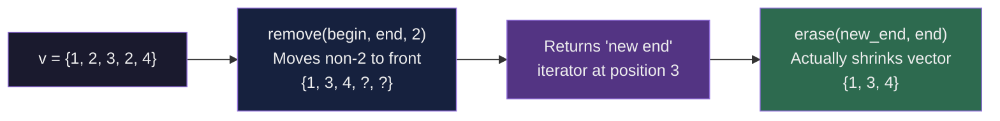

---

### Non-Modifying Algorithms

```cpp
// Count elements
count(v.begin(), v.end(), 3);                          // Count 3s
count_if(v.begin(), v.end(), [](int x){ return x>3; }); // Count >3

// Check predicates across range
all_of(v.begin(), v.end(), [](int x){ return x > 0; });  // All positive?
any_of(v.begin(), v.end(), [](int x){ return x > 5; });  // Any > 5?
none_of(v.begin(), v.end(), [](int x){ return x < 0; }); // None negative?

// For each (apply function without modifying)
for_each(v.begin(), v.end(), [](int x){ cout << x << " "; });

// Mismatch (find first difference between two ranges)
auto [it1, it2] = mismatch(v.begin(), v.end(), dest.begin());

// Equal (are two ranges equal?)
equal(v.begin(), v.end(), dest.begin());

// Lexicographic comparison
lexicographical_compare(v.begin(), v.end(), dest.begin(), dest.end());
```

---

### Numeric Algorithms

```cpp
#include <numeric>

vector<int> v = {1, 2, 3, 4, 5};

// Sum (accumulate)
int sum = accumulate(v.begin(), v.end(), 0);  // 15

// Product
int prod = accumulate(v.begin(), v.end(), 1, multiplies<int>()); // 120

// Custom accumulate
string joined = accumulate(v.begin(), v.end(), string(""),
    [](string acc, int x){ return acc + to_string(x) + ","; });

// Prefix sums (partial_sum)
vector<int> prefix(5);
partial_sum(v.begin(), v.end(), prefix.begin());
// prefix = {1, 3, 6, 10, 15}

// Adjacent difference
vector<int> diff(5);
adjacent_difference(v.begin(), v.end(), diff.begin());
// diff = {1, 1, 1, 1, 1}

// Inner product (dot product)
vector<int> w = {5, 4, 3, 2, 1};
int dot = inner_product(v.begin(), v.end(), w.begin(), 0);
// 1*5 + 2*4 + 3*3 + 4*2 + 5*1 = 35

// iota (fill with increasing values)
iota(v.begin(), v.end(), 1); // {1, 2, 3, 4, 5}
iota(v.begin(), v.end(), 0); // {0, 1, 2, 3, 4}
```

---

### Other Important Algorithms

```cpp
// min / max / clamp
min(3, 5);               // 3
max(3, 5);               // 5
min({1, 5, 3, 2, 4});    // 1 (initializer list)
max({1, 5, 3, 2, 4});    // 5
clamp(x, low, high);     // Clamps x to [low, high] (C++17)

// swap
swap(a, b);

// Permutations
vector<int> p = {1, 2, 3};
next_permutation(p.begin(), p.end());  // {1, 3, 2}
prev_permutation(p.begin(), p.end());  // {1, 2, 3}

// GCD / LCM (C++17, <numeric>)
__gcd(12, 8);        // 4  (C++11 way)
gcd(12, 8);          // 4  (C++17 way, <numeric>)
lcm(4, 6);           // 12 (C++17 way)

// Heap operations
make_heap(v.begin(), v.end());
push_heap(v.begin(), v.end());
pop_heap(v.begin(), v.end());
sort_heap(v.begin(), v.end());
```

---

## Component 3: Iterators

> **Iterators** are the glue between containers and algorithms. They act like smart pointers — they can point to elements inside containers.

### Iterator Types

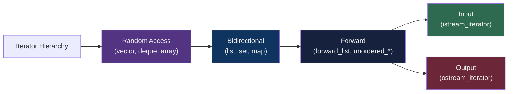

| Iterator Type | Read | Write | Forward | Backward | Random Jump |
|---|---|---|---|---|---|
| Input | ✅ | ❌ | ✅ (once) | ❌ | ❌ |
| Output | ❌ | ✅ | ✅ (once) | ❌ | ❌ |
| Forward | ✅ | ✅ | ✅ | ❌ | ❌ |
| Bidirectional | ✅ | ✅ | ✅ | ✅ | ❌ |
| Random Access | ✅ | ✅ | ✅ | ✅ | ✅ |

### Iterator Operations

```cpp
vector<int> v = {10, 20, 30, 40, 50};

auto it = v.begin();      // Points to 10
auto end = v.end();       // Points PAST 50

*it;          // Dereference: 10
++it;         // Advance: points to 20
--it;         // Go back: points to 10 (bidirectional)
it += 3;      // Jump 3 ahead: points to 40 (random access)
it - v.begin(); // Distance from begin: 3

// begin / end
v.begin();     // Iterator to first
v.end();       // Iterator past last
v.rbegin();    // Reverse iterator to last
v.rend();      // Reverse iterator before first
v.cbegin();    // Const iterator to first
v.cend();      // Const iterator past last

// Advance and Distance
advance(it, 2);              // Move it by 2
int d = distance(v.begin(), it);  // Distance between iterators

// next / prev (C++11)
auto next_it = next(it);     // Iterator to next element
auto prev_it = prev(it);     // Iterator to previous element
auto skipped = next(it, 3);  // Skip 3 elements
```

### Special Iterators

```cpp
#include <iterator>

// Insert iterators
vector<int> v;
back_insert_iterator<vector<int>> bi(v);
*bi = 5; // Equivalent to v.push_back(5)

// Shorthand with back_inserter / front_inserter
copy(src.begin(), src.end(), back_inserter(v));
copy(src.begin(), src.end(), front_inserter(lst));

// Stream iterators
#include <iterator>
vector<int> v(istream_iterator<int>(cin), istream_iterator<int>());
copy(v.begin(), v.end(), ostream_iterator<int>(cout, " "));
```

---

## Utility Components

### Pairs and Tuples

```cpp
#include <utility>

// pair
pair<int, string> p = {1, "hello"};
p.first;           // 1
p.second;          // "hello"
auto p2 = make_pair(2, "world");

// Useful in maps and sorted containers
vector<pair<int,int>> edges = {{1,2}, {3,4}};
sort(edges.begin(), edges.end()); // Sorts by first, then second

// tuple (C++11)
#include <tuple>
tuple<int, string, double> t = {1, "hi", 3.14};
get<0>(t);   // 1
get<1>(t);   // "hi"
get<2>(t);   // 3.14

auto t2 = make_tuple(42, "world", 2.71);

// Structured bindings (C++17)
auto [x, y, z] = t;

// tie (unpack tuple into variables)
int a; string b; double c;
tie(a, b, c) = t;
```

---

### Functors

> A **functor** (function object) is a class/struct with `operator()` defined.

```cpp
struct Multiply {
    int factor;
    Multiply(int f) : factor(f) {}
    int operator()(int x) { return x * factor; }
};

Multiply triple(3);
triple(5);  // 15

vector<int> v = {1, 2, 3, 4, 5};
transform(v.begin(), v.end(), v.begin(), Multiply(2));
// v = {2, 4, 6, 8, 10}

// Built-in functors in <functional>
plus<int>()        // a + b
minus<int>()       // a - b
multiplies<int>()  // a * b
divides<int>()     // a / b
modulus<int>()     // a % b
negate<int>()      // -a
greater<int>()     // a > b
less<int>()        // a < b
equal_to<int>()    // a == b
```

---

### Lambda Functions

```cpp
// Basic lambda
auto add = [](int a, int b) { return a + b; };
add(3, 4); // 7

// Capture by value
int x = 10;
auto addX = [x](int a) { return a + x; };

// Capture by reference
auto addXref = [&x](int a) { x += a; };

// Capture all by value
auto f1 = [=]() { return x + 5; };

// Capture all by reference
auto f2 = [&]() { x += 5; };

// Mutable lambda (can modify captured-by-value)
auto counter = [count = 0]() mutable { return ++count; };
counter(); // 1
counter(); // 2

// Generic lambda (C++14)
auto print = [](auto x) { cout << x; };
print(5);
print("hello");
```

---

## Deep Dive: Each Container

### Vector — When to Use and When NOT to

```mermaid
flowchart TD
    Q["What do you need?"] --> A{"Random Access?"}
    A -->|Yes| B{"Frequent insert\nin middle?"}
    A -->|No| C{"Insert at\nboth ends?"}
    B -->|No| USE["✅ Use vector"]
    B -->|Yes| AVOID["❌ Avoid vector\nUse list"]
    C -->|Yes| DEQUE["✅ Use deque"]
    C -->|No| Q2{"Sorted unique\nelements?"}
    Q2 -->|Yes| SET["✅ Use set"]
    Q2 -->|No| LIST["✅ Use list"]

    style USE fill:#2d6a4f,color:#eee
    style DEQUE fill:#2d6a4f,color:#eee
    style SET fill:#2d6a4f,color:#eee
    style LIST fill:#2d6a4f,color:#eee
    style AVOID fill:#6b2737,color:#eee
```

### Map vs Unordered Map Decision

```mermaid
flowchart LR
    Q["Need key-value\nmapping?"] --> A{"Need sorted\norder?"}
    A -->|Yes| MAP["map\nO(log n)"]
    A -->|No| B{"Custom\nhash type?"}
    B -->|No| UMAP["unordered_map\nO(1) avg"]
    B -->|Yes| C{"Can write\ncustom hash?"}
    C -->|Yes| UMAP2["unordered_map\nwith custom hash"]
    C -->|No| MAP2["map as fallback"]

    style MAP fill:#2d6a4f,color:#eee
    style UMAP fill:#2d6a4f,color:#eee
    style UMAP2 fill:#2d6a4f,color:#eee
    style MAP2 fill:#533483,color:#eee
```

---

## Time Complexity Cheatsheet

### Containers

| Operation | vector | list | deque | set/map | unordered_set/map |
|---|---|---|---|---|---|
| Access by index | O(1) | O(n) | O(1) | - | - |
| Insert at end | O(1)* | O(1) | O(1) | - | - |
| Insert at front | O(n) | O(1) | O(1) | - | - |
| Insert in middle | O(n) | O(1)† | O(n) | O(log n) | O(1)* |
| Delete at end | O(1) | O(1) | O(1) | - | - |
| Delete at front | O(n) | O(1) | O(1) | - | - |
| Search | O(n) | O(n) | O(n) | O(log n) | O(1)* |
| Sorted iteration | O(n log n) | O(n log n) | O(n log n) | O(n) | O(n) |

> `*` = amortized, `†` = with known iterator

### Algorithms

| Algorithm | Time | Space | Notes |
|---|---|---|---|
| `sort` | O(n log n) | O(log n) | Introsort (hybrid) |
| `stable_sort` | O(n log n) | O(n) | Merge sort based |
| `partial_sort` | O(n log k) | O(1) | Sort first k elements |
| `nth_element` | O(n) avg | O(1) | Not fully sorted |
| `binary_search` | O(log n) | O(1) | Must be sorted |
| `lower_bound` | O(log n) | O(1) | Must be sorted |
| `find` | O(n) | O(1) | Linear scan |
| `count` | O(n) | O(1) | Linear scan |
| `accumulate` | O(n) | O(1) | |
| `reverse` | O(n) | O(1) | |
| `unique` | O(n) | O(1) | Must be sorted first |
| `next_permutation` | O(n) | O(1) | |
| `make_heap` | O(n) | O(1) | |
| `push_heap` | O(log n) | O(1) | |
| `pop_heap` | O(log n) | O(1) | |

---

## Common Competitive Programming Patterns

### Pattern 1: Frequency Map

```cpp
// Count frequency of each element
map<int, int> freq;
for (int x : v) freq[x]++;

// Most frequent element
auto maxEl = max_element(freq.begin(), freq.end(),
    [](auto& a, auto& b){ return a.second < b.second; });
cout << maxEl->first << " appears " << maxEl->second << " times";
```

### Pattern 2: Sliding Window with Multiset

```cpp
// Find minimum in every window of size k
multiset<int> window;
for (int i = 0; i < n; i++) {
    window.insert(arr[i]);
    if (i >= k) window.erase(window.find(arr[i-k]));
    if (i >= k-1) cout << *window.begin() << " "; // min
}
```

### Pattern 3: Coordinate Compression

```cpp
vector<int> vals = {1000000, 3, 500, 7, 3};
vector<int> sorted_vals = vals;
sort(sorted_vals.begin(), sorted_vals.end());
sorted_vals.erase(unique(sorted_vals.begin(), sorted_vals.end()), sorted_vals.end());

auto compress = [&](int x) {
    return lower_bound(sorted_vals.begin(), sorted_vals.end(), x) - sorted_vals.begin();
};
// Now compress(1000000) = 4, compress(3) = 0, etc.
```

### Pattern 4: Dijkstra with Priority Queue

```cpp
vector<vector<pair<int,int>>> adj(n);
vector<int> dist(n, INT_MAX);
priority_queue<pair<int,int>, vector<pair<int,int>>, greater<>> pq;

dist[src] = 0;
pq.push({0, src});

while (!pq.empty()) {
    auto [d, u] = pq.top(); pq.pop();
    if (d > dist[u]) continue;
    for (auto [v, w] : adj[u]) {
        if (dist[u] + w < dist[v]) {
            dist[v] = dist[u] + w;
            pq.push({dist[v], v});
        }
    }
}
```

### Pattern 5: BFS with Queue

```cpp
queue<int> q;
vector<bool> visited(n, false);

q.push(start);
visited[start] = true;

while (!q.empty()) {
    int node = q.front(); q.pop();
    for (int neighbor : adj[node]) {
        if (!visited[neighbor]) {
            visited[neighbor] = true;
            q.push(neighbor);
        }
    }
}
```

### Pattern 6: Custom Sort with Multiple Keys

```cpp
struct Item { int priority, time, id; };
vector<Item> items;

sort(items.begin(), items.end(), [](const Item& a, const Item& b) {
    if (a.priority != b.priority) return a.priority > b.priority; // High priority first
    if (a.time != b.time) return a.time < b.time;                 // Then earlier time
    return a.id < b.id;                                            // Then smaller id
});
```

### Pattern 7: Two Pointer with Vector

```cpp
// Find pair summing to target
sort(v.begin(), v.end());
int lo = 0, hi = v.size() - 1;
while (lo < hi) {
    int sum = v[lo] + v[hi];
    if (sum == target) { /* found */ break; }
    else if (sum < target) lo++;
    else hi--;
}
```

### Pattern 8: Monotonic Stack

```cpp
// Next Greater Element
vector<int> v = {4, 5, 2, 25};
vector<int> nge(n, -1);
stack<int> stk; // stores indices

for (int i = 0; i < n; i++) {
    while (!stk.empty() && v[stk.top()] < v[i]) {
        nge[stk.top()] = v[i];
        stk.pop();
    }
    stk.push(i);
}
```

---

## STL Gotchas & Tips

### ⚠️ Common Mistakes

```mermaid
mindmap
  root((STL Gotchas))
    Iterators
      Invalidated after insert/erase
      Never use == with end on ints
      vector erase invalidates all subsequent iterators
    Map
      Accessing non-existent key CREATES it
      Use count() or find() to check existence
    Set
      Cannot modify elements directly
      Lower_bound is O(logn) not O(n)
    Sort
      Comparator must be strict weak ordering
      Equal elements must return false
    Remove
      Does NOT change container size
      Must use erase-remove idiom
```

### 💡 Pro Tips

```cpp
// ✅ Tip 1: Use emplace_back instead of push_back for complex objects
v.emplace_back(1, "hello"); // Constructs in-place, faster

// ✅ Tip 2: Reserve vector size beforehand
vector<int> v;
v.reserve(1000000); // Avoid reallocations

// ✅ Tip 3: Swap trick to free memory
vector<int> v = {1,2,3};
vector<int>().swap(v);  // Free memory completely
// OR: v.shrink_to_fit(); (hint only)

// ✅ Tip 4: Check map key existence safely
if (m.count(key)) { /* safe to access */ }
if (m.find(key) != m.end()) { /* safe to access */ }
// ❌ BAD: if (m[key]) — creates default entry!

// ✅ Tip 5: Structured bindings (C++17) for readability
for (auto& [key, val] : myMap) {
    cout << key << " -> " << val << "\n";
}

// ✅ Tip 6: Sort then unique to get distinct elements from vector
sort(v.begin(), v.end());
v.erase(unique(v.begin(), v.end()), v.end());

// ✅ Tip 7: Use INT_MAX/INT_MIN safely
#include <climits>
INT_MAX;   // 2147483647
INT_MIN;   // -2147483648
LLONG_MAX; // For long long

// ✅ Tip 8: Custom hash for unordered_map with pairs
auto hash_fn = [](const pair<int,int>& p) {
    return hash<long long>()(((long long)p.first << 32) | (unsigned)p.second);
};
unordered_map<pair<int,int>, int, decltype(hash_fn)> mp(0, hash_fn);

// ✅ Tip 9: Global set/map for speed (avoid local re-initialization)
// In competitive programming: declare heavy containers globally

// ✅ Tip 10: __builtin functions (GCC specific, very fast)
__builtin_popcount(x);    // Count 1-bits
__builtin_clz(x);         // Count leading zeros
__builtin_ctz(x);         // Count trailing zeros
__builtin_parity(x);      // Parity of number of 1s
```

---

## Quick Reference — Headers

```cpp
#include <vector>          // vector
#include <list>            // list
#include <deque>           // deque
#include <array>           // array (C++11)
#include <forward_list>    // forward_list (C++11)
#include <set>             // set, multiset
#include <map>             // map, multimap
#include <unordered_set>   // unordered_set, unordered_multiset
#include <unordered_map>   // unordered_map, unordered_multimap
#include <stack>           // stack
#include <queue>           // queue, priority_queue
#include <algorithm>       // sort, find, binary_search, etc.
#include <numeric>         // accumulate, partial_sum, iota, gcd, lcm
#include <iterator>        // advance, distance, back_inserter, etc.
#include <functional>      // greater, less, plus, etc.
#include <utility>         // pair, make_pair, swap, move
#include <tuple>           // tuple, get, make_tuple, tie
#include <string>          // string (also an STL container!)
#include <bitset>          // bitset
#include <climits>         // INT_MAX, INT_MIN, LLONG_MAX, etc.
```

---

## STL Ecosystem at a Glance

```mermaid
graph TB
    subgraph CORE["🏛️ Core STL"]
        C1["📦 Containers"]
        C2["⚙️ Algorithms"]
        C3["🔗 Iterators"]
    end

    subgraph SUPPORT["🛠️ Support Layer"]
        S1["Functors & Lambdas"]
        S2["Pairs & Tuples"]
        S3["Smart Pointers"]
        S4["String & Streams"]
    end

    subgraph USE["🎯 Use Cases"]
        U1["Competitive Programming"]
        U2["System Design"]
        U3["Interview Questions"]
        U4["Production Code"]
    end

    CORE --> USE
    SUPPORT --> USE
    CORE <--> SUPPORT

    style CORE fill:#1a1a2e,color:#e0e0e0,stroke:#58a6ff
    style SUPPORT fill:#16213e,color:#e0e0e0,stroke:#7b2d8b
    style USE fill:#0f3460,color:#e0e0e0,stroke:#2d6a4f
```

---

## Summary

```mermaid
flowchart LR
    P["Problem"] --> Q{"What do\nyou need?"}

    Q -->|"Store data"| CONT["Pick Container"]
    Q -->|"Process data"| ALGO["Pick Algorithm"]
    Q -->|"Connect both"| ITER["Use Iterators"]

    CONT --> V2["Need order + fast access → vector"]
    CONT --> S2["Need sorted unique → set"]
    CONT --> M2["Need key-value → map"]
    CONT --> U2["Need fast lookup → unordered_map"]
    CONT --> PQ2["Need max/min → priority_queue"]

    ALGO --> SO2["Sort → sort()"]
    ALGO --> SE2["Search → binary_search / find"]
    ALGO --> SU2["Sum → accumulate"]
    ALGO --> TR2["Transform → transform / for_each"]

    style P fill:#1a1a2e,color:#eee
    style Q fill:#533483,color:#eee
```

---

> 📌 **Remember:** STL is not magic — it's well-written, well-tested code that you can rely on. Master these and you'll write C++ that is fast, readable, and correct.
>
> 🔗 **Further Reading:**
> - [cppreference.com](https://cppreference.com) — The definitive C++ reference
> - [codeforces.com](https://codeforces.com) — Practice STL in competitive programming
> - [leetcode.com](https://leetcode.com) — Apply STL to interview problems

---

*Made with ❤️ for competitive programmers and C++ enthusiasts.*
