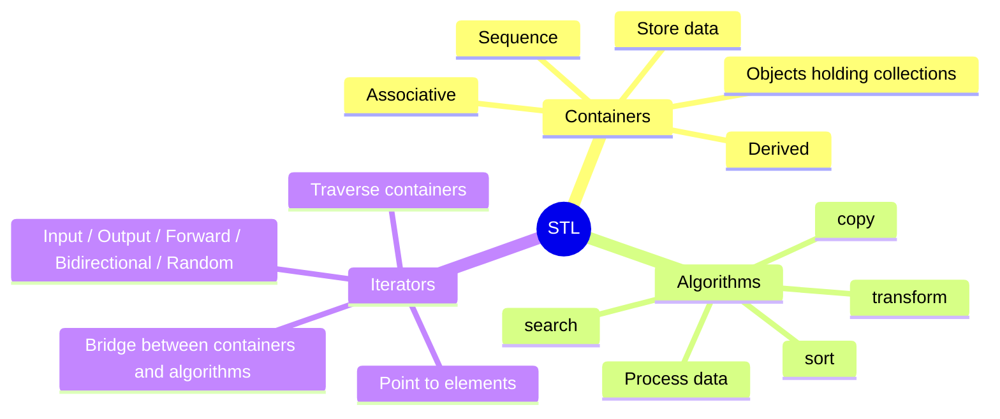
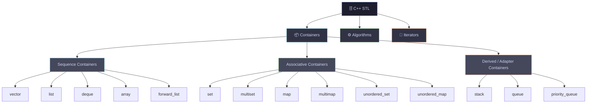
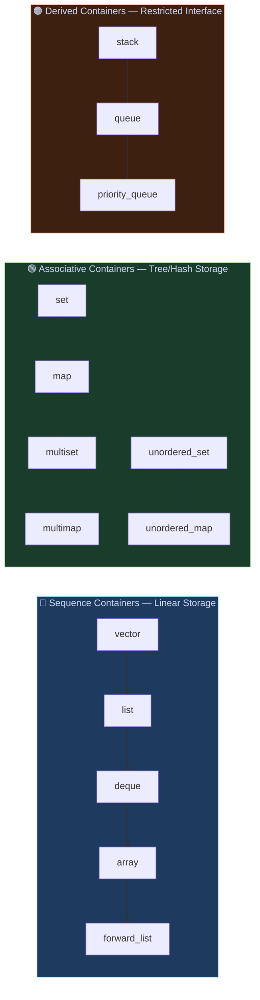
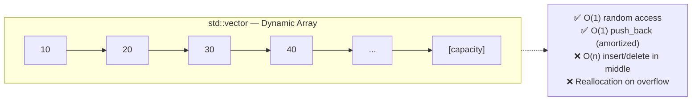
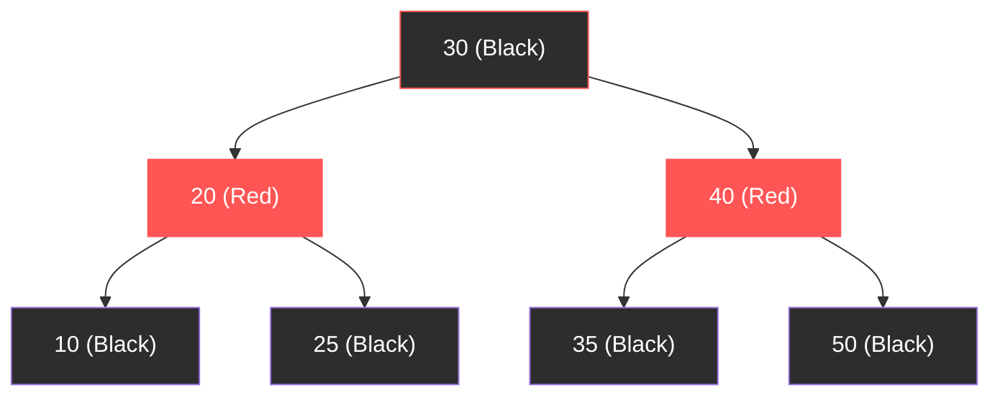
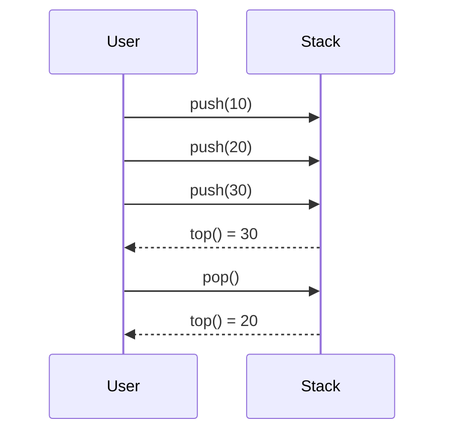
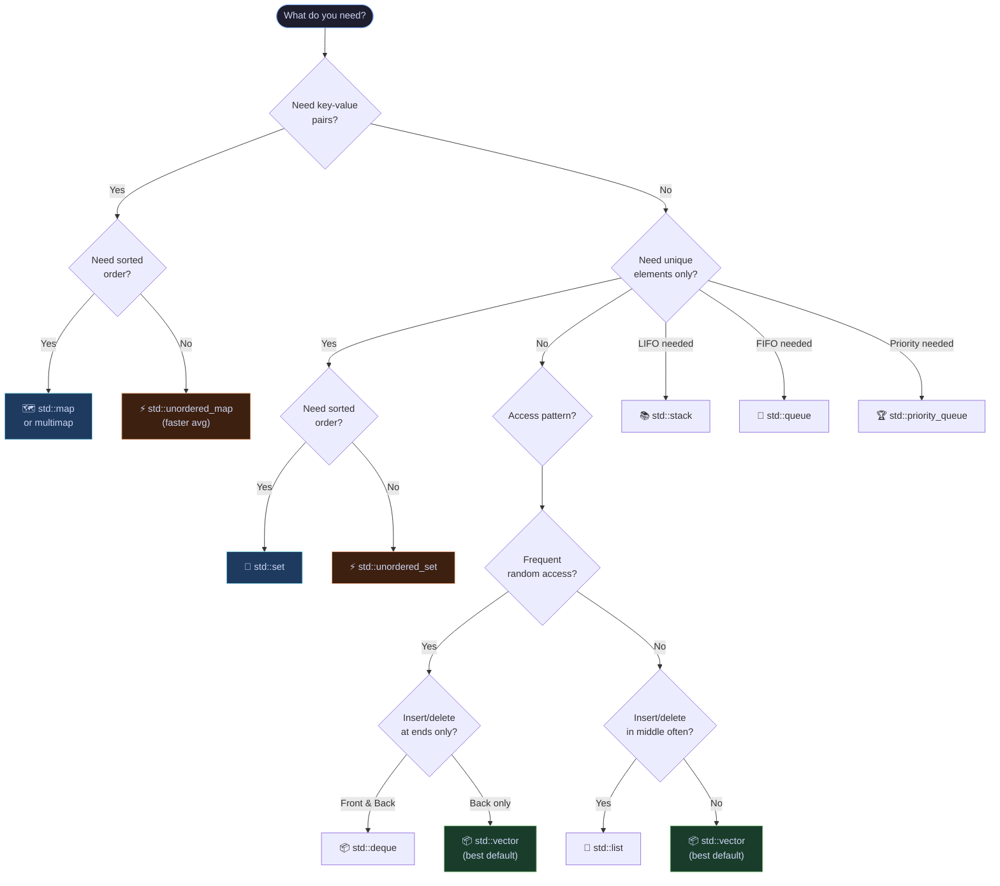
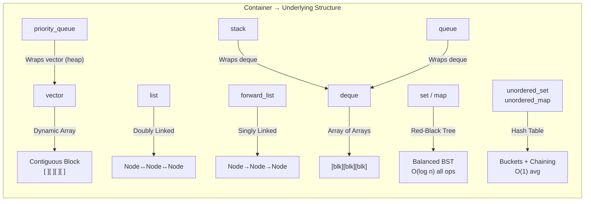
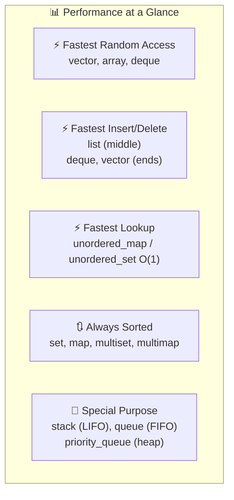

# 📦 C++ STL Containers — Complete Reference Guide
> **C++ Tutorials for Beginners #70** | Part of the Standard Template Library Series

---

## 📌 Table of Contents

- [What is the STL?](#what-is-the-stl)
- [STL Overview](#stl-overview)
- [Container Categories](#container-categories)
- [Sequence Containers](#sequence-containers)
- [Associative Containers](#associative-containers)
- [Derived (Container Adapters)](#derived-container-adapters)
- [Complexity Comparison Table](#complexity-comparison-table)
- [When to Use Which Container?](#when-to-use-which-container)
- [Internal Data Structures](#internal-data-structures)
- [Header File Reference](#header-file-reference)
- [Quick Code Examples](#quick-code-examples)

---

## What is the STL?

The **Standard Template Library (STL)** is a powerful set of C++ template classes and functions that provides general-purpose classes and functions with templates that implement many popular and commonly used algorithms and data structures.

The STL has **three core components**:



---

## STL Overview



---

## Container Categories



---

## Sequence Containers

Sequence containers store elements **in a linear, ordered fashion**. The position of each element depends on when and where it was inserted.

### Memory Layout Visualization

```
vector / array — Contiguous Memory
┌─────┬─────┬─────┬─────┬─────┬─────┐
│  10 │  20 │  30 │  40 │  50 │  60 │
└─────┴─────┴─────┴─────┴─────┴─────┘
  [0]   [1]   [2]   [3]   [4]   [5]
        ↑ Random access: O(1) via index

list — Doubly Linked (Non-contiguous)
┌──────┐   ┌──────┐   ┌──────┐   ┌──────┐
│  10  │◄──│  20  │◄──│  30  │◄──│  40  │
│ next─┼──►│ next─┼──►│ next─┼──►│ null │
└──────┘   └──────┘   └──────┘   └──────┘
  ↑ Insertion/deletion anywhere: O(1) with iterator

deque — Segmented Memory (chunks)
[chunk 1]   [chunk 2]   [chunk 3]
┌──┬──┐     ┌──┬──┐     ┌──┬──┐
│10│20│     │30│40│     │50│60│
└──┴──┘     └──┴──┘     └──┴──┘
  ↑ Fast insert/delete at BOTH ends
```

### `std::vector`



```cpp
#include <vector>
#include <iostream>

int main() {
    std::vector<int> v = {10, 20, 30, 40, 50};

    v.push_back(60);         // O(1) amortized — add to end
    v.insert(v.begin(), 5);  // O(n) — insert at front (slow!)

    std::cout << v[2];       // O(1) — random access
    std::cout << v.size();   // number of elements
    std::cout << v.capacity(); // allocated memory slots

    // Iterating
    for (auto& x : v) std::cout << x << " ";
    return 0;
}
```

### `std::list`

A **doubly linked list** — each element stores a pointer to both the next and previous node.

```cpp
#include <list>

int main() {
    std::list<int> lst = {10, 20, 30};

    lst.push_front(5);   // O(1) — insert at front
    lst.push_back(40);   // O(1) — insert at back

    auto it = lst.begin();
    std::advance(it, 2);
    lst.insert(it, 99);  // O(1) — insert at iterator position

    lst.remove(20);      // O(n) — find and remove by value
    return 0;
}
```

### `std::deque`

A **double-ended queue** with fast insert/delete at both ends and O(1) random access (slightly slower than vector).

```cpp
#include <deque>

int main() {
    std::deque<int> dq = {20, 30, 40};

    dq.push_front(10);  // O(1) — fast front insert
    dq.push_back(50);   // O(1) — fast back insert

    dq.pop_front();     // O(1) — remove from front
    dq[1] = 99;         // O(1) — random access
    return 0;
}
```

### `std::array` (C++11)

A **fixed-size** stack-allocated array — same as C-style arrays but with STL interface.

```cpp
#include <array>

int main() {
    std::array<int, 5> arr = {1, 2, 3, 4, 5};
    arr.fill(0);         // set all to 0
    arr.size();          // always 5
    arr[2] = 42;         // O(1) access
    return 0;
}
```

### `std::forward_list` (C++11)

A **singly linked list** — uses less memory than `list` but can only iterate forward.

```cpp
#include <forward_list>

int main() {
    std::forward_list<int> fl = {10, 20, 30};
    fl.push_front(5);    // O(1)
    fl.pop_front();      // O(1)
    // No push_back — no tail pointer
    return 0;
}
```

---

## Associative Containers

Associative containers store elements in a **sorted order** (typically using a Red-Black Tree) or in an **unordered** manner (using Hash Tables). They enable fast lookup, insertion, and deletion.

### Ordered — Red-Black Tree Structure



> **Red-Black Tree** guarantees O(log n) search, insert, and delete. Elements are always kept sorted.

### `std::set` and `std::multiset`

```cpp
#include <set>

int main() {
    std::set<int> s = {5, 3, 8, 1, 3};  // {1, 3, 5, 8} — no duplicates, sorted

    s.insert(4);         // O(log n)
    s.erase(3);          // O(log n)
    s.count(5);          // O(log n) — 0 or 1 for set
    s.find(8);           // O(log n) — returns iterator

    std::multiset<int> ms = {5, 3, 8, 3}; // {3, 3, 5, 8} — allows duplicates
    ms.count(3);         // returns 2
    return 0;
}
```

### `std::map` and `std::multimap`

```cpp
#include <map>
#include <string>

int main() {
    std::map<std::string, int> scores;

    scores["Alice"] = 95;   // O(log n)
    scores["Bob"]   = 87;

    scores.at("Alice");     // O(log n) — throws if not found
    scores.count("Bob");    // O(log n) — 0 or 1
    scores.find("Alice");   // O(log n) — iterator

    // Iterates in sorted key order
    for (auto& [key, val] : scores)
        std::cout << key << ": " << val << "\n";

    // multimap allows duplicate keys
    std::multimap<std::string, int> mm;
    mm.insert({"Alice", 90});
    mm.insert({"Alice", 95});  // Both stored
    return 0;
}
```

### Unordered Variants — Hash Table Structure

```
Unordered Map / Set — Hash Table

Key "Alice" → hash(Alice) = 3 → Bucket[3] → ("Alice", 95)
Key "Bob"   → hash(Bob)   = 7 → Bucket[7] → ("Bob", 87)

Buckets:
[0] → empty
[1] → empty
[2] → empty
[3] → ("Alice", 95)
[4] → empty
...
[7] → ("Bob", 87)
```

```cpp
#include <unordered_map>
#include <unordered_set>

int main() {
    std::unordered_map<std::string, int> umap;
    umap["Alice"] = 95;   // O(1) average

    std::unordered_set<int> uset = {5, 1, 8, 3};
    uset.count(5);         // O(1) average
    uset.insert(10);       // O(1) average
    return 0;
}
```

---

## Derived (Container Adapters)

These are **not standalone containers** — they wrap sequence containers and restrict their interface to model real-world data structures.

### `std::stack` — LIFO

```
PUSH ──►  ┌─────┐
          │  40 │ ← TOP
          ├─────┤
          │  30 │
          ├─────┤
          │  20 │
          ├─────┤
          │  10 │ ← BOTTOM
          └─────┘
              │
           POP ◄──
```



```cpp
#include <stack>

int main() {
    std::stack<int> st;
    st.push(10);  // [10]
    st.push(20);  // [10, 20]
    st.push(30);  // [10, 20, 30]

    st.top();     // 30 — peek without removing
    st.pop();     // removes 30
    st.size();    // 2
    st.empty();   // false
    return 0;
}
```

> **Default underlying container:** `std::deque`. Can be changed to `std::vector` or `std::list`.

### `std::queue` — FIFO

```
ENQUEUE ──►  ┌────┬────┬────┬────┐  ──► DEQUEUE
             │ 10 │ 20 │ 30 │ 40 │
             └────┴────┴────┴────┘
              BACK               FRONT
```

```cpp
#include <queue>

int main() {
    std::queue<int> q;
    q.push(10);   // enqueue
    q.push(20);
    q.push(30);

    q.front();    // 10 — peek at front
    q.back();     // 30 — peek at back
    q.pop();      // removes 10 (FIFO)
    return 0;
}
```

### `std::priority_queue` — Heap

The **highest priority element** is always at the top (max-heap by default).

```
     [100]          ← Always at top (max)
    /     \
  [75]   [80]
  /  \
[30] [50]
```

```cpp
#include <queue>
#include <vector>
#include <functional>

int main() {
    // Max-heap (default)
    std::priority_queue<int> pq;
    pq.push(30);
    pq.push(100);
    pq.push(50);
    pq.top();   // 100 — always the max

    // Min-heap
    std::priority_queue<int, std::vector<int>, std::greater<int>> min_pq;
    min_pq.push(30);
    min_pq.push(100);
    min_pq.push(50);
    min_pq.top();  // 30 — always the min

    return 0;
}
```

---

## Complexity Comparison Table

### Sequence Containers

| Operation | `vector` | `list` | `deque` | `array` | `forward_list` |
|-----------|----------|--------|---------|---------|----------------|
| Random Access `[]` | ✅ O(1) | ❌ O(n) | ✅ O(1) | ✅ O(1) | ❌ O(n) |
| Insert at Front | ❌ O(n) | ✅ O(1) | ✅ O(1) | ❌ N/A | ✅ O(1) |
| Insert at Back | ✅ O(1)* | ✅ O(1) | ✅ O(1) | ❌ N/A | ❌ O(n) |
| Insert in Middle | ❌ O(n) | ✅ O(1)† | ❌ O(n) | ❌ N/A | ✅ O(1)† |
| Delete at Front | ❌ O(n) | ✅ O(1) | ✅ O(1) | ❌ N/A | ✅ O(1) |
| Delete at Back | ✅ O(1) | ✅ O(1) | ✅ O(1) | ❌ N/A | ❌ O(n) |
| Search | ❌ O(n) | ❌ O(n) | ❌ O(n) | ❌ O(n) | ❌ O(n) |
| Memory Layout | Contiguous | Non-contiguous | Segmented | Contiguous | Non-contiguous |
| Cache Friendly | ✅ Yes | ❌ No | ⚠️ Partial | ✅ Yes | ❌ No |
| Size Fixed? | ❌ No | ❌ No | ❌ No | ✅ Yes | ❌ No |

> \* Amortized O(1) — occasionally O(n) due to reallocation
> † O(1) only when you already have the iterator; finding the position is O(n)

### Ordered Associative Containers

| Operation | `set/multiset` | `map/multimap` |
|-----------|---------------|----------------|
| Insert | O(log n) | O(log n) |
| Delete | O(log n) | O(log n) |
| Search | O(log n) | O(log n) |
| Min / Max | O(log n) | O(log n) |
| Sorted Order | ✅ Yes | ✅ Yes (by key) |
| Duplicates | `set`: No / `multiset`: Yes | `map`: No / `multimap`: Yes |
| Underlying Structure | Red-Black Tree | Red-Black Tree |

### Unordered Associative Containers

| Operation | `unordered_set` | `unordered_map` |
|-----------|----------------|-----------------|
| Insert | O(1) avg, O(n) worst | O(1) avg, O(n) worst |
| Delete | O(1) avg, O(n) worst | O(1) avg, O(n) worst |
| Search | O(1) avg, O(n) worst | O(1) avg, O(n) worst |
| Sorted Order | ❌ No | ❌ No |
| Underlying Structure | Hash Table | Hash Table |

### Container Adapters

| Operation | `stack` | `queue` | `priority_queue` |
|-----------|---------|---------|-----------------|
| Insert | O(1) | O(1) | O(log n) |
| Remove | O(1) | O(1) | O(log n) |
| Peek (top/front) | O(1) | O(1) | O(1) |
| Order | LIFO | FIFO | By Priority |
| Random Access | ❌ | ❌ | ❌ |

---

## When to Use Which Container?



### Quick Decision Summary

| Use Case | Best Container |
|----------|---------------|
| Default dynamic array | `std::vector` |
| Frequent insert/delete anywhere | `std::list` |
| Fast insert/delete at both ends | `std::deque` |
| Fixed-size array with STL API | `std::array` |
| Unique sorted elements | `std::set` |
| Key-value sorted lookup | `std::map` |
| Fastest lookup (no ordering needed) | `std::unordered_map` |
| Undo/redo functionality | `std::stack` |
| Task scheduling / BFS | `std::queue` |
| Priority-based scheduling | `std::priority_queue` |
| LRU Cache implementation | `std::list` + `std::unordered_map` |
| Frequency counter | `std::unordered_map<T, int>` |

---

## Internal Data Structures



---

## Header File Reference

| Container | Header |
|-----------|--------|
| `vector` | `#include <vector>` |
| `list` | `#include <list>` |
| `forward_list` | `#include <forward_list>` |
| `deque` | `#include <deque>` |
| `array` | `#include <array>` |
| `set`, `multiset` | `#include <set>` |
| `map`, `multimap` | `#include <map>` |
| `unordered_set`, `unordered_multiset` | `#include <unordered_set>` |
| `unordered_map`, `unordered_multimap` | `#include <unordered_map>` |
| `stack` | `#include <stack>` |
| `queue`, `priority_queue` | `#include <queue>` |

---

## Quick Code Examples

### Iterating Any Container with Range-Based For

```cpp
#include <vector>
#include <map>
#include <set>

// Vector
std::vector<int> v = {1, 2, 3};
for (const auto& x : v) std::cout << x << " ";

// Set (always sorted output)
std::set<int> s = {5, 3, 1};
for (const auto& x : s) std::cout << x << " ";  // 1 3 5

// Map
std::map<std::string, int> m = {{"a", 1}, {"b", 2}};
for (const auto& [key, val] : m) std::cout << key << ":" << val;
```

### Common Algorithms on Containers

```cpp
#include <vector>
#include <algorithm>
#include <numeric>

std::vector<int> v = {5, 2, 8, 1, 9};

std::sort(v.begin(), v.end());              // {1, 2, 5, 8, 9}
std::reverse(v.begin(), v.end());           // {9, 8, 5, 2, 1}
auto it = std::find(v.begin(), v.end(), 5); // iterator to 5
int sum = std::accumulate(v.begin(), v.end(), 0); // 25
std::binary_search(v.begin(), v.end(), 8); // true (must be sorted)
```

### Emplace vs Insert (Efficiency Tip)

```cpp
std::vector<std::pair<int, std::string>> v;

// insert — constructs then copies/moves
v.push_back({1, "hello"});

// emplace — constructs in-place (faster, avoids temporary)
v.emplace_back(1, "hello");

std::map<int, std::string> m;
m.insert({1, "hello"});    // constructs pair, then inserts
m.emplace(1, "hello");     // in-place construction (preferred)
```

---

## Summary



| Container Type | Key Strength | Key Weakness |
|----------------|-------------|--------------|
| `vector` | Cache-friendly, fast random access | Slow insert in middle |
| `list` | Fast insert/delete anywhere | No random access, poor cache |
| `deque` | Fast at both ends + random access | Slightly slower than vector |
| `set/map` | Always sorted, O(log n) everything | Slower than unordered variants |
| `unordered_set/map` | O(1) average operations | No ordering, hash collisions |
| `stack/queue` | Simple, purpose-built | No iteration or random access |

---

> 📁 **Next Tutorial:** Iterators in STL — Types, Arithmetic & Usage
> 🔗 **Previous Tutorial:** Introduction to STL — Components Overview

---

*Reference: ISO C++ Standard | cppreference.com | C++ Primer (5th Edition)*
